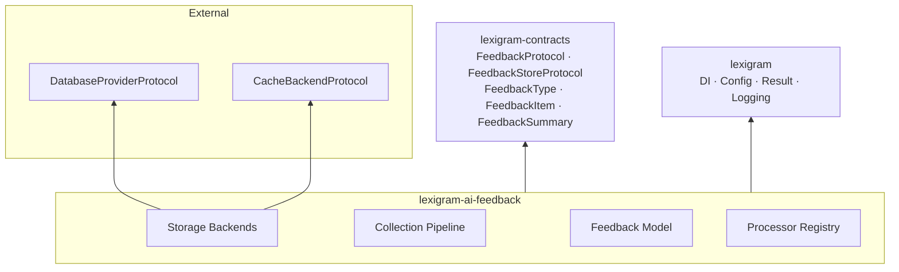
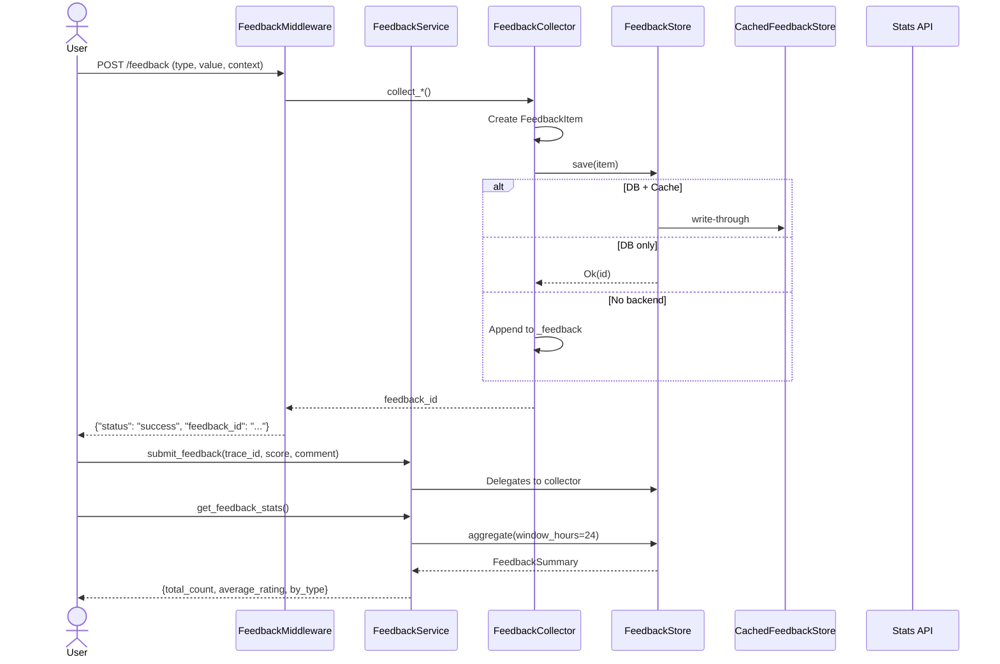
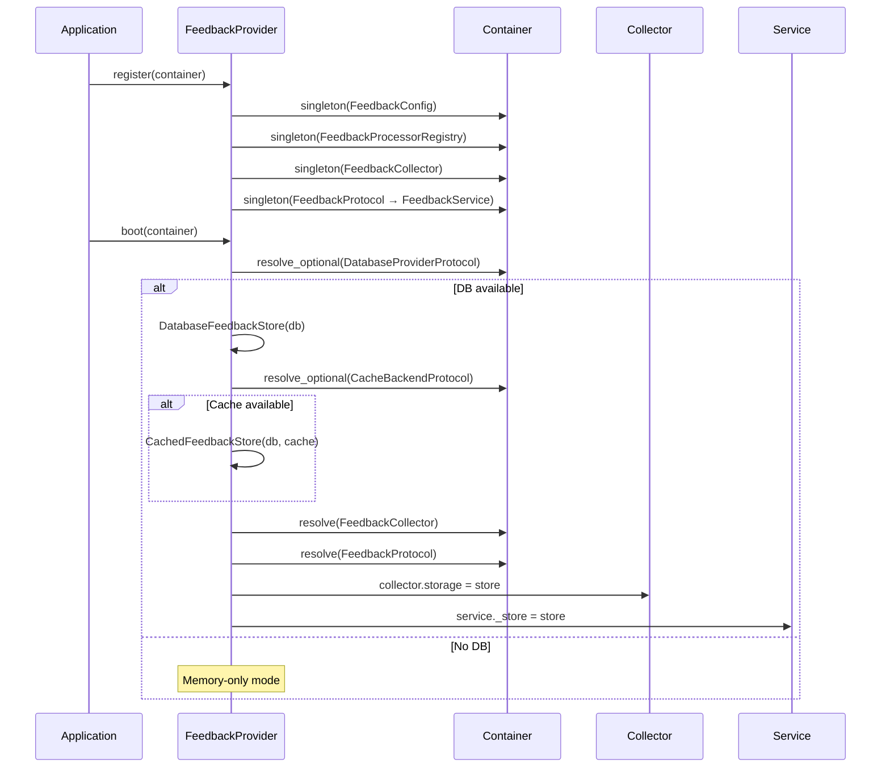

# Architecture

Internal design of the `lexigram-ai-feedback` package.

---

## Role in the System

`lexigram-ai-feedback` is the **feedback collection layer** for AI-generated outputs — data types, storage backends, and services for collecting, processing, and querying user feedback on AI responses.



Depends only on `lexigram` and `lexigram-contracts`. Storage backends wired dynamically in `boot()` via optional container resolution.

---

## Feedback Model

```python
class FeedbackType(StrEnum):
    RATING = "rating"         # Numeric score (1.0–5.0)
    TEXT = "text"             # Free-text comment
    CORRECTION = "correction" # Original → corrected pair
    LABEL = "label"           # Ground truth label + input
```

```python
@dataclass(frozen=True)
class FeedbackItem:
    feedback_type: FeedbackType
    value: Any                        # float, str, or dict
    context: dict[str, Any]           # trace_id, session_id, model
    metadata: dict[str, Any]          # comment, user_id, endpoint
    id: str                           # UUID4, auto-generated
    created_at: datetime              # UTC, auto-generated
```

```python
@dataclass(frozen=True)
class FeedbackSummary:
    total_count: int
    average_rating: float | None
    count_by_type: dict[str, int]
```

---

## src/ Layout

```
src/lexigram/ai/feedback/
├── config.py                # FeedbackConfig (enabled, async_processing)
├── constants.py             # ENV_PREFIX, rating min/max, size limits
├── events.py                # FeedbackSubmittedEvent (DomainEvent)
├── exceptions.py            # FeedbackError hierarchy
├── hooks.py                 # Lifecycle hook payloads
├── types.py                 # Re-exports FeedbackType, FeedbackItem
├── protocols.py             # Re-exports FeedbackProtocol, FeedbackStoreProtocol
├── module.py                # FeedbackModule — configure() + stub()
├── di/provider.py           # FeedbackProvider — register, boot, shutdown
├── services/
│   ├── collector.py         # FeedbackCollector — collect_rating/text/correction/label
│   └── feedback_service.py  # FeedbackService — submit_feedback, get_feedback_stats
├── storage/
│   ├── database.py          # DatabaseFeedbackStore — SQL via DatabaseProviderProtocol
│   └── cache.py             # CachedFeedbackStore — write-through via CacheBackendProtocol
├── processors/
│   └── processor_registry.py# FeedbackProcessorRegistry + 4 built-in processors
└── middleware/
    └── middleware.py         # FeedbackMiddleware, FeedbackContext
```

---

## Collection Pipeline



Two entry points: **web middleware** (auto-captures request context) and **programmatic API** (trace-correlated submission).

---

## Provider Lifecycle



**register()** — Registers config, processor registry, collector, and service. Exits early if `enabled=False`.

**boot()** — Wires storage. Resolves `DatabaseProviderProtocol` (optional). If found, creates `DatabaseFeedbackStore`, optionally wraps with `CachedFeedbackStore`. Assigns store to collector and service. Falls back to in-memory when no DB available.

**shutdown()** — No-op. Database connection pooling managed by the database provider.

---

## Contracts Used

| Contract | Import Path | Implemented By |
|----------|-------------|----------------|
| `FeedbackProtocol` | `lexigram.contracts.ai.feedback` | `FeedbackService` |
| `FeedbackStoreProtocol` | `lexigram.contracts.ai.feedback` | `DatabaseFeedbackStore`, `CachedFeedbackStore` |
| `FeedbackType` | `lexigram.contracts.ai.feedback` | `StrEnum` |
| `FeedbackItem` | `lexigram.contracts.ai.feedback` | Frozen dataclass |
| `FeedbackSummary` | `lexigram.contracts.ai.feedback` | Frozen dataclass |
| `DatabaseProviderProtocol` | `lexigram.contracts.data` | *consumed* |
| `CacheBackendProtocol` | `lexigram.contracts.infra.cache` | *consumed* |
| `DomainEvent` | `lexigram.contracts.domain.events` | `FeedbackSubmittedEvent` |

---

## Eventing & Hooks

`FeedbackSubmittedEvent` (`feedback_id`, `item_type`) extends `DomainEvent` for event bus subscribers. Three lifecycle hooks:

| Hook | Fired When |
|------|-----------|
| `FeedbackSubmittedHook` | Feedback enters the pipeline |
| `FeedbackProcessedHook` | Processing completes |
| `FeedbackStoredHook` | Feedback is persisted |

---

## Processor Registry

`FeedbackProcessorRegistry` dispatches to the correct collector method by `FeedbackType`:

| Processor | FeedbackType | Collector Action |
|-----------|-------------|-----------------|
| `RatingFeedbackProcessor` | `RATING` | `collect_rating(value)` |
| `TextFeedbackProcessor` | `TEXT` | `collect_text(text)` |
| `CorrectionFeedbackProcessor` | `CORRECTION` | `collect_correction(original, corrected)` |
| `LabelFeedbackProcessor` | `LABEL` | `collect_label(label, input)` |

Built-in processors loaded via `with_defaults()`. Custom processors implement `FeedbackProcessor` protocol.

---

## Middleware

`FeedbackMiddleware.__call__()` extracts request context (body, user_id, session_id), calls next handler, captures output. `create_feedback_endpoint()` returns a `POST /feedback` handler. `FeedbackContext` is an async context manager for manual scoping:

```python
async with FeedbackContext(collector, operation="prediction") as ctx:
    result = await model.predict(input_data)
    ctx.set_result(result)
```

---

## Exception Convention

```
FeedbackError
├── FeedbackProcessingError  # Processor pipeline failure
└── FeedbackValidationError  # Schema / data-validation failure
```

Domain operations use `Result[T, E]`. Exceptions above signal configuration and processing failures.

---

## Extension Points

| Point | Mechanism | Example |
|-------|-----------|---------|
| Custom feedback type | Add `FeedbackType` member + register `FeedbackProcessor` | `FeedbackType.PREFERENCE` |
| Custom storage | Implement `FeedbackStoreProtocol`, assign to `collector.storage` | S3-backed store |
| Custom analytics | Subscribe to hook or listen for domain event | ML retraining trigger |
| Custom processors | Implement `FeedbackProcessor`, call `registry.register()` | Sentiment analysis |
| Lifecycle hooks | Subscribe to `FeedbackSubmittedHook` | Audit logging |
| Custom middleware | Subclass or wrap `FeedbackMiddleware` | AI chat application |
