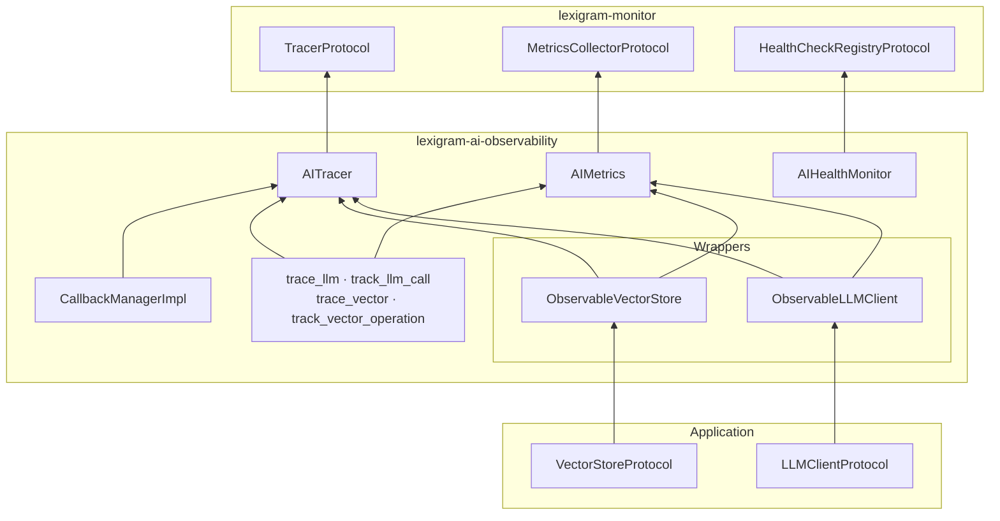
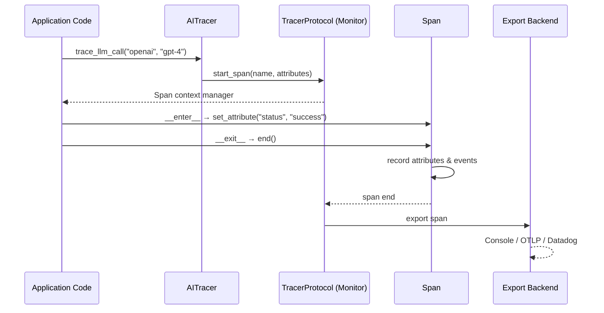
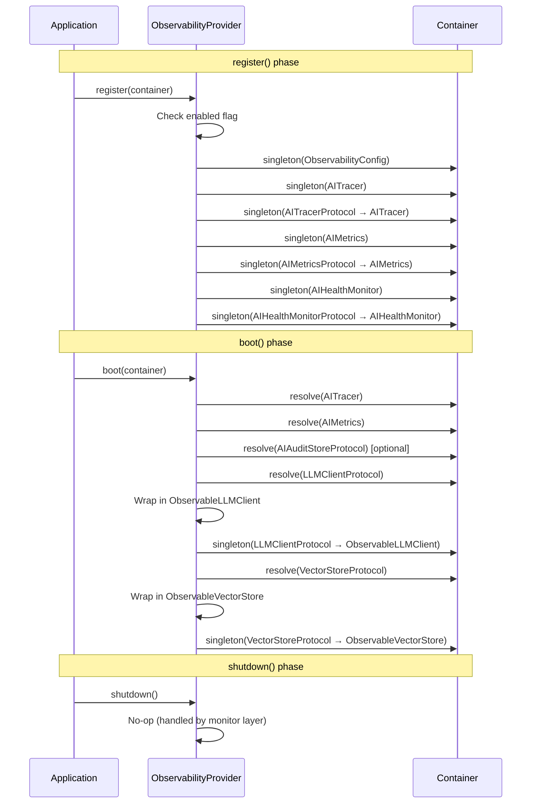

# Architecture

Internal design of the `lexigram-ai-observability` package.

---

## Role in the System

`lexigram-ai-observability` provides distributed tracing, metrics collection, and health monitoring for AI operations (LLM calls, vector search, embeddings, RAG, document ingestion). It depends only on `lexigram` and `lexigram-contracts` — it discovers `LLMClientProtocol` and `VectorStoreProtocol` via the container and wraps them transparently.



The arrow direction points toward the dependency. Wrappers depend on AITracer and AIMetrics. AITracer depends on TracerProtocol. Application code observes LLM/Vector operations through decorators or automatic proxy wrapping.

---

## Package Layout

```
src/lexigram/ai/observability/
├── __init__.py              # Lazy-loaded public API
├── config.py                # ObservabilityConfig dataclass
├── constants.py             # ENV_PREFIX, metric/span name constants
├── decorators.py            # Re-exports of trace_llm, track_llm_call, etc.
├── exceptions.py            # ObservabilityError, TracingError, MetricsError
├── hooks.py                 # AIObservabilityStartedHook, LLMCallTracedHook
├── protocols.py             # Re-exports of AITracerProtocol, etc. from contracts
├── types.py                 # HealthCheckFunc, MetricLabels
├── module.py                # ObservabilityModule
├── di/
│   └── provider.py          # ObservabilityProvider (register, boot, shutdown)
├── tracing/
│   ├── core.py              # AITracer — span context manager API
│   └── decorators.py        # @trace_llm, @trace_vector, @trace_rag
├── metrics/
│   ├── core.py              # AIMetrics — all 30+ instrument definitions
│   └── decorators.py        # @track_llm_call, @track_vector_operation, @track_embedding
├── health/
│   └── monitor.py           # AIHealthMonitor — per-component check registry
├── wrappers/
│   ├── observable_llm.py    # ObservableLLMClient — LLM proxy
│   └── observable_vector.py # ObservableVectorStore — vector proxy
└── callbacks/
    └── manager.py           # CallbackManagerImpl — event fan-out
```

---

## Tracing Model

`AITracer` wraps a `TracerProtocol` (from `lexigram-monitor`) and exposes domain-specific span methods. Each span carries standardised attributes for LLM provider, model, token counts, latency, and cost.

### Span Types

| Method | Span Name | Key Attributes |
|--------|-----------|----------------|
| `trace_llm_call()` | `llm.{provider}.{model}` | `llm.provider`, `llm.model`, `operation.type` |
| `trace_vector_operation()` | `vector.{operation}.{provider}` | `vector.operation`, `vector.provider`, `vector.collection` |
| `trace_embedding_operation()` | `embedding.{model}` | `embedding.model`, `embedding.batch_size` |
| `trace_rag_stage()` | `rag.{stage}` | `rag.stage`, `rag.pipeline` |
| `trace_rag_query()` | `rag.query` | `rag.query`, `rag.pipeline` |

### Span Lifecycle



---

## Metrics

`AIMetrics` registers all instruments against `MetricsCollectorProtocol` (from `lexigram-monitor`). 24 instruments total, grouped by domain:

| Domain | Instruments | Types |
|--------|-------------|-------|
| LLM | `llm_requests_total`, `llm_tokens_total`, `llm_duration_seconds`, `llm_cost_dollars`, `llm_active_requests` | Counter, Histogram, Gauge |
| Vector | `vector_operations_total`, `vector_duration_seconds`, `vector_documents_total`, `vector_collection_size` | Counter, Histogram, Gauge |
| Embedding | `embedding_operations_total`, `embedding_duration_seconds`, `embedding_batch_size`, `embedding_cache_hits/misses`, `embedding_cache_size` | Counter, Histogram, Gauge |
| RAG | `rag_queries_total`, `rag_duration_seconds`, `rag_documents_retrieved`, `rag_active_queries` | Counter, Histogram, Gauge |
| Ingestion | `document_ingestion_jobs_submitted/completed/failed`, `document_chunks_created`, `ingestion_workers_active` | Counter, Gauge |
| Batch | `batch_embedding_jobs_submitted/completed/failed`, `texts_processed`, `workers_active` | Counter, Gauge |
| Maintenance | `workers_active`, `tasks_completed/failed`, `task_duration_seconds` | Counter, Histogram, Gauge |
| DLQ | `items_total/added/retried/archived/deleted`, `workers_active`, `notifications_sent` | Counter, Gauge |

---

## Export Backends

Tracing and metrics are exported through `lexigram-monitor`, which provides an `Exporter` abstraction chain. Backends are injected at the monitor layer — `lexigram-ai-observability` never couples to a specific exporter.

| Backend | Tracing | Metrics | Configuration |
|---------|---------|---------|---------------|
| Console | Yes | Yes | `LEX_MONITOR__EXPORTER=console` |
| OpenTelemetry (OTLP) | Yes | Yes | `LEX_MONITOR__EXPORTER=otlp` |
| Datadog (via OTLP) | Yes | Yes | Datadog OTLP endpoint config |
| Prometheus | No | Yes | `LEX_MONITOR__EXPORTER=prometheus` |
| Custom | Yes | Yes | Implement `TracerProtocol` / `MetricsCollectorProtocol` |

---

## Provider Lifecycle

`ObservabilityProvider` (`di/provider.py`) handles three phases:



**Key design rule**: During `boot()`, the provider re-registers the wrapped protocol instances under the **same protocol key**. Any code that already resolved `LLMClientProtocol` before boot keeps the raw client; code that resolves after boot gets the wrapped version. This is intentional — services that boot after `ObservabilityProvider` automatically receive instrumented proxies.

---

## Contracts Used

| Protocol | Source | Consumed By | Role |
|----------|--------|-------------|------|
| `AITracerProtocol` | `lexigram.contracts.observability.ai` | `AITracer` | AI tracing API |
| `AIMetricsProtocol` | `lexigram.contracts.observability.ai` | `AIMetrics` | AI metrics API |
| `AIHealthMonitorProtocol` | `lexigram.contracts.observability.ai` | `AIHealthMonitor` | AI health check API |
| `ObservabilityProtocol` | `lexigram.contracts.observability.ai` | — (composite) | Combined observability |
| `TracerProtocol` | `lexigram.contracts.observability.tracing` | `AITracer` (injected) | Span creation & context |
| `SpanProtocol` | `lexigram.contracts.observability.tracing` | `AITracer` (returned) | Span attribute/event API |
| `MetricsCollectorProtocol` | `lexigram.contracts.observability.metrics` | `AIMetrics` (injected) | Instrument creation |
| `LLMClientProtocol` | `lexigram.contracts.ai` | `ObservableLLMClient` (wrapped) | Proxied LLM calls |
| `VectorStoreProtocol` | `lexigram.contracts.data.vector.protocols` | `ObservableVectorStore` (wrapped) | Proxied vector ops |
| `AIAuditStoreProtocol` | `lexigram.contracts.ai.governance` | `ObservableLLMClient` (optional) | Audit event emission |
| `CallbackHandlerProtocol` | `lexigram.contracts.ai.callbacks` | `AITracer`, `CallbackManagerImpl` | Observe callbacks |

---

## Extension Points

| Point | Mechanism | Example |
|-------|-----------|---------|
| Custom trace backend | Implement `TracerProtocol`, register in container | OpenTelemetry SDK, Jaeger |
| Custom metrics backend | Implement `MetricsCollectorProtocol`, register in container | Prometheus, StatsD, Datadog |
| Custom span processor | Provide a span-processor to `TracerProtocol` during monitor setup | Attribute redaction, sampling |
| Custom metric collector | Provide a `MetricsBackendProtocol` to `MetricsCollectorProtocol` | CloudWatch, InfluxDB |
| Health check registrar | Call `AIHealthMonitor.add_llm_check()` / `add_vector_check()` | Custom provider ping |
| Decorator-based tracing | `@trace_llm(provider, model, tracer)` | Application orchestration code |
| Decorator-based metrics | `@track_llm_call(provider, model, metrics)` | Batch processing pipelines |
| Lifecycle hooks | Subscribe to `LLMCallTracedHook` / `HealthCheckRunHook` | Alerting, compliance logging |
| Callback handlers | Implement `CallbackHandlerProtocol`, register via `CallbackManagerImpl` | Custom event processing |
| New wrappable protocol | Create `wrappers/observable_*.py`, register in `ObservabilityProvider.boot()` | Hypothetical `EmbeddingClientProtocol` |

### Adding a New Wrappable Protocol

1. Create an `Observable*Client` wrapper in `wrappers/` that delegates to the raw protocol with tracing/metrics injection.
2. In `ObservabilityProvider.boot()`, resolve the protocol from the container and wrap it.
3. Re-register the wrapped instance under the same protocol key via `container.singleton()`.

---

## DE Registration

```python
# lexigram/ai/observability/module.py
@module()
class ObservabilityModule(Module):
    @classmethod
    def configure(cls, config: ObservabilityConfig | dict | None = None) -> DynamicModule:
        provider = ObservabilityProvider(config=...)
        return DynamicModule(
            module=cls,
            providers=[provider],
            exports=[AITracerProtocol],
        )
```

The module exports `AITracerProtocol` so that dependent services can inject the tracer without importing the implementation package.

---

## Exception Convention

```
AIError (contracts)
└── ObservabilityError         # LEX_ERR_OBS_001 — base for this package
    ├── TracingError           # LEX_ERR_OBS_004 — span/trace operations
    ├── MetricsError           # LEX_ERR_OBS_003 — metric recording operations
    └── HealthCheckError       # LEX_ERR_OBS_002 — health check failures
```

All exceptions are leaf-level — callers catch `ObservabilityError` for observability failures or let them propagate as infrastructure errors (the system should degrade gracefully when monitoring is unavailable).

---

## Constants

Defined in `constants.py`:

| Symbol | Value | Description |
|--------|-------|-------------|
| `ENV_PREFIX` | `LEX_AI_OBSERVABILITY__` | Env var prefix for config overrides |
| `METRIC_PREFIX_LLM` | `lexigram.ai.llm` | Metric namespace for LLM ops |
| `METRIC_PREFIX_VECTOR` | `lexigram.ai.vector` | Metric namespace for vector ops |
| `SPAN_LLM_CALL` | `llm.call` | Default LLM span name |
| `SPAN_VECTOR_QUERY` | `vector.query` | Default vector span name |
| `SPAN_RAG_PIPELINE` | `rag.pipeline` | Default RAG span name |
| `DEFAULT_CHECK_INTERVAL` | `30` | Default health check interval (s) |
| `DEFAULT_CHECK_TIMEOUT` | `5.0` | Default health check timeout (s) |

---

## Config

`ObservabilityConfig` is loaded from the `ai_observability:` key in `application.yaml` with `LEX_AI_OBSERVABILITY__*` env var overrides:

| Field | Type | Default | Description |
|-------|------|---------|-------------|
| `enabled` | `bool` | `True` | Master on/off switch |
| `metrics_enabled` | `bool` | `True` | Enable metrics collection |
| `tracing_enabled` | `bool` | `True` | Enable distributed tracing |
| `health_checks_enabled` | `bool` | `True` | Enable AI component health checks |

In production, disabling tracing or metrics emits a `ConfigIssue` warning with remediation suggestions.
