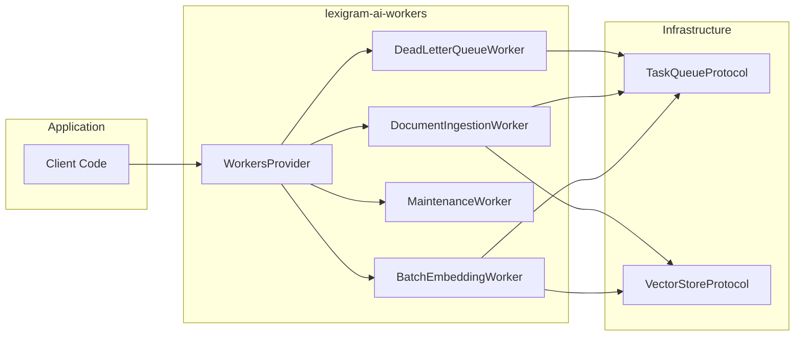
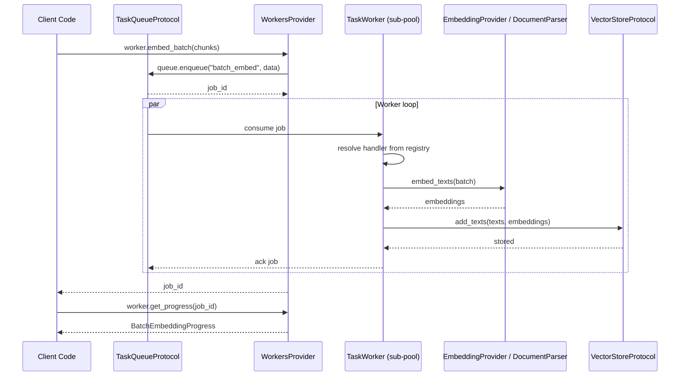
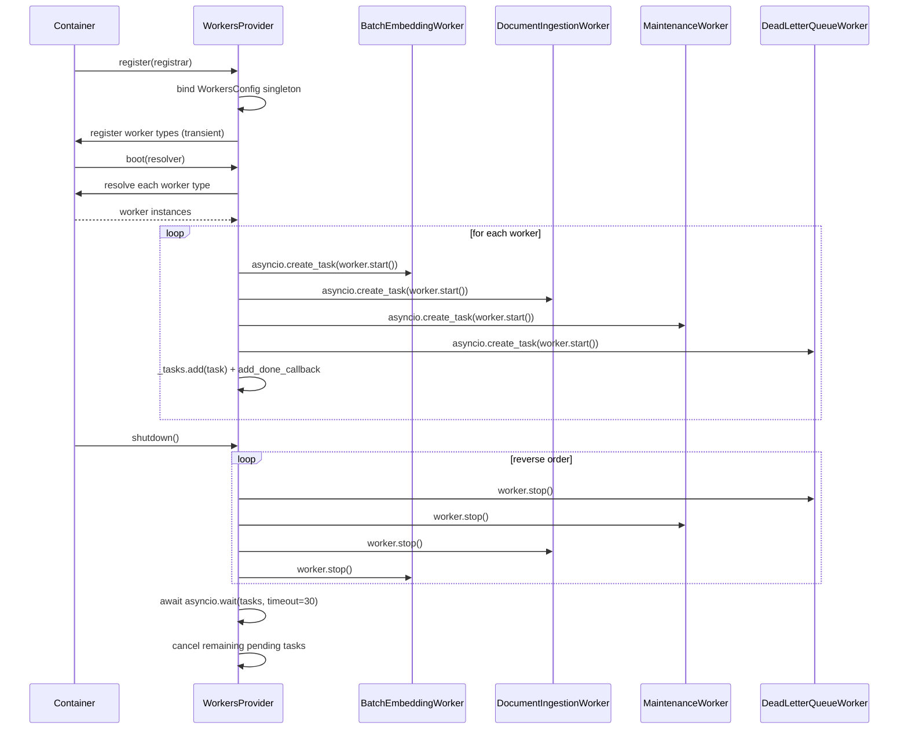

# Architecture

Internal design of the `lexigram-ai-workers` package.

---

## Role in the System

`lexigram-ai-workers` provides a concurrent worker pool for AI task execution — batch embedding generation, document ingestion, scheduled maintenance, and dead-letter-queue recovery. It sits in the AI subsystem, depending only on `lexigram` and `lexigram-contracts`.



---

## Worker Pool Model

The package implements a **worker pool** pattern with four worker types registered by `WorkersProvider`:

### Pool Components

| Component | Role |
|-----------|------|
| `WorkersProvider` | DI provider; registers and boots all workers as `asyncio.Task` instances |
| `BatchEmbeddingWorker` | Consumes `batch_embed` jobs; delegates to `EmbeddingProvider`, caches results, stores in `VectorStoreProtocol` |
| `DocumentIngestionWorker` | Consumes `ingest_document` jobs; parses files via `DocumentParser`, chunks via `DocumentProcessor`, stores in `VectorStoreProtocol` |
| `MaintenanceWorker` | Timer-driven loop; runs registered `MaintenanceTask` instances (index optimization, cache cleanup, metrics rollup) |
| `DeadLetterQueueWorker` | Failed-job recovery; classifies errors via `ErrorClassifier`, retries with exponential backoff, notifies on permanent failures |

### Dispatch

Each worker registers named handlers in a dict (e.g. `{"batch_embed": self._handle_batch_embed}`) at start time. The `TaskWorkerProtocol` implementation resolves these handlers when a matching job arrives from the queue — no `if/elif` chains.

### Concurrency

`BatchEmbeddingWorker` and `DocumentIngestionWorker` maintain their own sub-pools of `TaskWorkerProtocol` instances, configurable via `WorkersConfig.batch_embedding_concurrency` and `WorkersConfig.document_ingestion_concurrency` (both default to 3).

---

## Task Execution



---

## Provider Lifecycle



### WorkersProvider

- **Priority**: `ProviderPriority.INFRASTRUCTURE` (10)
- **register()**: Binds `WorkersConfig` singleton; registers each worker type as transient if `config.enabled` is true
- **boot()**: Skips if disabled; resolves each worker from the container; starts each via `asyncio.create_task()` with `add_done_callback` for cleanup (RUF006 compliant)
- **shutdown()**: Calls `stop()` on each worker in reverse order; awaits background tasks with 30-second timeout; cancels stragglers
- **health_check()**: Always `HEALTHY` — in-process provider with no external backends

### Error Recovery

Failed worker tasks are handled by `_on_worker_done()` — logs the exception and discards the task reference. DLQ recovery is handled by `DeadLetterQueueWorker`, which classifies failures via `ErrorClassifier` and applies exponential backoff (`base_backoff * 2^retry_count`, max 3600s).

---

## Contracts Used

The package consumes protocols from `lexigram-contracts` and defines one local protocol:

| Contract | Location | Used By |
|----------|----------|---------|
| `TaskWorkerProtocol` | `contracts/infra/tasks/protocols.py` | Worker sub-pool management; exported by `WorkersModule` |
| `TaskQueueProtocol` | `contracts/infra/tasks/protocols.py` | Job enqueue/dequeue for embedding and ingestion |
| `VectorStoreProtocol` | `contracts/data/vector/protocols.py` | Embedding storage and document chunk persistence |
| `HealthCheckResult` / `HealthStatus` | `contracts/core/health.py` | Health reporting for all workers |
| `AIError` | `contracts/ai/errors.py` | Exception hierarchy base (`WorkerError < AIError < LexigramError`) |
| `EmbeddingProvider` | `batch_embedding/protocols.py` (package-local) | Embedding generation abstraction |

### Extension Exceptions

| Exception | Extends | Code |
|-----------|---------|------|
| `WorkerError` | `AIError` | `LEX_ERR_AIWORK_001` |
| `DLQError` | `WorkerError` | `LEX_ERR_AIWORK_002` |
| `MaintenanceError` | `WorkerError` | `LEX_ERR_AIWORK_003` |

---

## Module Registration

`WorkersModule` provides a `configure()` factory that returns a `DynamicModule`:

```python
from lexigram.ai.workers.config import WorkersConfig
from lexigram.ai.workers.module import WorkersModule
from lexigram.contracts.infra.tasks.protocols import TaskWorkerProtocol

# Register with explicit config
module = WorkersModule.configure(
    config=WorkersConfig(enabled=True, batch_embedding_concurrency=5),
)

# Testing — no background scheduler
test_module = WorkersModule.stub()
```

The module exports `TaskWorkerProtocol` so downstream consumers can resolve worker pool references through the container.

---

## Extension Points

| Point | Mechanism |
|-------|-----------|
| Custom embedding provider | Implement `EmbeddingProvider` protocol from `batch_embedding/protocols.py` |
| Custom document parser | Subclass `DocumentParser` interface |
| Custom worker type | Add a new class; register in `_WORKER_TYPES` tuple in `di/provider.py` |
| Custom queue backend | Implement `TaskQueueProtocol` from `lexigram-contracts` |
| Custom worker strategy | Implement `TaskWorkerProtocol`; register `"TaskWorkerClass"` in the container |
| Maintenance tasks | `MaintenanceWorker.register_task()` with handler + schedule |
| DLQ notification handler | `DeadLetterQueueWorker.set_notification_handler()` |
| Custom adapter | Add adapter in `adapters/` (loader, RAG, task queue adapters exist) |
| Hook consumer | Register hook listener for `WorkerJobStartedHook`, `WorkerJobCompletedHook`, or `WorkerMaintenanceRunHook` |
