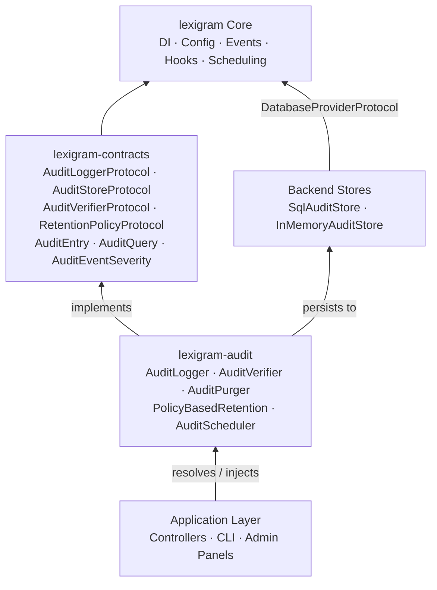
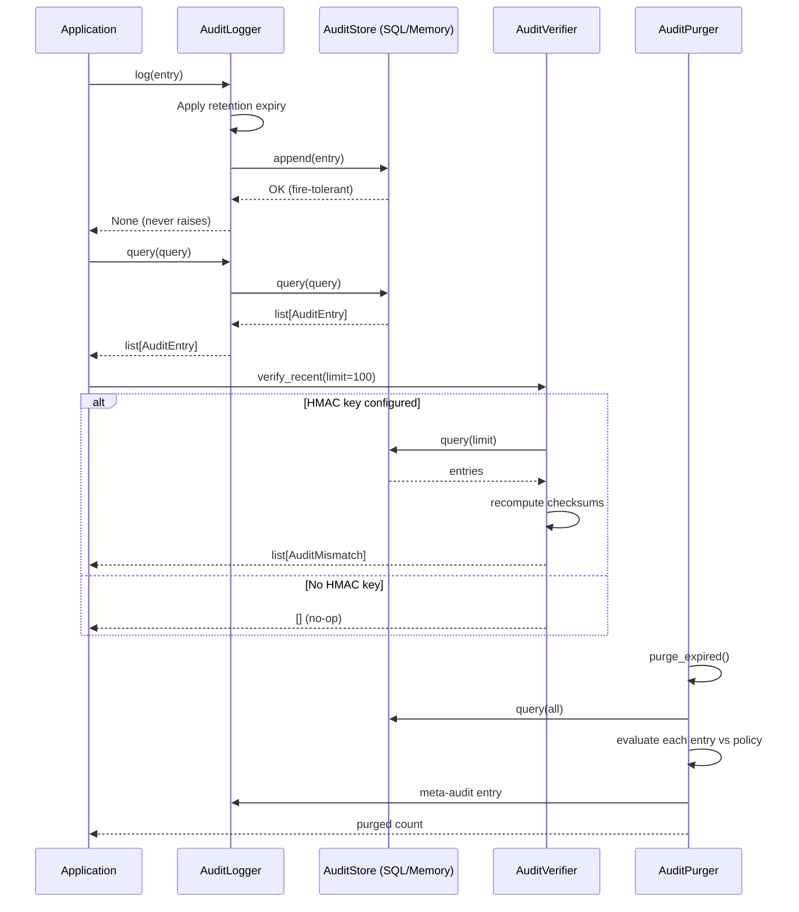
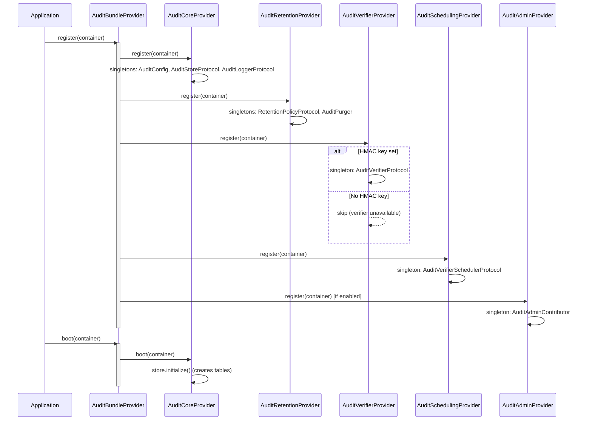
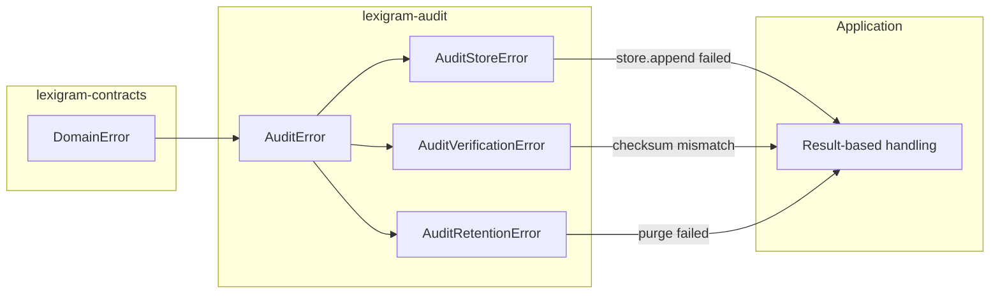

# Architecture

Internal design of the `lexigram-audit` package.

---

## Role in the System



**Dependency direction:** Arrows point toward the dependency. Audit
consumes contracts and core; the application consumes audit. Backend
stores are swappable implementations behind `AuditStoreProtocol`.

---

## Audit Event Model

`AuditEntry` is the canonical event shape defined in
`lexigram.contracts.audit.types`:

```python
@dataclass(frozen=True)
class AuditEntry:
    action: str                    # "user.update"
    actor_id: str                  # "user-abc123"
    resource_type: str             # "User"
    resource_id: str               # "user-abc123"
    outcome: str                   # "success" | "failure" | "partial"
    severity: AuditEventSeverity   # LOW | MEDIUM | HIGH | CRITICAL
    occurred_at: datetime           # UTC timestamp
    metadata: dict[str, Any]       # Arbitrary context
    old_values: dict | None         # Before snapshot
    new_values: dict | None         # After snapshot
    source: str                    # "sql", "admin", "ai", ...
    tenant_id: str | None          # Multi-tenant scope
```

### Severity Levels

| Severity | Meaning | Default Retention |
|----------|---------|-------------------|
| `LOW` | Routine operations (read, list) | 365 days |
| `MEDIUM` | Notable events (create, update) | 365 days |
| `HIGH` | Security-sensitive (auth failure, data access) | 1095 days (3 yr) |
| `CRITICAL` | Compliance-critical (delete, impersonation) | 2555 days (7 yr) |

### Categories (by `action` prefix)

| Prefix | Domain |
|--------|--------|
| `user.*` | User management |
| `auth.*` | Authentication / authorization |
| `data.*` | Data lifecycle |
| `config.*` | Configuration changes |
| `audit.*` | Meta-audit (purge, verification) |
| `admin.*` | Administrative operations |

---

## Pipeline



**Fire-tolerance:** `AuditLogger.log()` catches every exception and
emits a warning. Audit failure must never block the operation that
triggered it — this is enforced at the protocol level.

---

## Backend Support

| Backend | Class | Dependencies | Persistence | Checksums | Initialization |
|---------|-------|-------------|-------------|-----------|----------------|
| SQL | `SqlAuditStore` | `DatabaseProviderProtocol` | Relational DB | HMAC-SHA256 (optional) | Auto-creates table + indexes |
| Memory | `InMemoryAuditStore` | None | Bounded deque (10k entries) | N/A | None |

The backend is selected at configuration time via `AuditConfig.store_backend`
(`"sql"` or `"memory"`). The `AuditCoreProvider` registers the appropriate
implementation:

```python
if config.store_backend == "sql":
    try:
        container.singleton(AuditStoreProtocol, SqlAuditStore)
    except ImportError:
        container.singleton(AuditStoreProtocol, InMemoryAuditStore)
else:
    container.singleton(AuditStoreProtocol, InMemoryAuditStore)
```

### SQL Schema

| Column | Type | Purpose |
|--------|------|---------|
| `id` | SERIAL / INTEGER PK | Auto-increment ID |
| `table_name` | VARCHAR(255) | Resource type |
| `entity_id` | VARCHAR(255) | Resource ID |
| `action` | VARCHAR(50) | Action verb |
| `old_values` | TEXT | Before-state JSON |
| `new_values` | TEXT | After-state JSON |
| `changed_by` | VARCHAR(255) | Actor ID |
| `changed_at` | TIMESTAMP | Event timestamp |
| `metadata` | TEXT | Arbitrary JSON |
| `checksum` | VARCHAR(64) | HMAC-SHA256 hex digest |
| `severity` | VARCHAR(20) | Severity level |
| `source` | VARCHAR(100) | Originating subsystem |
| `outcome` | VARCHAR(50) | Success / failure |
| `tenant_id` | VARCHAR(255) | Multi-tenant scope |

Three indexes: `(table_name, entity_id)`, `(changed_at)`, `(checksum)`.

---

## Provider Lifecycle



| Sub-provider | Priority | `register()` binds | `boot()` |
|-------------|----------|-------------------|----------|
| `AuditCoreProvider` | INFRASTRUCTURE | `AuditConfig`, `AuditStoreProtocol` (SQL/Memory), `AuditLoggerProtocol` | `store.initialize()` |
| `AuditRetentionProvider` | INFRASTRUCTURE | `RetentionPolicyProtocol`, `AuditPurger` | — |
| `AuditVerifierProvider` | INFRASTRUCTURE | `AuditVerifierProtocol` (only if `hmac_key` is set) | — |
| `AuditSchedulingProvider` | INFRASTRUCTURE | `AuditVerifierSchedulerProtocol` | — |
| `AuditAdminProvider` | LOW | `AuditAdminContributor` | — |

---

## Contracts Used

All protocols and shared types live in `lexigram.contracts.audit`:

| Contract | Type | Methods / Fields |
|----------|------|------------------|
| `AuditLoggerProtocol` | Protocol | `log(entry)`, `query(query)` |
| `AuditStoreProtocol` | Protocol | `append(entry)`, `query(query)`, `count(query)` |
| `AuditVerifierProtocol` | Protocol | `verify_recent(*, limit)`, `verify_entry(entry_id)` |
| `RetentionPolicyProtocol` | Protocol | `evaluate(entry)`, `get_expiry(entry)` |
| `AuditVerifierSchedulerProtocol` | Protocol | `register_handler(task_provider)`, `schedule(task_provider, ...)` |
| `AuditEntry` | Dataclass | Frozen event record with action, actor, severity, metadata |
| `AuditQuery` | Dataclass | Composable filters (actor_id, action, severity, time range, etc.) |
| `AuditEventSeverity` | StrEnum | `LOW`, `MEDIUM`, `HIGH`, `CRITICAL` |
| `AuditMismatch` | Dataclass | Checksum mismatch record |
| `RetentionDecision` | StrEnum | `RETAIN`, `RETAIN_UNTIL`, `ARCHIVE`, `PURGE` |
| `RetentionPolicy` | Dataclass | Retention rules: defaults, severity/source overrides |

Additional framework contracts used internally:

| Contract | Use |
|----------|-----|
| `DatabaseProviderProtocol` | SQL store executes queries through this |
| `BaseAdminContributor` | Admin panel integration |
| `EventBusProtocol` | Domain event emission (`AuditEntryLoggedEvent`, etc.) |
| `HookRegistryProtocol` | Lifecycle hook payloads |
| `ContainerRegistrarProtocol` / `BootContainerProtocol` | DI lifecycle |

---

## Source Mapping

```
src/lexigram/audit/
├── __init__.py                 # Lazy-export public surface (12 symbols)
├── module.py                   # AuditModule — configure() → DynamicModule
├── config.py                   # AuditConfig — all configuration fields
├── constants.py                # __version__, ENV_PREFIX, defaults, StrEnums
├── exceptions.py               # AuditError, AuditStoreError, AuditVerificationError, AuditRetentionError
├── protocols.py                # Re-exports from contracts
├── types.py                    # Package-internal types (PurgeResult, VerificationResult, StoreBackend)
├── events.py                   # Domain events: AuditEntryLoggedEvent, AuditPurgeCompletedEvent, ...
├── hooks.py                    # Hook payloads: AuditEntryCreatedHook, AuditPurgeScheduledHook, ...
├── decorators.py               # @audited decorator for auto-logging
├── di/
│   ├── bundle_provider.py      # AuditBundleProvider — composite of 5 sub-providers
│   └── sub_providers/
│       ├── core_provider.py    # AuditCoreProvider — store + logger
│       ├── retention_provider.py   # AuditRetentionProvider — policy + purger
│       ├── verifier_provider.py    # AuditVerifierProvider — conditional on HMAC key
│       ├── scheduling_provider.py  # AuditSchedulingProvider — cron verification
│       └── admin_provider.py       # AuditAdminProvider — admin panel
├── logging/
│   └── logger.py               # AuditLogger — fire-tolerant AuditLoggerProtocol impl
├── store/
│   ├── memory.py               # InMemoryAuditStore — bounded deque (10k entries)
│   └── sql.py                  # SqlAuditStore — relational DB via DatabaseProviderProtocol
├── retention/
│   ├── policy.py               # PolicyBasedRetention — severity/source override resolution
│   └── purge.py                # AuditPurger — batch expiry purge with meta-audit
├── verification/
│   ├── checksum.py             # compute_audit_checksum, verify_audit_checksum (HMAC-SHA256)
│   ├── verifier.py             # AuditVerifier — AuditVerifierProtocol impl
│   └── backfill.py             # backfill_checksums — populates NULL checksum columns
├── scheduling/
│   └── scheduler.py            # AuditScheduler — cron-triggered verification registration
├── admin/
│   └── contributor.py          # AuditAdminContributor — admin panel (search, export, verify)
└── cli/
    ├── contributor.py          # AuditCliContributor — commands, health, doctor checks
    ├── commands.py             # `lexigram audit` CLI command group
    ├── checks.py               # Health checks
    ├── doctor.py               # Doctor checks
    ├── hooks.py                # CLI command audit hook
    └── shell.py                # Interactive shell context
```

---

## Exception Convention



All audit exceptions are expected, recoverable domain errors. The
`AuditLogger` itself never raises — fire-tolerance is built in at the
logger level, not the exception level.

---

## DI Registration

```python
# lexigram/audit/di/bundle_provider.py
class AuditBundleProvider(Provider):
    config_key = "audit"

    def __init__(self, config=None, enable_admin=True):
        self._sub_providers = [
            AuditCoreProvider(config=config),
            AuditRetentionProvider(config=config),
            AuditVerifierProvider(config=config),
            AuditSchedulingProvider(config=config),
        ]
        if enable_admin:
            self._sub_providers.append(AuditAdminProvider(config=config))

    async def register(self, container):
        for p in self._sub_providers:
            await p.register(container)

    async def boot(self, container):
        for p in self._sub_providers:
            await p.boot(container)
```

Module usage:

```python
from lexigram.audit import AuditModule

app.use(AuditModule.configure(
    hmac_key=b"secret",
    store_backend="sql",
    retention_days=365,
))
```

---

## Constants

`constants.py` defines:

| Symbol | Description |
|--------|-------------|
| `__version__` | Package version from `importlib.metadata` |
| `ENV_PREFIX` | `LEX_AUDIT__` |
| `ENV_NESTED_DELIMITER` | `__` |
| `DEFAULT_STORE_BACKEND` | `"sql"` |
| `DEFAULT_TABLE_NAME` | `"audit_log"` |
| `DEFAULT_VERIFICATION_SCHEDULE` | `"0 * * * *"` (hourly) |
| `DEFAULT_VERIFICATION_BATCH_SIZE` | `100` |
| `StoreBackend` | `SQL`, `MEMORY` (StrEnum) |
| `AuditSeverity` | `LOW`, `MEDIUM`, `HIGH`, `CRITICAL` (StrEnum) |
| `AuditOutcome` | `SUCCESS`, `FAILURE`, `PARTIAL`, `UNKNOWN` (StrEnum) |

---

## Extension Points

| Point | Mechanism |
|-------|-----------|
| Custom store backend | Implement `AuditStoreProtocol`, register in container |
| Custom retention policy | Implement `RetentionPolicyProtocol`, register in container |
| Custom verifier | Implement `AuditVerifierProtocol`, register in container |
| Event enrichment | Subscribe to `AuditEntryCreatedHook` via `HookRegistryProtocol` |
| Custom middleware | Use `@audited()` decorator with interceptor pattern |
| Admin panel customization | Subclass `AuditAdminContributor` or implement `BaseAdminContributor` |
| CLI commands | Add `CommandContribution` entries via CLI contributor |
| Verification scheduling | Implement `AuditVerifierSchedulerProtocol` for custom cron backends |
