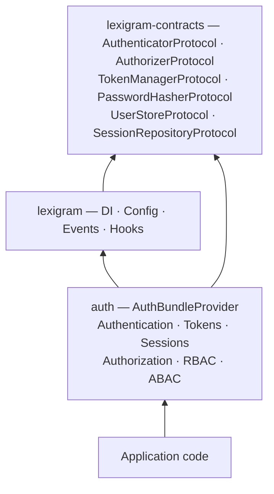
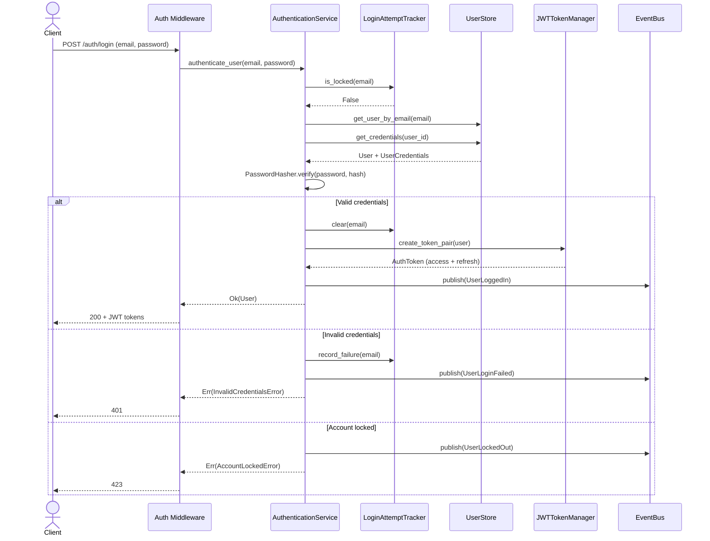
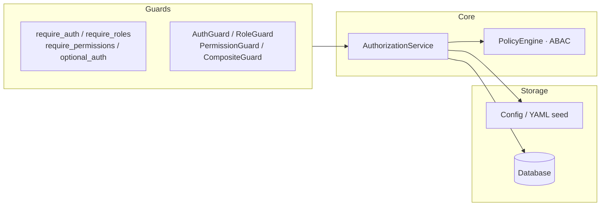
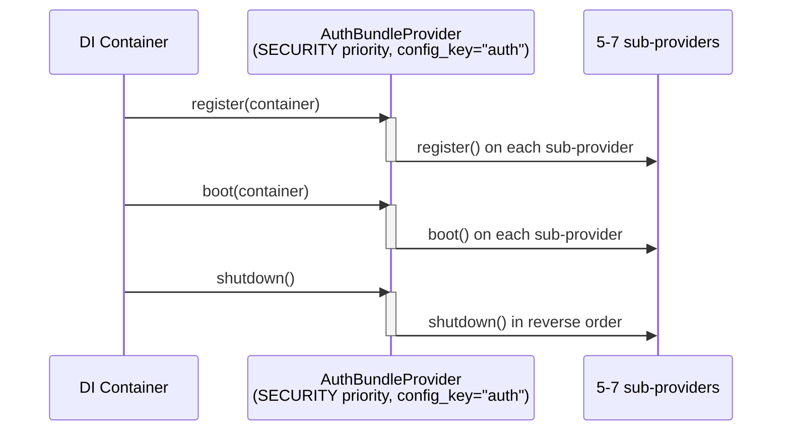

# Architecture

Internal design of the `lexigram-auth` package.

---

## Role in the System

`lexigram-auth` is the **security** layer, depending only on `lexigram` and `lexigram-contracts`. Other packages consume auth capabilities through protocols resolved from the DI container — never direct imports.



---

## Authentication Flow



**Timing-attack mitigation:** `PasswordHasher.verify()` always runs against a dummy hash for non-existent users, preventing user-enumeration.

---

## Authorization

Combines **RBAC** (role-based access control) with optional **ABAC** attribute-based policies.



Roles support **inheritance** and configurable permission caching (default 300s TTL):

```python
auth_service.set_roles({
    "admin": {"permissions": ["*"]},
    "editor": {"inherits": ["viewer"], "permissions": ["articles.write"]},
    "viewer": {"permissions": ["articles.read"]},
})
```

| Decorator / Guard | Purpose |
|-------------------|---------|
| `@require_auth()` | Requires valid authentication |
| `@require_roles("admin")` | Requires at least one role |
| `@require_permissions("write")` | Requires all listed permissions |
| `@optional_auth` | Populates user if present, never blocks |
| `AuthGuard` | GuardProtocol — requires authenticated user |
| `RoleGuard("admin")` | GuardProtocol — requires specific role |
| `PermissionGuard("write")` | GuardProtocol — requires specific permission |
| `CompositeGuard(*guards)` | AND-combination of multiple guards |

---

## Provider Lifecycle



| Sub-provider | Key Registrations |
|-------------|-------------------|
| `AuthenticationProvider` | `AuthenticationService`, `LoginAttemptTracker`, `PasswordHasherProtocol`, `UserStoreProtocol` |
| `TokenProvider` | `JWTTokenManager` — HS256/RS256, key rotation, blacklist, grace periods |
| `SessionProvider` | `SessionManagerImpl`, `SessionManagerProtocol` — `max_sessions_per_user` |
| `AuthorizationProvider` | `AuthorizationService`, `AuthorizerProtocol` — initial RBAC role seed |
| `AuthAdminProvider` | `AuthAdminContributor`, `PackageWidgetRenderer`, widget handlers |
| `GoogleOAuthProvider` | `GoogleOAuthService` — only when `oauth2_providers.google` configured |
| `PasskeyProvider` | WebAuthn passkey support — only when `enable_passkeys=True` |

---

## Module Structure

```
src/lexigram/auth/
├── __init__.py              # Lazy re-exports
├── module.py                # AuthModule — @module(is_global=True)
├── config.py                # AuthConfig, JWTConfig, RBACConfig, PasswordConfig, …
├── constants.py             # Token/session/MFA defaults
├── exceptions.py            # AuthError, AuthenticationError, TokenError, … (23 leaf types)
├── types.py                 # AuthStatus, UserStatus, RoleDefinition, TokenType, AuthResult
├── protocols.py             # TokenValidatorProtocol, IdentityResolverProtocol
├── events.py                # 11 domain events (UserLoggedIn, TokenRevoked, …)
├── hooks.py                 # 5 hook payloads (AuthTokenIssuedHook, …)
├── decorators.py            # @require_auth, @require_roles
│
├── models/                  # User, AuthToken, UserSession, MFARecoveryCode, APIKey
├── authn/                   # Authentication — AuthenticationService, JWTTokenManager,
│   │                        #   PasswordHasher, APIKeyAuthenticator, OAuth2, WebAuthn,
│   │                        #   SAML, LDAP, MFA, key rotation, token blacklist
│   ├── schemas/             # Pydantic request/response schemas
│   └── [...] (19 modules)
├── authz/                   # AuthorizationService, guards (5 modules)
├── session/                 # SessionManagerImpl, SessionCookieBackend, fingerprint
├── mfa/                     # MFAManager, TOTP lifecycle, recovery codes
├── policies/                # ABAC PolicyEngine, ConditionEvaluator, policy types
├── web/                     # AuthMiddleware, middleware chain, GuardProtocol guards
│   └── middleware/          # 8 middleware components (JWT, session, API key, throttle, …)
├── admin/                   # AuthAdminContributor, dashboard widgets, renderer
├── storage/                 # UserStore, SessionStore, OAuthIdentityStore implementations
├── services/                # Result-pattern auth service
├── cli/                     # CLI commands
└── di/                      # Provider registration
    ├── bundle_provider.py   # AuthBundleProvider
    ├── provider.py          # AuthProvider (legacy)
    └── sub_providers/       # 8 sub-providers
```

---

## Contracts Used

| Contract | Source | Purpose |
|----------|--------|---------|
| `AuthenticatorProtocol` | `contracts.auth.guard` | Authentication boundary |
| `AuthorizerProtocol` | `contracts.auth.guard` | Authorization boundary |
| `TokenManagerProtocol` | `contracts.auth.token` | Token lifecycle |
| `PasswordHasherProtocol` | `contracts.auth.protocols` | Password hashing |
| `PasswordPolicyProtocol` | `contracts.auth.protocols` | Password complexity |
| `LoginAttemptTrackerProtocol` | `contracts.auth.protocols` | Account lockout |
| `AuthProviderProtocol` | `contracts.auth.protocols` | Composite auth |
| `MFAManagerProtocol` | `contracts.auth.protocols` | Multi-factor auth |
| `IdentityResolverProtocol` | `contracts.auth.identity` | Token → user identity |
| `SessionRepositoryProtocol` | `contracts.auth.repositories` | Session persistence |
| `TokenBlacklistProtocol` | `contracts.auth.blacklist` | Token revocation |
| `UserStoreProtocol` | `contracts.auth.store` | Full user CRUD |
| `PolicyStoreProtocol` | `contracts.auth.policy` | ABAC policy storage |
| `CacheBackendProtocol` | `contracts.infra.cache` | Distributed state |
| `EventBusProtocol` | `contracts.events` | Domain events |
| `HookRegistryProtocol` | `contracts.core` | Lifecycle hooks |
| `AuditLoggerProtocol` | `contracts.audit` | Audit trails |

---

## Security Features

| Feature | Implementation | Configuration |
|---------|---------------|---------------|
| **JWT tokens** | HS256/RS256/PS256, configurable expiry, audience, key rotation | `JWTConfig` |
| **Token blacklist** | `JWTBlacklist` — in-process + optional `CacheBackendProtocol` | Auto-enabled with cache |
| **Key rotation** | `JWTKeyStore` — multiple keys, grace period (default 3600s) | `key_rotation_grace_period` |
| **Token binding** | SHA-256 hash of IP/fingerprint bound to token | `TokenBindingConfig` |
| **Password hashing** | Argon2id via `KeyDerivationProtocol` | `PasswordConfig` |
| **Account lockout** | Rolling window, configurable threshold + duration | `LockoutConfig` |
| **Rate limiting** | Auth middleware throttle | `login_rate_limit` |
| **Session management** | Device-aware sessions, optional max per user | `max_sessions_per_user` |
| **MFA (TOTP)** | RFC 6238 — enroll, verify, recovery codes | TOTP defaults (6 digits, 30s) |
| **WebAuthn / Passkeys** | EC P-256 challenge-response, sign-counter | `enable_passkeys=True` |
| **OAuth2 / OIDC** | Authlib-based, any provider | `oauth2_providers` dict |
| **Google OAuth** | First-class JWKS / tokeninfo verification | `oauth2_providers.google` |
| **SAML / LDAP** | SAML + LDAP auth support | Config sections |
| **API keys** | Header or query param lookup | `APIKeyConfig` |

---

## Exception Convention

```mermaid
flowchart LR
    subgraph Contracts
        AE[AuthError · 001]
        TE[TokenError · 002]
        VE[VerificationError · 003]
    end
    subgraph Package
        AUTHERR[AuthenticationError · 005]
        AUTHZERR[AuthorizationError · 006]
        ICE[InvalidCredentialsError · 007]
        ALE[AccountLockedError · 008]
        UNFE[UserNotFoundError · 009]
        TE2[TokenError · 010] --> ITE[InvalidToken · 011]
        TE2 --> TEE[TokenExpired · 012]
        TE2 --> TBE[Blacklisted · 013]
        TE2 --> TIE[Invalid · 014]
        TE2 --> TAE[Audience · 015]
        TE2 --> TNTE[NotFound · 016]
        EEE[EmailExistsError · 022]
        PPE[PasswordPolicyError · 024]
        O2E[OAuth2Error · 025]
    end
    Contracts --> Package
```



**Rules:** `AuthError` (contracts) is the catch-all. `TokenError`/`VerificationError` are expected, recoverable — use `Result`. Leaf exceptions (23 total, all with `LEX_ERR_AUTH_*` codes) live in `lexigram.auth.exceptions`. Infrastructure failures propagate as exceptions, never wrapped in `Result`.

---

## DI Registration

```python
# AuthModule.configure(config) → AuthBundleProvider registers sub-providers
container.singleton(PasswordHasherProtocol, hasher)
container.singleton(UserStoreProtocol, user_store)
container.singleton(AuthenticationService, service)
container.singleton(JWTTokenManager, token_manager)
container.singleton(SessionManagerProtocol, session_mgr)
container.singleton(AuthorizerProtocol, auth_service)

# Module exports (resolvable by consumers):
# AuthenticatorProtocol, AuthorizerProtocol, TokenManagerProtocol,
# PasswordHasherProtocol, AuthAdminContributor, PackageWidgetRenderer,
# ActiveSessionsWidgetHandler, FailedLoginsWidgetHandler,
# TokenRefreshRateWidgetHandler
```

---

## Extension Points

| Point | Mechanism |
|-------|-----------|
| Custom auth backend | Implement `AuthenticatorProtocol` and register with higher priority |
| Custom token format | Implement `TokenManagerProtocol` (e.g., opaque tokens) |
| Custom user store | Implement `UserStoreProtocol` / `UserReaderProtocol` / `UserWriterProtocol` |
| Custom authorization | Implement `AuthorizerProtocol` — override RBAC with custom logic |
| Custom identity resolver | Implement `IdentityResolverProtocol` |
| OAuth2 providers | Add configs in `oauth2_providers` section |
| MFA methods | Implement `MFAManagerProtocol` |
| WebAuthn passkeys | Set `enable_passkeys=True` |
| Event hooks | Subscribe to `AuthTokenIssuedHook`, `AuthTokenRevokedHook`, `AuthUserAuthenticatedHook` |
| Domain events | Subscribe via `EventBusProtocol` — `UserLoggedIn`, `UserLockedOut`, `TokenRevoked`, etc. |
| Admin widgets | Register via `AuthAdminContributor` |
| Custom password policy | Implement `PasswordPolicyProtocol` |
| Cache backend | Inject `CacheBackendProtocol` for distributed lockout/blacklist |
| Audit logger | Inject `AuditLoggerProtocol` |
