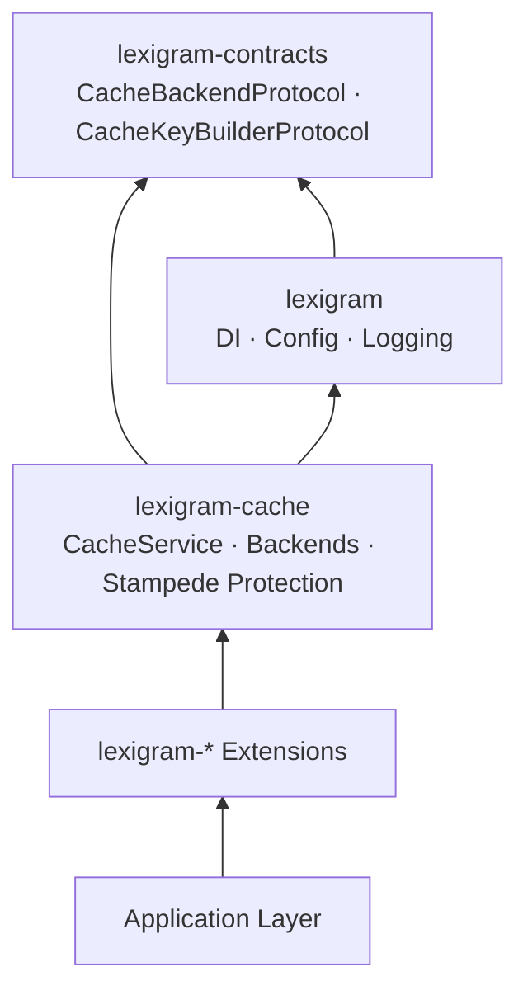
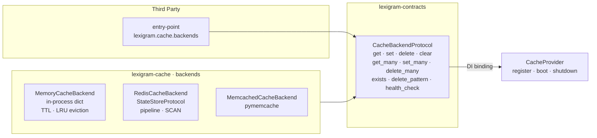
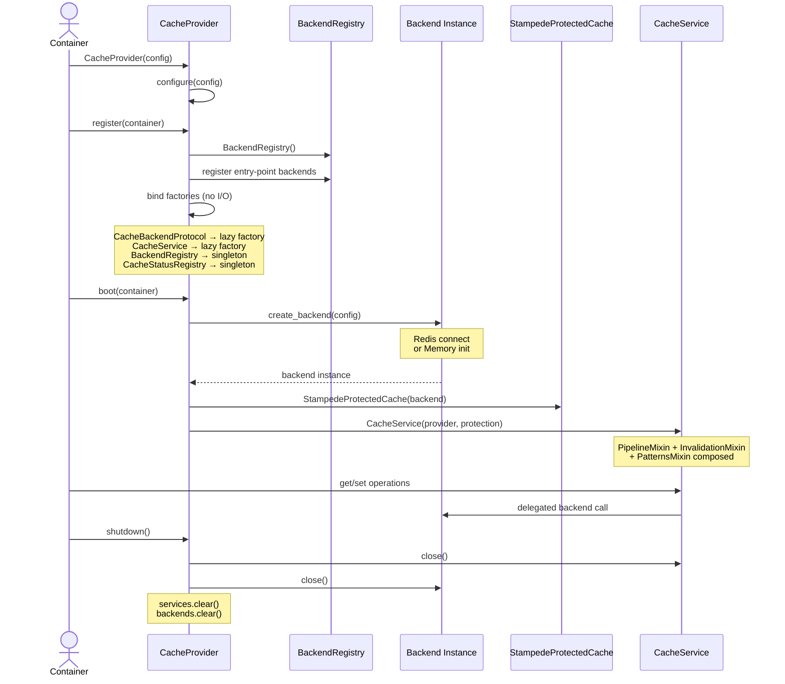

# Architecture

Internal design of the `lexigram-cache` package.

---

## Role in the System

`lexigram-cache` is the **caching abstraction layer** in the Lexigram framework. It depends only on `lexigram` and `lexigram-contracts`. Other packages consume caching through `CacheBackendProtocol` resolved via the DI container — never through direct imports.



**Import direction:** Arrows point toward the dependency. Services depend on protocols from contracts; backends implement those protocols. The cache provider wires both sides through the container.

---

## Backend Abstraction

All cache backends implement `CacheBackendProtocol` from `lexigram-contracts`. Operations return `Result[T, CacheError]` — backend errors are signalled via `Err` rather than exceptions, letting callers decide how to handle failures.



### Backend Selection

Backends are configured via `CacheConfig.backends`. Each backend specifies a `name`, `type` (memory / redis / memcached), and `default` flag. The provider registers an unnamed `CacheBackendProtocol` singleton for the default backend and named singletons for all enabled backends:

```python
container.singleton(CacheBackendProtocol, factory=lambda: self.get_backend(None))
container.singleton(CacheBackendProtocol, factory=lambda n=name: self.get_backend(n), name=name)
```

---

## Cache Operations

`CacheService` is the main high-level API. It composes three mixins:

| Class | Source | Adds |
|-------|--------|------|
| `CacheService` | `core.py` | `get`, `set`, `delete`, `exists`, `clear`, `delete_pattern`, `get_typed`, health check |
| `PipelineMixin` | `pipeline.py` | `get_many`, `set_many`, `delete_many` |
| `InvalidationMixin` | `invalidation.py` | `set_with_tags`, `invalidate_by_tag` |
| `PatternsMixin` | `patterns.py` | `get_or_set`, `get_or_compute`, `get_or_set_result`, `remember` |

### Key Behaviours

- **TTL jitter:** `set()` applies ±10% random jitter to spread expiry times and reduce thundering-herd risk.
- **Fast path:** Primitive values (`str`, `int`, `float`, `bool`) are stored directly without serialization round-trip.
- **Namespace scoping:** Keys can be request-scoped via `request_scoped=True`, which prepends `req:<request_id>:` to the key.
- **Error handling:** Backend errors are caught (`RuntimeError`, `OSError`, `ConnectionError`, etc.) and logged; `get` returns `default`, `set`/`delete` return `False`.
- **Metrics:** Every operation updates an in-memory counter (`hits`, `misses`, `errors`, `operations`). Exposed via `get_metrics()` and `reset_metrics()`.

```python
cache = container.resolve(CacheService)

await cache.set("user:42", profile, ttl=300)
profile = await cache.get("user:42", default=None)
await cache.delete("user:42")

batch = await cache.get_many(["a", "b", "c"])
await cache.set_many({"x": 1, "y": 2}, ttl=60)

# Tag-based invalidation
await cache.set_with_tags("pet:1", pet, tags=["user:42"])
await cache.invalidate_by_tag("user:42")

# Type-safe access
count = await cache.get_typed("counter", type_=int, default=0)
```

---

## Stampede Protection

Two complementary mechanisms prevent cache stampedes (thundering-herd problems):

### 1. TTL Jitter (Built Into CacheService)

`_add_ttl_jitter()` applies ±10% random variation to every TTL, spreading out natural expiry times so multiple keys don't expire simultaneously.

### 2. Single-Flight Pattern (StampedeProtectedCache)

`StampedeProtectedCache` wraps a `CacheBackendProtocol` (injected via `@inject`) and implements single-flight coalescing:

```mermaid
flowchart TD
    R1[Request A<br/>get_or_compute(key)]
    R2[Request B<br/>get_or_compute(key)]
    R3[Request C<br/>get_or_compute(key)]
    STAMP[StampedeProtectedCache]
    CACHE[Cache Backend]
    COMPUTE[Compute Function]

    R1 --> STAMP
    R2 --> STAMP
    R3 --> STAMP

    STAMP -->|try cache| CACHE
    CACHE -->|miss| STAMP
    STAMP -->|acquire lock| STAMP
    STAMP -->|double-check cache| CACHE
    CACHE -->|still miss| STAMP
    STAMP -->|single flight task| COMPUTE
    COMPUTE -->|value| STAMP
    STAMP -->|store + return| R1
    STAMP -->|return same| R2
    STAMP -->|return same| R3
```

Key implementation details:

| Mechanism | How It Works |
|-----------|--------------|
| **In-process lock** | `asyncio.Lock` per key via `WeakValueDictionary` — concurrent requests for the same key serialize |
| **Double-check** | After acquiring the lock, re-checks cache (another request may have filled it) |
| **Single-flight task** | One `asyncio.Task` per key; subsequent requests `await` the same task |
| **XFetch early refresh** | Probabilistic early refresh: the closer to expiry, the higher the probability a request refreshes before the key expires |

```python
from lexigram.cache.service.stampede import StampedeProtectedCache

protected = StampedeProtectedCache(backend, lock_timeout=10)

# Only one compute call per key, regardless of concurrent requests
result = await protected.get_or_compute(
    key="expensive:data",
    compute=load_data_from_db,
    ttl=300,
    ttl_jitter=0.2,
)
```

### XFetch Algorithm

When `ttl_jitter > 0`, `StampedeProtectedCache` applies probabilistic early refresh (XFetch). A request that finds a cached but partially-stale entry will refresh it with probability proportional to how close it is to expiry:

```
staleness = 1.0 - (time_left / ttl)
refresh if random() < staleness   # higher probability near expiry
```

---

## Provider Lifecycle



### Provider Configuration

```python
class CacheProvider(Provider):
    name = "cache"
    priority = ProviderPriority.INFRASTRUCTURE  # 10
    config_key = "cache"                         # LEX_CACHE__* env vars
```

| Phase | Action | I/O? |
|-------|--------|------|
| `__init__` | Store config, initialize serializers | No |
| `register()` | Bind lazy factories, discover entry-point backends, register admin components | No |
| `boot()` | Create backends (open connections), wire stampede protection, create services, register admin hooks | Yes |
| `shutdown()` | Close services → close backends → clear state | Yes |

---

## Contracts Used

| Contract | Source | Purpose |
|----------|--------|---------|
| `CacheBackendProtocol` | `lexigram.contracts.infra.cache` | Primary backend interface: `get`, `set`, `delete`, `clear`, `exists`, `get_many`, `set_many`, `delete_many`, `delete_pattern`, `health_check` |
| `CacheKeyBuilderProtocol` | `lexigram.contracts.infra.cache` | Key construction and namespace management |
| `CacheProtectionStrategyProtocol` | `lexigram.contracts.infra.cache` | Stampede protection contract |
| `CacheProviderProtocol` | `lexigram.contracts.infra.cache` | Provider self-reference for DI resolution |
| `CacheHealthCheckerProtocol` | `lexigram.contracts.infra.cache` | Backend health checks |
| `StateStoreProtocol` | `lexigram.contracts.infra` | Low-level key-value store (Redis backends) |
| `AsyncStringSerializerProtocol` | `lexigram.contracts.core.serialization` | Serialization interface (JSON, Pickle, Msgpack) |
| `SemanticCacheProtocol` | `lexigram.contracts.ai.llm` | Semantic caching (optional, requires faiss) |
| `EmbeddingClientProtocol` | `lexigram.contracts.ai.llm` | Embedding generation for semantic caching |
| `HealthCheckResult` | `lexigram.contracts.core` | Structured health check type |
| `HookRegistryProtocol` | `lexigram.contracts.core` | Lifecycle hook emission |

---

## Extension Points

| Point | Mechanism |
|-------|-----------|
| Custom backend | Implement `CacheBackendProtocol`, register via `lexigram.cache.backends` entry point |
| Custom serializer | Implement `AsyncStringSerializerProtocol` |
| Custom cache key builder | Implement `CacheKeyBuilderProtocol` |
| Custom stampede strategy | Implement `CacheProtectionStrategyProtocol` |
| Named multi-backend | Add entries to `CacheConfig.backends` with unique `name` |
| Cache status handler | Implement `CacheStatusHandler`, register with `CacheStatusRegistry` |
| Cache warmer | Subclass or configure `CacheWarmer` |
| Semantic caching | Install `faiss`, provide `EmbeddingClientProtocol` |
| Cacheable decorator | Use `@cacheable` from `decorators.py` |
| Repository caching | Use `CacheRepository` from `repository/` with invalidation observer pattern |
| Admin widgets | Registered via `CacheAdminContributor`; extend with custom handlers |
| Operator CLI | Extend the `lexigram cache` CLI commands |
| Hooks | Register `HookRegistryProtocol` action handlers (`cache.hit`, `cache.miss`, `cache.evicted`) |

### Backend Registration via Entry Points

Third-party backends self-register using the `lexigram.cache.backends` entry point group. During `register()` the provider scans this group and calls each provider's `register()` method:

```python
# pyproject.toml
[project.entry-points."lexigram.cache.backends"]
my_backend = "my_package:MyBackendProvider"
```

Each entry point must resolve to a `Provider` subclass. The provider handles container bindings for its backend; the CacheProvider's `boot()` never references third-party types directly.
