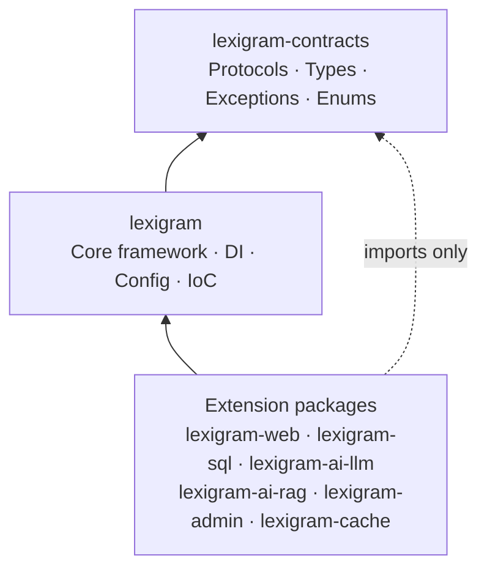
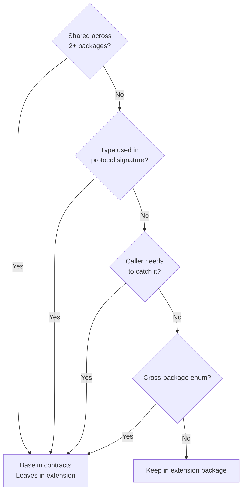
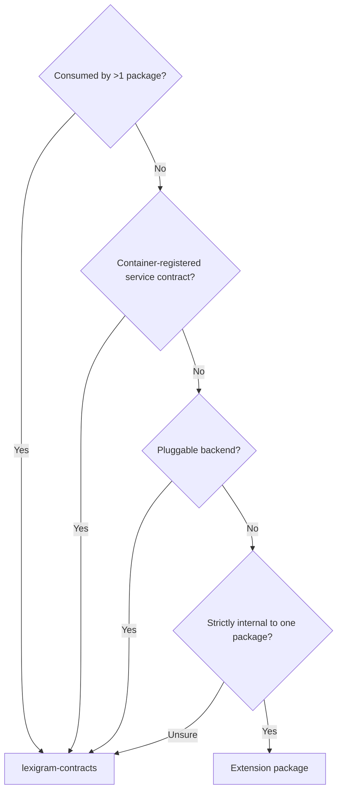
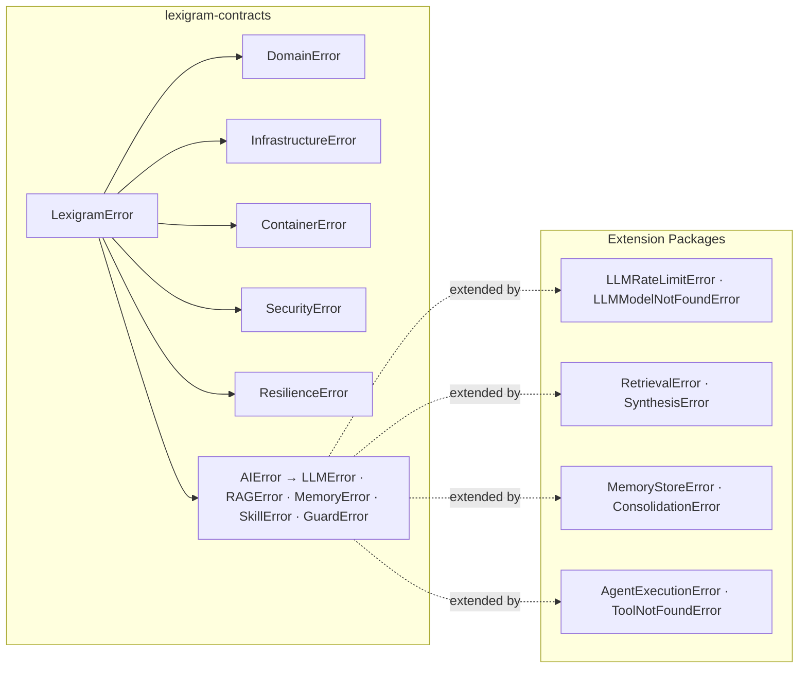

# Architecture

Internal design of the `lexigram-contracts` package.

---

## Role in the System

`lexigram-contracts` is the **zero-dependency foundation layer** of the Lexigram ecosystem. Every protocol, shared value type, base exception, and cross-package enum lives here.



**Zero-dependency rule:** only Python stdlib — no ecosystem imports.

```python
from typing import Protocol   # ✅ stdlib
from dataclasses import dataclass
from enum import Enum
# from pydantic import BaseModel   # ❌ transitive deps on every consumer
```

---

## The Golden Rule

> **If two or more packages need to reference the same type, protocol, or exception, it lives in `lexigram-contracts`. No exceptions.**



A type crossing extension boundaries must be **moved to contracts**.

---

## Organization by Domain

Protocols, types, and exceptions are organized by **domain**, not by package name. Each domain directory follows a consistent structure:

| File | Purpose |
|------|---------|
| `protocols.py` | Protocol definitions (interfaces) |
| `types.py` | Shared value types (dataclasses, type aliases) |
| `errors.py` | Base exception classes |
| `__init__.py` | Re-exports for ergonomic importing |

| Domain | Key Contents |
|--------|-------------|
| `core/` | `Result[T,E]`, `ContainerProtocol`, `ProviderProtocol`, `HealthCheckResult`, `ClockProtocol`, `ConfigProtocol`, `ServiceScope`, `Lifecycle` |
| `ai/` | `LLMClientProtocol`, `ChatMessage`, `Role`, `TokenUsage`, `MemoryStoreProtocol`, `RAGPipelineProtocol`, `AIError` hierarchy, `SkillProtocol`, `EmbeddingClientProtocol` |
| `data/` | `DatabaseProviderProtocol`, `RepositoryProtocol`, `VectorStoreProtocol`, `UnitOfWorkProtocol`, `SQLDialect` |
| `exceptions/` | `LexigramError`, `DomainError`, `InfrastructureError`, `ContainerError`, `SecurityError`, `ResilienceError`, `ProviderError` |
| `domain/` | `AggregateRootProtocol`, `DomainEvent`, `SpecificationProtocol`, `CursorPage` |
| `events/` | `EventBusProtocol`, `CommandBusProtocol`, `EventHandlerProtocol`, `EventStoreProtocol` |
| `auth/` | `TokenManagerProtocol`, `PasswordHasherProtocol`, `AuthorizerProtocol` |
| `infra/` | `CacheBackendProtocol`, `TaskQueueProtocol`, `BlobStoreProtocol`, `CircuitBreakerConfig` |
| `security/` | `HasherProtocol`, `KeyDerivationProtocol`, `SecretStoreProtocol` |
| `tenancy/` | `TenantResolverProtocol`, `TenantInfo`, `TenantStatus` |
| `web/` | `CORSPolicyProtocol`, `ErrorDetail`, `ErrorResponseDTO` |
| `mcp/` | `MCPServerProtocol`, `MCPTransportProtocol`, `MCPError` |
| `workflow/` | `SagaProtocol`, `SagaManagerProtocol`, `WorkflowNodeProtocol` |
| `notification/`, `queue/`, `webhook/`, `cli/`, `feature_flags/`, `lifecycle/`, `observability/`, `mapping/`, `search/`, `graphql/`, `mailer/`, `codegen/`, `admin/`, `lib/` | Smaller domains, each with protocols and types |

---

## Protocol Placement

Protocols define service boundaries. Their placement determines the entire dependency graph.



**Prohibited:** same protocol in two files (import collision), extension protocol consumed by another extension (cross-import), protocol with implementation (interfaces only), `protocols.py` containing dataclasses (separate types).

---

## Value Type Placement

Value types appear in function signatures framework-wide.

### In Contracts

| Type | Location | Consumed By |
|------|----------|-------------|
| `ChatMessage`, `Role`, `Completion`, `TokenUsage` | `ai/llm.py` | llm, agents, rag, memory, prompt |
| `Document`, `SearchResult` | `data/vector/` | rag, vector, memory |
| `MemoryEntry`, `MemoryQuery` | `ai/memory.py` | memory, agents |
| `AgentResponse` | `ai/types.py` | agents, ai |
| `SkillDefinition`, `SkillResult` | `ai/skills.py` | skills, agents |
| `ModelRequest`, `ModelResponse` | `ai/models.py` | llm, rag, routing |
| `HealthCheckResult` | `core/health.py` | every provider |
| `DomainEvent` | `domain/events.py` | events, all aggregates |
| `Result[T, E]`, `Ok`, `Err` | `core/result.py` | every package |
| `TenantInfo`, `TenantStatus` | `tenancy/` | every multi-tenant package |

### Stay in Extension Packages

| Type | Location | Reason |
|------|----------|--------|
| `ConversationStats` | `lexigram-ai-llm` | LLM conversation management only |
| `PlanStep` | `lexigram-ai-agents` | Plan-and-execute internal |
| `Chunk`, `PipelineContext` | `lexigram-ai-rag` | RAG implementation internals |
| `CacheEntry`, `CacheStats` | `lexigram-cache` | Cache internals |
| Package config classes | Each package | Package-specific configuration |

---

## Exception Hierarchy

Two-level hierarchy: **base** exceptions in contracts, **leaf** exceptions in extension packages.



```python
# Catch in contracts — no extension import needed
from lexigram.contracts.ai import AIError

try:
    result = await llm.generate(prompt)
except AIError as e:
    logger.warning("llm_failed", error=str(e))

# Specific leaf — import the extension
from lexigram_ai_llm.exceptions import LLMRateLimitError
```

| Rule | Rationale |
|------|-----------|
| Base exceptions in contracts | Callers catch at domain boundary without importing extensions |
| Leaf exceptions in extension packages | Specific to one implementation |
| No exception defined in two places | One definition, one import path |

---

## Enum Placement

Every enumeration uses `class X(str, Enum):` — never bare string constants.

```python
class Role(str, Enum):   # ✅
    SYSTEM = 'system'
class Role:              # ❌ not a real enum
    SYSTEM = 'system'
```

### Enums in Contracts

| Enum | Location | Used By |
|------|----------|---------|
| `Role` | `ai/llm.py` | llm, agents, rag, memory, prompt |
| `ServiceScope` | `core/scopes.py` | every DI-capable package |
| `ProviderPriority` | `core/provider.py` | every provider |
| `HealthStatus` | `core/health.py` | every package |
| `Environment` | `core/config.py` | every package |
| `SQLDialect` | `data/sql/` | db, search |
| `TenantStatus` | `tenancy/` | multi-tenant extensions |
| `JobStatus` | `infra/tasks.py` | task systems |
| `FlagType` | `feature_flags/` | feature flag consumers |

---

## No-Duplication Rule

> **Every protocol, type, exception, and enum has exactly ONE definition in the entire monorepo.**

If a name exists in `lexigram-contracts`, no extension package may redefine it. Re-export aliases (`ai/vector.py` → `data/vector/protocols.py`) are permitted for ergonomic imports — simple re-exports only, no added logic.

---

## File Organization

Canonical source tree layout:

```
lexigram-contracts/src/lexigram/contracts/
├── __init__.py              # Lazy imports, all public API
├── core/                    # DI, Result, provider, health, clock, identity, locks
│   ├── constants.py         # ENV_PREFIX, __version__, EP_* discovery groups
│   ├── config.py            # ConfigProtocol, Environment
│   ├── di.py                # ContainerRegistrarProtocol, ContainerResolverProtocol
│   ├── result.py            # Result[T,E], Ok, Err
│   ├── provider.py          # ProviderPriority, ProviderProtocol
│   ├── health.py            # HealthCheckResult, AggregateHealthResult, HealthStatus
│   ├── clock.py             # ClockProtocol
│   ├── identity.py          # IdGeneratorProtocol, IdStrategy
│   ├── lock.py              # AsyncLockProtocol, DistributedLockProtocol
│   ├── scopes.py            # ServiceScope
│   └── ...
├── ai/                      # LLM, memory, RAG, skills, guards, routing, models
│   ├── exceptions.py        # AIError, LLMError, RAGError, MemoryError, SkillError (bases)
│   ├── llm.py               # ChatMessage, Role, Completion, TokenUsage, LLMClientProtocol
│   ├── memory.py            # MemoryStoreProtocol, MemoryEntry, MemoryQuery
│   ├── skills.py            # SkillProtocol, SkillDefinition, SkillResult
│   ├── rag.py               # RAGPipelineProtocol, ChunkProtocol
│   ├── guards.py            # GuardPipelineProtocol, InputGuardProtocol
│   ├── vector.py            # Re-exports from data/vector/
│   └── models.py            # ModelRequest, ModelResponse
├── data/                    # Database protocols, vector store, SQL, repositories
│   ├── protocols.py         # DatabaseProviderProtocol, RepositoryProtocol
│   ├── vector/protocols.py  # VectorStoreProtocol, VectorCollectionProtocol
│   ├── vector/types.py      # SearchResult
│   └── sql/sql_dialect.py   # SQLDialect enum
├── exceptions/              # Full exception hierarchy
│   ├── base.py              # LexigramError
│   ├── domain.py            # DomainError, NotFoundError, ValidationError
│   ├── infra.py             # InfrastructureError, DatabaseError
│   ├── container.py         # ContainerError, CircularDependencyError
│   ├── provider.py          # ProviderError, ModuleError
│   ├── security.py          # SecurityError, GuardDeniedError
│   ├── resilience.py        # ResilienceError, CircuitBreakerError
│   └── events.py            # EventError, HandlerNotFoundError
├── domain/                  # Aggregates, events, pagination, specification
├── events/                  # EventBus, CommandBus, EventHandler protocols
├── auth/                    # TokenManager, PasswordHasher, Authorizer protocols
├── security/                # Hasher, KeyDerivation, SecretStore protocols
├── tenancy/                 # TenantResolver, TenantInfo, TenantStatus, tenant errors
├── web/                     # CORS, ErrorDetail, ErrorResponseDTO
├── infra/                   # Cache, tasks, storage, state, resilience configs
├── mcp/                     # MCP server/transport protocols, MCPError
├── workflow/                # Saga, SagaManager, WorkflowNode protocols
└── (notification, queue, webhook, feature_flags, cli,
     observability, lifecycle, mapping, search, graphql, mailer,
     codegen, admin, lib)    # Smaller domain subdirectories, each with protocols + types
```

---

## Lifecycle

No runtime lifecycle. Protocols and types are defined at import time.

---

## Extension Points

- **New protocol** → add `protocols.py` under the domain directory
- **New shared type** → add dataclass/enum to domain's `types.py`
- **New base exception** → add to domain's `errors.py`
- **Re-export path** → simple alias for ergonomic imports
- **New domain** → new top-level directory for an emerging subsystem

### Decision Table

| Item | Contracts? |
|------|-----------|
| Protocol used by 2+ packages | Yes |
| Dataclass in a protocol signature | Yes |
| Base exception for callers to catch | Yes (leaf → extension) |
| Cross-package enum | Yes |
| Pluggable backend protocol | Yes |
| Internal helper class | No |
