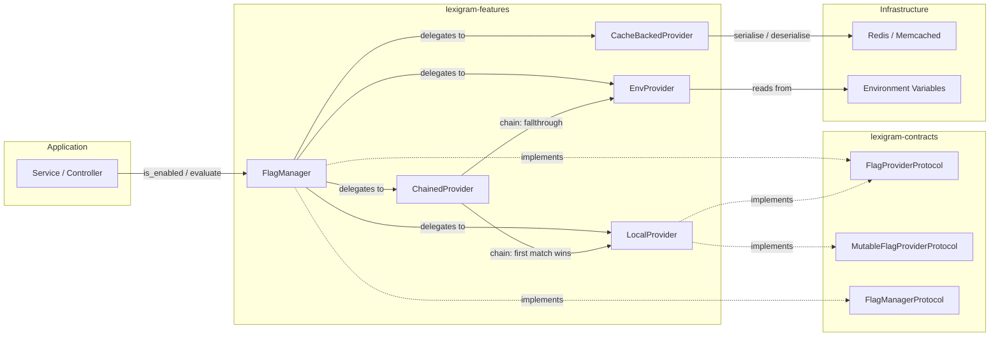
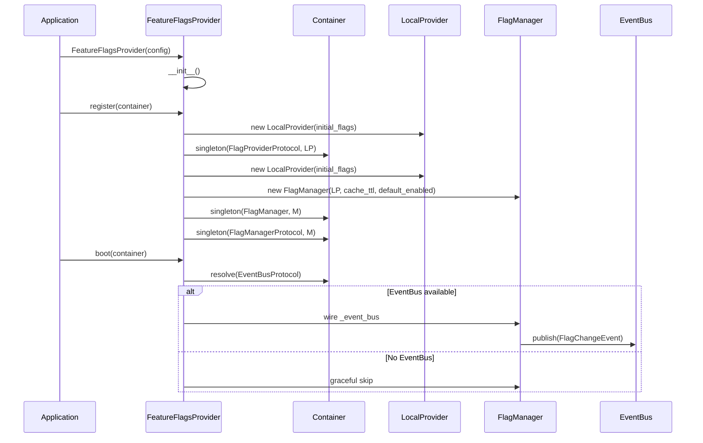

# Architecture

Internal design of the `lexigram-features` package.

---

## Role in the System



`lexigram-features` provides feature-flag evaluation for the Lexigram Framework. It sits in the infrastructure layer, available to every package and service via `FlagProviderProtocol`. The `FlagManager` is the primary entry point — it wraps any `AbstractFlagProvider`, adds TTL caching, runtime overrides, change listeners, audit logging, and optional event-bus integration.

---

## Feature Flag Model

### Flag Types

```python
class FlagType(StrEnum):
    BOOLEAN = "boolean"            # Simple on/off
    PERCENTAGE = "percentage"      # Gradual rollout (0–100)
    USER_LIST = "user_list"        # Explicit user-ID allowlist
    USER_ATTRIBUTE = "user_attribute"  # Attribute-key matching
    TIME_BASED = "time_based"      # Time-window activation
    VARIANT = "variant"            # A/B test with weighted variants
```

### Flag Definition

A `Flag` dataclass carries the evaluation strategy and its parameters:

| Field | Type | Used By |
|-------|------|---------|
| `name` | `str` | All types |
| `type` | `FlagType` | All — determines dispatch |
| `enabled` | `bool` | Master switch (all types short-circuit here) |
| `percentage` | `int` | `PERCENTAGE` — rollout bucket (0–100) |
| `user_list` | `list[str]` | `USER_LIST` — allowed user IDs |
| `user_attributes` | `dict[str, Any]` | `USER_ATTRIBUTE` — required K/V pairs |
| `start_time` / `end_time` | `datetime \| None` | `TIME_BASED` — active window |
| `variants` | `dict[str, int]` | `VARIANT` — name → weight (must sum to 100) |
| `default_variant` | `str` | `VARIANT` — fallback when no context |

### Evaluation Flow

```mermaid
flowchart TD
    E[evaluate(name, context)]
    E --> F{Flag exists?}
    F -->|No| NF[enabled=False<br/>reason=flag_not_found]
    F -->|Yes| M{enabled=True?}
    M -->|No| DS[enabled=False<br/>reason=flag_disabled]
    M -->|Yes| T{Dispatch on FlagType}
    T -->|BOOLEAN| B[Return flag.enabled]
    T -->|PERCENTAGE| P[Hash user_id:name<br/>bucket < percentage?]
    T -->|USER_LIST| UL[user_id in flag.user_list?]
    T -->|USER_ATTRIBUTE| UA[All attr K/V match?]
    T -->|TIME_BASED| TB[now in [start, end]?]
    T -->|VARIANT| V[Hash-weighted<br/>variant assignment]
```

Percentage and variant evaluation use deterministic MD5 hashing (`user_id:flag_name`) so each user gets a stable assignment per flag across requests. Variant weights define cumulative bucket ranges — the hash lands in exactly one range.

---

## Provider Lifecycle



The `FeatureFlagsProvider` (priority `INFRASTRUCTURE`) seeds a `LocalProvider` from `config.initial_flags` and wraps it in a `FlagManager`. The manager's `boot()` phase optionally wires an `EventBusProtocol` so that runtime override changes emit `FlagChangeEvent` domain events.

---

## Backend Support

| Backend | Class | Persistence | Evaluation | Best For |
|---------|-------|-------------|------------|----------|
| In-memory | `LocalProvider` | Dict (process-local) | Full (all types, sync/async) | Default, dev, single-node |
| Environment | `EnvProvider` | `os.environ` | Full (parsed on read) | CI/CD toggles, config-as-code |
| Cache-backed | `CacheBackendFlagProvider` | Redis / Memcached | Boolean only (returns `enabled`) | Distributed flag storage |
| Chained | `ChainedProvider` | Layer of providers | First-match wins | Env overrides on top of code defaults |

`LocalProvider` and `EnvProvider` extend `AbstractFlagProvider` which provides the shared evaluation logic. `CacheBackendFlagProvider` wraps `CacheBackendProtocol` (no shared evaluation — it stores/retrieves `Flag` definitions as JSON and delegates per-type evaluation elsewhere). `ChainedProvider` composes multiple providers with priority ordering.

### Cache-Backed Limitations

`CacheBackendFlagProvider.list_flags()` returns an empty list because the standard `CacheBackendProtocol` does not expose a key-scan API. Applications that need full flag enumeration alongside a cache backend should maintain a separate index or combine with `LocalProvider` via `ChainedProvider`.

---

## Contracts Used

From `lexigram-contracts` (`lexigram.contracts.feature_flags`):

| Contract | Purpose |
|----------|---------|
| `FlagProviderProtocol` | Read-only flag evaluation — `get_flag()`, `get_flag_sync()`, `get_variant()`, `get_variant_sync()` |
| `MutableFlagProviderProtocol` | Read-write extension — adds `set_flag()`, `set_flag_sync()`, `set_variant()`, `set_variant_sync()` |
| `FlagManagerProtocol` | Manager contract — `is_enabled()`, `evaluate()`, `get_value()`, `get_all_flags()`, `add_provider()` |
| `FlagEvaluation` | Frozen dataclass — `key`, `value`, `flag_type`, `reason`, `variant`, `metadata` |
| `FlagType` | StrEnum — `BOOLEAN`, `PERCENTAGE`, `USER_LIST`, `USER_ATTRIBUTE`, `TIME_BASED`, `VARIANT` |
| `FlagValue` | `bool \| str \| float` — evaluation result type alias |
| `FeatureFlagError` | Base exception (in `contracts.exceptions.feature_flags`) |

The package's `protocols.py` re-exports all three protocols so consumers may import from `lexigram.features` rather than `lexigram.contracts.feature_flags`.

---

## Extension Points

| Point | Interface / Base | Default | Customise By |
|-------|-----------------|---------|--------------|
| Flag backend | `AbstractFlagProvider` / `FlagProviderProtocol` | `LocalProvider` | Subclass `AbstractFlagProvider`, implement `get_flag_definition()` / `get_all_flags()` |
| Caching layer | `CacheBackendFlagProvider` + `CacheBackendProtocol` | — | Wrap any `CacheBackendProtocol` (Redis, Memcached, in-memory) |
| Provider chaining | `ChainedProvider` | — | Layer env overrides on code defaults with priority ordering |
| Runtime overrides | `FlagManager.enable()` / `disable()` | — | Force-enable/disable at runtime without modifying provider |
| Change listeners | `FlagChangeListener` / `AsyncFlagChangeListener` | — | Register via `manager.add_listener()` / `add_listener_sync()` |
| Event bus | `EventBusProtocol` | None (graceful skip) | Register `EventBus` in container; `FlagChangeEvent` published automatically |
| Audit log | `FlagAuditEntry` | In-memory list | Read via `manager.get_audit_log()` for compliance |
| Decorator guard | `@feature_flag` / `@require_flag` | — | Decorate async functions with a flag name + optional fallback |

### Custom Evaluation Strategy

To add a new `FlagType`:

1. Add the enum variant to `FlagType` (in contracts, then re-exported).
2. Add an `_evaluate_<strategy>()` method to `AbstractFlagProvider`.
3. Add the dispatch entry in `_evaluate_flag()`.
4. Add the relevant fields to the `Flag` dataclass (if the strategy needs parameters).

The evaluation method receives a `Flag` and `FlagContext` and returns a `FlagEvaluation`.
