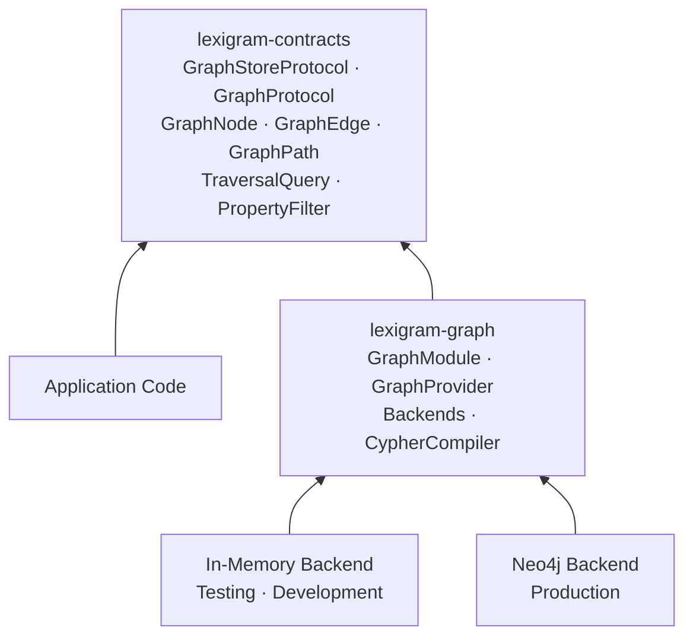
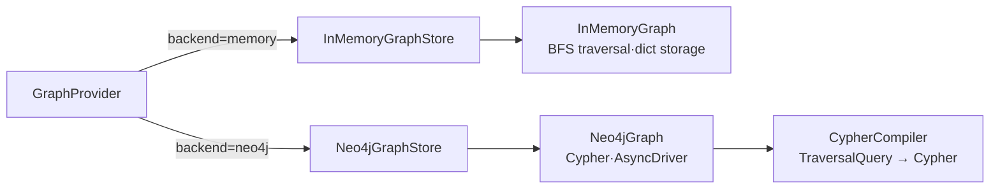
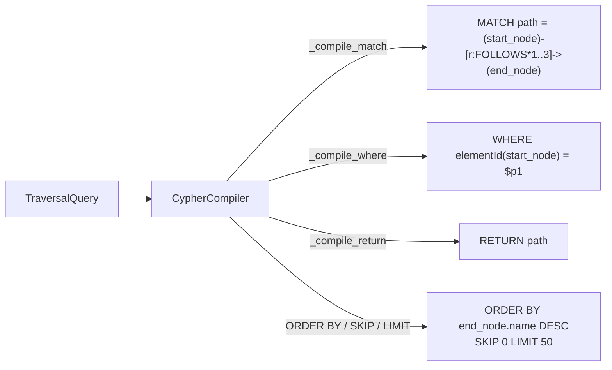
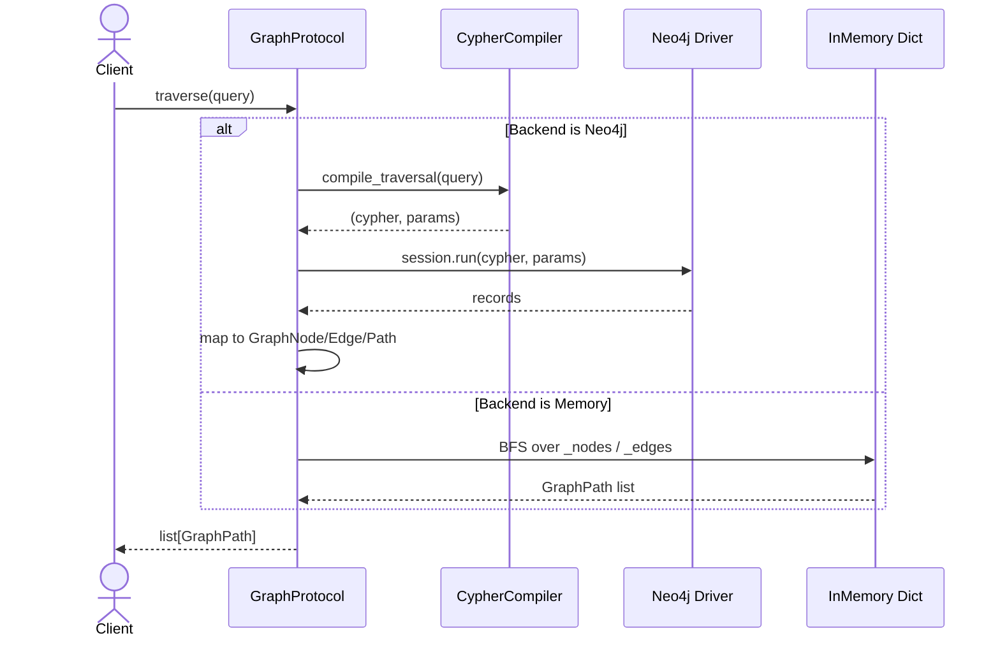
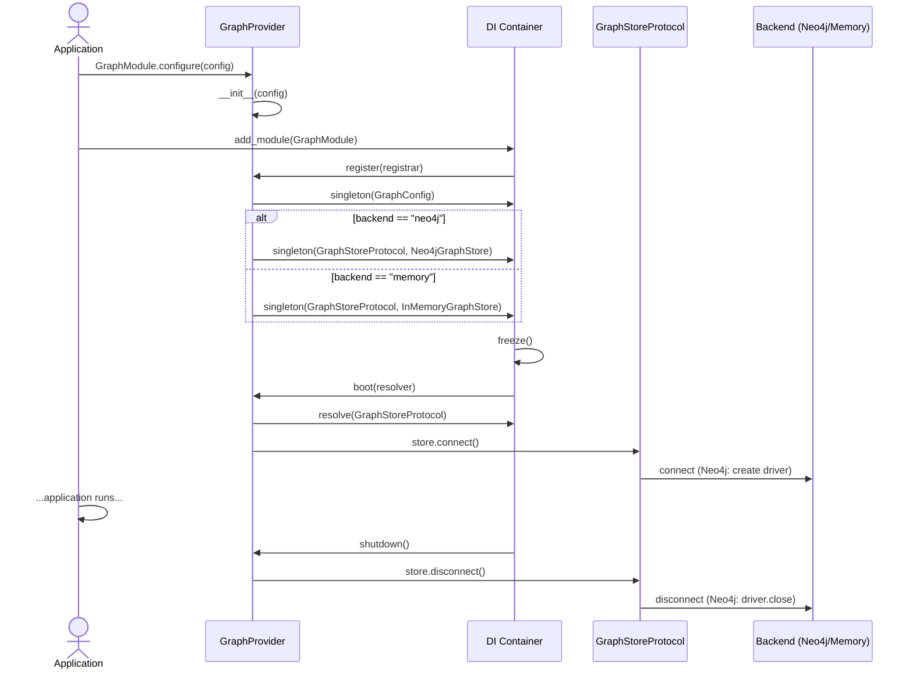
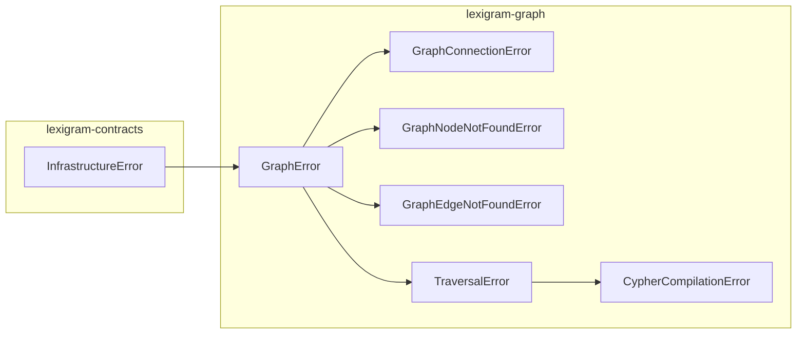

# Architecture

Internal design of the `lexigram-graph` package.

---

## Role in the System

`lexigram-graph` lives in the **Data & Persistence** tier. It implements `GraphStoreProtocol` and `GraphProtocol` from `lexigram-contracts` and provides pluggable backends for Neo4j and in-memory graph stores.



**Import direction:** Application code depends on `GraphStoreProtocol` from `lexigram-contracts`, never on `lexigram-graph` directly. The container resolves the protocol to the backend chosen at configuration time.

---

## Backend Abstraction

Two protocols define the store and graph boundaries:

### `GraphStoreProtocol`

Top-level lifecycle — connection, health, and graph database management:

```python
class GraphStoreProtocol(Protocol):
    async def connect(self) -> None: ...
    async def disconnect(self) -> None: ...
    async def health_check(self, timeout: float = 5.0) -> HealthCheckResult: ...
    async def get_graph(self, name: str | None = None) -> GraphProtocol: ...
    async def list_graphs(self) -> list[GraphInfo]: ...
    async def create_graph(self, name: str) -> None: ...
    async def delete_graph(self, name: str) -> None: ...
```

### `GraphProtocol`

All operations on a single graph database — CRUD, traversal, query, bulk, schema:

```python
class GraphProtocol(Protocol):
    # Node operations
    async def create_node(self, labels: list[str], ...) -> NodeResult: ...
    async def get_node(self, node_id: str) -> GraphNode | None: ...
    async def find_nodes(self, ...) -> list[GraphNode]: ...
    async def update_node(self, node_id: str, ...) -> bool: ...
    async def delete_node(self, node_id: str, detach: bool = True) -> bool: ...
    async def neighbors(self, node_id: str, ...) -> list[GraphNode]: ...
    async def count_nodes(self) -> int: ...
    async def get_labels(self) -> list[str]: ...

    # Edge operations
    async def create_edge(self, source_id: str, target_id: str, ...) -> EdgeResult: ...
    async def get_edge(self, edge_id: str) -> GraphEdge | None: ...
    async def get_edges(self, node_id: str, ...) -> list[GraphEdge]: ...
    async def update_edge(self, edge_id: str, ...) -> bool: ...
    async def delete_edge(self, edge_id: str) -> bool: ...
    async def get_edge_types(self) -> list[str]: ...

    # Traversal & query
    async def traverse(self, query: TraversalQuery) -> list[GraphPath]: ...
    async def shortest_path(self, from_id: str, to_id: str, ...) -> GraphPath | None: ...
    async def query(self, query_string: str, ...) -> list[dict[str, Any]]: ...

    # Bulk & schema
    async def bulk_create_nodes(self, nodes: list[NodeSpec]) -> BulkNodeResult: ...
    async def bulk_create_edges(self, edges: list[EdgeSpec]) -> BulkEdgeResult: ...
    async def create_index(self, spec: IndexSpec) -> None: ...
    async def drop_index(self, name: str) -> None: ...
    async def create_constraint(self, spec: ConstraintSpec) -> None: ...
    async def drop_constraint(self, name: str) -> None: ...
```

### Supported Backends



**In-Memory** (`lexigram.graph.backends.memory`): Pure-Python `dict` store. No external dependencies. BFS traversal. Default for development/testing.

**Neo4j** (`lexigram.graph.backends.neo4j`): Uses the `neo4j` async driver. Translates all graph operations to Cypher. Production backend.

---

## Graph Model

The canonical graph data types are defined in `lexigram-contracts` as frozen dataclasses:

### Core Types

| Type | Fields | Description |
|------|--------|-------------|
| `GraphNode` | `id: str`, `labels: tuple[str, ...]`, `properties: dict[str, Any]` | A vertex in the graph |
| `GraphEdge` | `id: str`, `type: str`, `source_id: str`, `target_id: str`, `properties: dict[str, Any]` | A directed relationship |
| `GraphPath` | `nodes: tuple[GraphNode, ...]`, `edges: tuple[GraphEdge, ...]` | Alternating node-edge sequence |
| `NodeSpec` | `labels`, `properties`, `id?` | Input spec for node creation |
| `EdgeSpec` | `source_id`, `target_id`, `type`, `properties` | Input spec for edge creation |
| `NodeResult` | `id: str`, `created: bool` | Output of node creation |
| `EdgeResult` | `id: str`, `created: bool` | Output of edge creation |
| `BulkNodeResult` | `created_count: int`, `ids: tuple[str, ...]` | Output of bulk node create |
| `BulkEdgeResult` | `created_count: int`, `ids: tuple[str, ...]` | Output of bulk edge create |

### Type Aliases

```
NodeId: TypeAlias = str | int
EdgeId: TypeAlias = str | int
Properties: TypeAlias = dict[str, Any]
```

### Enums

| Enum | Values |
|------|--------|
| `EdgeDirection` | `OUTGOING`, `INCOMING`, `BOTH` |
| `ReturnType` | `NODES`, `EDGES`, `PATHS`, `COUNT` |
| `IndexKind` | `BTREE`, `FULLTEXT`, `RANGE`, `POINT`, `TEXT`, `VECTOR` |
| `ConstraintKind` | `UNIQUE`, `EXISTS`, `NODE_KEY` |
| `MergeAction` | `CREATE`, `MATCH`, `MERGE` |

### Property Filters

Filters compose conditions via `Prop` factory:

```python
from lexigram.contracts.data.graph import Prop

filter = Prop.and_(
    Prop.eq("active", True),
    Prop.gte("age", 21),
    Prop.or_(
        Prop.eq("role", "admin"),
        Prop.eq("role", "moderator"),
    ),
)
```

---

## Query Building

### TraversalQuery

A traversal is described by `StartSpec` + one or more `TraversalStep`:

```python
from lexigram.contracts.data.graph import TraversalQuery, StartSpec, TraversalStep
from lexigram.contracts.data.graph.enums import EdgeDirection, ReturnType

query = TraversalQuery(
    start=StartSpec(node_ids=("user-1",)),
    steps=(TraversalStep(
        edge_types=("FOLLOWS",),
        direction=EdgeDirection.OUTGOING,
        max_depth=3,
    ),),
    return_type=ReturnType.PATHS,
    limit=50,
)
```

### Cypher Compilation

The `CypherCompiler` in `lexigram.graph.backends.neo4j.cypher` translates `TraversalQuery` to Cypher:



Compilation produces a `(cypher_string, params_dict)` tuple passed directly to the Neo4j driver.

The in-memory backend uses an internal BFS instead of Cypher — `_compile_traversal` is not invoked.

### Query Execution Flow



---

## Provider Lifecycle

### `GraphProvider`

```python
class GraphProvider(Provider):
    name = "graph"
    priority = ProviderPriority.INFRASTRUCTURE
```

| Phase | What Happens |
|-------|-------------|
| `__init__` | Accepts optional `GraphConfig`; falls back to environment variable defaults |
| `register()` | Binds `GraphConfig` as singleton. Selects and binds `GraphStoreProtocol` — `InMemoryGraphStore` or `Neo4jGraphStore` based on `config.backend` |
| `boot()` | Resolves `GraphStoreProtocol` and calls `store.connect()`. Neo4j establishes driver and creates uniqueness constraint |
| `shutdown()` | Disconnects the store. Neo4j closes the async driver; memory clears its graph dict |
| `health_check()` | Delegates to the store's `health_check()`; returns `DEGRADED` if disabled or uninitialized |

### Sequence



---

## Contracts Used

All contracts come from `lexigram.contracts.data.graph`:

| Contract | Location | How It's Used |
|----------|----------|---------------|
| `GraphStoreProtocol` | `lexigram.contracts.data.graph.protocols` | Top-level interface registered by `GraphProvider` |
| `GraphProtocol` | `lexigram.contracts.data.graph.protocols` | Returned by `get_graph()`; all node/edge/traversal operations |
| `GraphNode` | `lexigram.contracts.data.graph.types` | Return type for node CRUD |
| `GraphEdge` | `lexigram.contracts.data.graph.types` | Return type for edge CRUD |
| `GraphPath` | `lexigram.contracts.data.graph.types` | Return type for traversal and shortest-path |
| `TraversalQuery` | `lexigram.contracts.data.graph.types` | Input spec for traversal operations |
| `TraversalStep` | `lexigram.contracts.data.graph.types` | Single hop in a traversal |
| `StartSpec` | `lexigram.contracts.data.graph.types` | How to locate traversal start nodes |
| `NodeSpec` / `EdgeSpec` | `lexigram.contracts.data.graph.types` | Input specs for bulk operations |
| `NodeResult` / `EdgeResult` | `lexigram.contracts.data.graph.types` | Creation results |
| `BulkNodeResult` / `BulkEdgeResult` | `lexigram.contracts.data.graph.types` | Bulk operation results |
| `GraphInfo` | `lexigram.contracts.data.graph.types` | Graph database metadata |
| `IndexSpec` / `ConstraintSpec` | `lexigram.contracts.data.graph.types` | Schema operation specs |
| `EdgeDirection` | `lexigram.contracts.data.graph.enums` | Direction for edge queries |
| `ReturnType` | `lexigram.contracts.data.graph.enums` | What traversal returns |
| `IndexKind` | `lexigram.contracts.data.graph.enums` | Index type |
| `ConstraintKind` | `lexigram.contracts.data.graph.enums` | Constraint type |
| `PropertyFilter` | `lexigram.contracts.data.graph.filters` | Filter expression for nodes/edges |
| `Prop` | `lexigram.contracts.data.graph.filters` | Static factory for building filters |

---

## Source Layout

```
lexigram-graph/src/lexigram/graph/
├── __init__.py              # Lazy-exported public API
├── config.py                # GraphConfig, Neo4jConfig, MemoryConfig
├── constants.py             # ENV_PREFIX, BACKEND_*, defaults
├── exceptions.py            # GraphError hierarchy (12 exceptions)
├── types.py                 # NodeId, EdgeId, Properties type aliases
├── protocols.py             # Re-exports from lexigram-contracts
├── module.py                # GraphModule — configure() / stub()
├── events.py                # GraphConnectedEvent, GraphNodeCreatedEvent, etc.
├── hooks.py                 # Lifecycle hooks (future)
├── decorators.py            # Decorators (future)
├── di/
│   └── provider.py          # GraphProvider
└── backends/
    ├── base.py              # BaseGraphStore (ABC), BaseGraph (stub defaults)
    ├── memory/
    │   ├── backend.py       # InMemoryGraphStore
    │   └── graph.py         # InMemoryGraph (BFS traversal)
    └── neo4j/
        ├── backend.py       # Neo4jGraphStore
        ├── graph.py         # Neo4jGraph (Cypher-backed)
        └── cypher.py        # CypherCompiler (TraversalQuery → Cypher)
```

---

## Exception Convention



12 exceptions total, all under `GraphError(InfrastructureError)` with unique `LEX_ERR_GRAPH_0xx` codes. Exception hierarchy: connection failures (`GraphConnectionError`), not-found errors for nodes/edges/graphs, schema errors, transaction errors, traversal errors, and Cypher compilation errors.

---

## Events

The package emits lifecycle events on connection, disconnection, node creation, edge creation, and query execution:

| Event | Fields |
|-------|--------|
| `GraphConnectedEvent` | `backend: str` |
| `GraphDisconnectedEvent` | `backend: str` |
| `GraphNodeCreatedEvent` | `node_id: str`, `labels: tuple[str, ...]` |
| `GraphEdgeCreatedEvent` | `source_id: str`, `target_id: str`, `relationship_type: str` |
| `GraphQueryExecutedEvent` | `query_type: str`, `result_count: int` |

```python
from lexigram.graph import GraphNodeCreatedEvent

@event_handler(GraphNodeCreatedEvent)
async def on_node_created(event: GraphNodeCreatedEvent) -> None:
    logger.info("node_created", node_id=event.node_id, labels=event.labels)
```

---

## DI Registration

```python
# lexigram/graph/di/provider.py
class GraphProvider(Provider):
    async def register(self, container):
        container.singleton(GraphConfig, self._config)

        if backend == BACKEND_NEO4J:
            container.singleton(GraphStoreProtocol, factory=lambda: Neo4jGraphStore(...))
        elif backend == BACKEND_MEMORY:
            container.singleton(GraphStoreProtocol, factory=InMemoryGraphStore)
```

Application code configures via `GraphModule`:

```python
from lexigram.graph.config import GraphConfig
from lexigram.graph.module import GraphModule

@module(imports=[GraphModule.configure(GraphConfig(backend="neo4j"))])
class AppModule(Module):
    pass
```

For tests:

```python
@module(imports=[GraphModule.stub()])
class TestModule(Module):
    pass
```

---

## Constants

`constants.py` defines:

| Symbol | Description |
|--------|-------------|
| `BACKEND_MEMORY` / `BACKEND_NEO4J` | Backend identifier strings |
| `ENV_PREFIX` | `LEX_GRAPH__` |
| `DEFAULT_MEMORY_MAX_NODES` | 1,000,000 |
| `DEFAULT_MEMORY_MAX_EDGES` | 5,000,000 |
| `DEFAULT_NEO4J_MAX_POOL_SIZE` | 100 |
| `DEFAULT_CONNECT_TIMEOUT` | 30.0s |
| `DEFAULT_TRAVERSAL_MAX_DEPTH` | 10 |
| `DEFAULT_QUERY_LIMIT` | 100 |
| `DEFAULT_BULK_BATCH_SIZE` | 1000 |
| `DEFAULT_MAX_RETRIES` | 3 |
| `__version__` | Package version |

---

## Extension Points

| Point | Mechanism |
|-------|-----------|
| Custom backend | Implement `GraphStoreProtocol` + `GraphProtocol`, register via custom provider |
| Custom traversal strategy | Subclass `CypherCompiler` or implement inline (e.g., for Gremlin) |
| Event hooks | Subscribe to `GraphNodeCreatedEvent`, `GraphEdgeCreatedEvent`, etc. |
| Health check override | Override `health_check()` in custom backend |
| Config override | Pass `dict` or `GraphConfig` to `GraphModule.configure()` |
| Environment config | `LEX_GRAPH__BACKEND=neo4j LEX_GRAPH__NEO4J__URI=bolt://...` |
