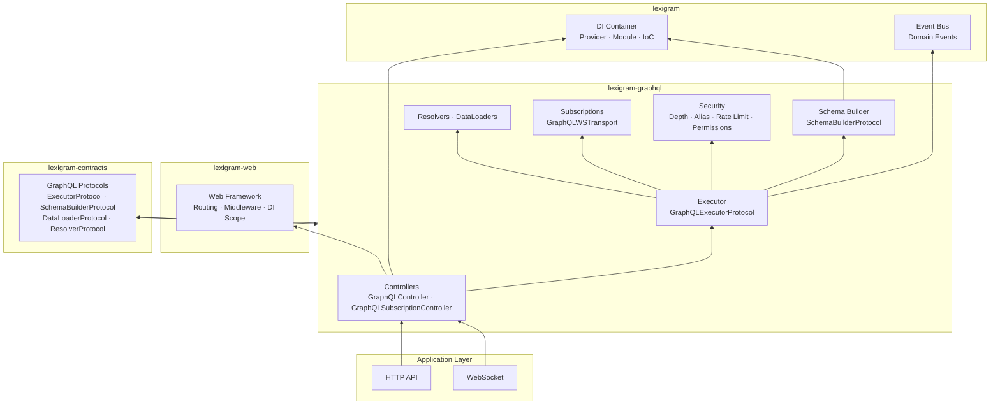
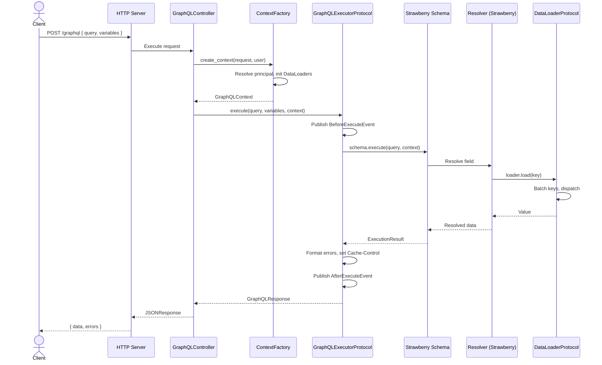
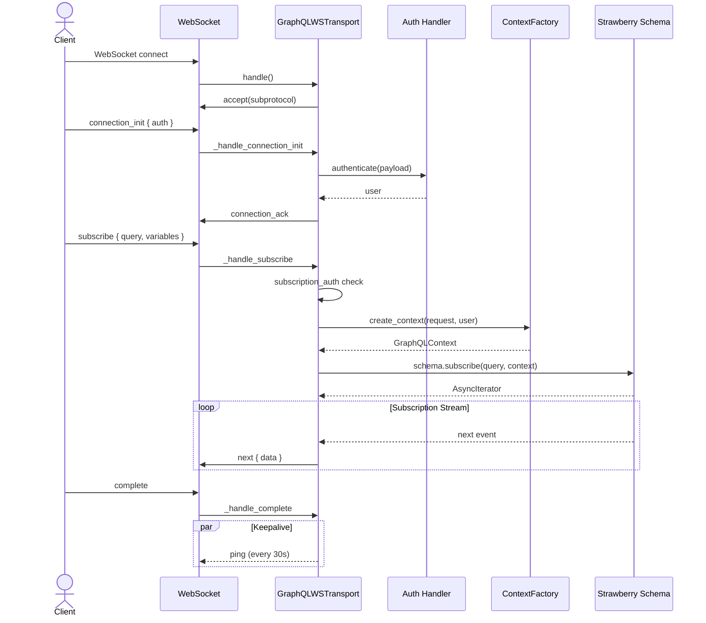

# Architecture

Internal design of the `lexigram-graphql` package.

---

## Role in the System



**Import direction:** `lexigram-graphql` depends on `lexigram` and `lexigram-contracts`. It integrates with `lexigram-web` through the `GraphQLController` (registered via `GraphQLWebContributor`). Cross-extension communication goes through contracts and the DI container — never direct imports.

---

## Schema Architecture

Schemas are composed declaratively from Strawberry types. The `SchemaBuilderProtocol` provides a fluent API to assemble query, mutation, subscription, types, extensions, directives, and scalar overrides into a single Strawberry `Schema`.

```mermaid
flowchart LR
    subgraph Types[Strawberry Types]
        Q[Query type]
        M[Mutation type]
        S[Subscription type]
        T[Additional types<br/>Connections · Inputs · Interfaces]
    end
    subgraph Ext[Extensions & Directives]
        E[Schema Extensions<br/>Metrics · Tracing · Rate Limit]
        D[Custom Directives<br/>Deprecation · Auth]
        SO[Scalar Overrides<br/>DateTime · JSON · UUID · URL]
    end
    subgraph Builder[SchemaBuilderProtocol]
        B[build&#40;&#41;]
    end
    subgraph Output[Strawberry Schema]
        SCHEMA[Schema<br/>query · mutation · subscription<br/>extensions · directives · types]
    end

    Types --> B
    Ext --> B
    B --> SCHEMA
```



Registration happens during `GraphQLProvider.boot()`:

```python
builder = SchemaBuilderProtocol(config)
builder.query(Query).mutation(Mutation).subscription(Subscription)
builder.add_extension(MetricsExtension())
builder.add_extension(RateLimitExtension(rate_limiter=rate_limiter))
builder.scalar_override(DateTime, DateTimeScalar)
schema = builder.build()
```

Types can also be auto-discovered by scanning packages for `@strawberry.type` classes named `Query`, `Mutation`, or `Subscription`:

```python
GraphQLProvider.auto_discover("my_app.graphql")
```

---

## Request Lifecycle



The `GraphQLExecutorProtocol` wraps Strawberry's `schema.execute()` with:
- **Timeout enforcement** via `asyncio.wait_for`
- **Error formatting** via `ErrorFormatter` (masking in production)
- **Lifecycle events** published to `EventBusProtocol`
- **Cache-Control** header injection from `CacheConfig`
- **DI scope disposal** after each request

---

## Resolver System

Resolvers are plain `Callable[..., Any]` functions that accept `(parent, args, context, info)` — they can be sync or async. The `resolver()` decorator wraps a resolver with error handling and logging:

```python
from lexigram.graphql import resolver, field

@strawberry.type
class User:
    id: strawberry.ID

    @field
    @resolver
    async def posts(self, info: strawberry.Info) -> list[Post]:
        loader = info.context.get_dataloader("posts")
        return await loader.load(self.id)
```

### Dependency Injection in Resolvers

Dependencies reach resolvers through `GraphQLContext`:

| Mechanism | How |
|-----------|-----|
| **Context Factory** | `ContextFactory` receives the DI container resolver, creates per-request scopes |
| **DataLoaders** | Registered via `SchemaBuilderProtocol.add_dataloader()`, initialized per-request in `ContextFactory` |
| **Services** | Accessed through `info.context` (the `GraphQLContext` object) |
| **Principal** | Resolved from user via `GraphQLPrincipalResolverProtocol` |

### Permission Guards

Permission classes check authorization before field resolution:

```python
@field(permission_classes=[IsAuthenticated])
async def email(self) -> str:
    return self._email
```

Built-in permissions: `IsAuthenticated`, `IsAdmin`, `IsOwner`, `IsOwnerOrAdmin`, `AllowAny`, `DenyAll`.

### DataLoader Batching

The `DataLoaderProtocol` solves the N+1 problem by batching key-based loads within a single event-loop tick:

```python
loader = DataLoaderProtocol(batch_load_users)
user1 = await loader.load("1")  # Batched together
user2 = await loader.load("2")
# -> single call to batch_load_users(["1", "2"])
```

---

## Error Handling

```mermaid
flowchart LR
    subgraph Domain[Domain Layer]
        RE["Result&#40;T, E&#41;<br/>Expected failures"]
    end
    subgraph GQL[lexigram-graphql]
        EXC[GraphQLError hierarchy<br/>15 exception types]
        EF[ErrorFormatter<br/>mask · format · stacktrace]
    end
    subgraph HTTP[HTTP Response]
        RES[JSONResponse<br/>{ errors, data }]
    end

    Domain -->|unexpected| EXC
    EXC -->|format| EF
    EF -->|safe/code extensions| RES
    RE -->|map to GraphQLError| EXC
```

Every `DomainError` from `lexigram-contracts` can be mapped to a `GraphQLError` with a specific error code. The `ErrorFormatter` applies masking rules based on `ErrorConfig`:

| Config | Behavior |
|--------|----------|
| `mask_errors=True` | Internal errors become "Internal server error" |
| `include_stacktrace=True` | Stacktrace appended to `extensions` (debug only) |
| `safe=True` (per exception) | Error message is shown to the client |

### Error Code Mapping

| Exception | `code` | `safe` |
|-----------|--------|--------|
| `AuthenticationError` | `UNAUTHENTICATED` | Yes |
| `AuthorizationError` | `UNAUTHORIZED` | Yes |
| `ForbiddenError` | `FORBIDDEN` | Yes |
| `NotFoundError` | `NOT_FOUND` | Yes |
| `InputGraphQLError` | `BAD_USER_INPUT` | Yes |
| `RateLimitError` | `RATE_LIMITED` | Yes |
| `QueryTooDeepError` | `QUERY_TOO_DEEP` | No |
| `QueryTooComplexError` | `QUERY_TOO_COMPLEX` | No |
| `ParseError` | `GRAPHQL_PARSE_FAILED` | No |

---

## DI Integration

```mermaid
flowchart LR
    subgraph Module[GraphQLModule]
        CF[configure&#40;&#41;]
        S[stub&#40;&#41;]
    end
    subgraph Provider[GraphQLProvider]
        R[register&#40;&#41;]
        B[boot&#40;&#41;]
        SD[shutdown&#40;&#41;]
    end
    subgraph Container[DI Container]
        REG[ContainerRegistrarProtocol]
        RESOLVE[BootContainerProtocol]
    end

    CF -->|DynamicModule| Provider
    Provider -->|singleton bindings| REG
    Provider -->|resolve dependencies| RESOLVE
```



### Provider Lifecycle

`GraphQLProvider` (priority `PRESENTATION`):

```python
register():
  - GraphQLExecutorProtocol (deferred)
  - SchemaBuilderProtocol (deferred)
  - MetricsCollectorProtocol (deferred)
  - ContextFactory (deferred)
  - ResponseCache (deferred)
  - RateLimiter, UnifiedRateLimiter
  - GraphQLController
  - WebSocketTransportProtocol

boot():
  - Resolve infrastructure (identity, event bus)
  - Build schema from query/mutation/subscription classes
  - Wire WebRateLimiterProtocol
  - Wire MetricsRecorderProtocol
  - Wire CacheBackendProtocol (or in-memory shim)
  - Build WebSocket transport
  - Run schema diff against baseline (optional)

shutdown():
  - Close metrics collector
  - Close response cache
```

### Module Registration

```python
@module(imports=[GraphQLModule.configure(query_class=Query)])
class AppModule(Module):
    pass
```

The module exports `GraphQLExecutorProtocol` as the public contract. `configure()` accepts `config`, `query_class`, `mutation_class`, `subscription_class`, and `context_factory_class`.

---

## WebSocket Subscriptions



The `GraphQLWSTransport` implements the `graphql-transport-ws` protocol. Key features:
- **Authenticated connections** via `auth_handler` on `connection_init`
- **Per-subscription authorization** via `SubscriptionAuthHandlerProtocol`
- **Keep-alive** ping/pong at configurable interval
- **Background task tracking** for async subscription streams

---

## Contracts Used

From `lexigram-contracts` (`lexigram.contracts.graphql.*`) and other contract modules:

| Protocol | Purpose |
|----------|---------|
| `GraphQLExecutorProtocol` | Execute queries, return `Result[GraphQLResponse, Exception]` |
| `SchemaBuilderProtocol` | Fluent schema assembly (query, mutation, subscription, extensions) |
| `DataLoaderProtocol` | Batched key-based loading (load, load_many, prime) |
| `ResolverProtocol` | GraphQL field resolver callable |
| `WebSocketTransportProtocol` | WebSocket subscription transport for graphql-transport-ws |
| `ValidationRuleProtocol` | Custom query validation rules |
| `SubscriptionAuthHandlerProtocol` | Per-subscription authorization |
| `ErrorFormatterProtocol` | Error masking and formatting |
| `GraphQLControllerProtocol` | Marker protocol for HTTP controller resolution |
| `GraphQLPrincipalResolverProtocol` | Resolve `GraphQLPrincipal` from authenticated user |
| `WebRateLimiterProtocol` | Web-layer rate limiting (injected into `UnifiedRateLimiter`) |
| `CacheBackendProtocol` | Response caching backend (optional, falls back to in-memory) |
| `MetricsRecorderProtocol` | Platform metrics recording (optional) |
| `EventBusProtocol` | Execution lifecycle event publishing (optional) |
| `IdGeneratorProtocol` | Request ID generation (optional) |

### Domain Events

| Event | Fired When |
|-------|------------|
| `BeforeExecuteEvent` | Before a GraphQL operation reaches Strawberry |
| `AfterExecuteEvent` | After successful execution |
| `OnErrorEvent` | On infrastructure-level errors (timeout, crash) |
| `SchemaBuiltEvent` | After schema compilation |
| `SubscriptionStartedEvent` | When a subscription is established |

---

## Extension Points

| Point | Interface | Default | Customise by |
|-------|-----------|---------|--------------|
| Query types | Strawberry `@type` | — | Pass `query_class` to `configure()` |
| Mutation types | Strawberry `@type` | — | Pass `mutation_class` to `configure()` |
| Subscription types | Strawberry `@type` | — | Pass `subscription_class` to `configure()` |
| Schema extensions | Strawberry `SchemaExtension` | — | `schema_builder.add_extension(...)` |
| Custom scalars | Strawberry scalar class | `DateTime`, `UUID`, `JSON`, `URL`, `Date`, `Time` | `schema_builder.scalar_override(original, custom)` |
| Custom directives | Strawberry directive | `DeprecationDirectiveHandler` | `schema_builder.add_directive(...)` |
| Context factory | `ContextFactory` | Default | Pass `context_factory_class` to `configure()` |
| Permission guard | `AbstractPermission` | `IsAuthenticated`, `IsAdmin`, `IsOwner`, etc. | Subclass `AbstractPermission`, implement `has_permission()` |
| DataLoader | `DataLoaderProtocol` factory | — | `schema_builder.add_dataloader(name, factory)` |
| Rate limiter | `WebRateLimiterProtocol` | In-memory fallback | Register before boot |
| Cache backend | `CacheBackendProtocol` | In-memory shim | Register before boot |
| Metrics recorder | `MetricsRecorderProtocol` | None | Register before boot |
| Subscription auth | `SubscriptionAuthHandlerProtocol` | None | Register before boot |
| Event bus | `EventBusProtocol` | None | Subscribe to domain events |
| Resolver decorator | `resolver()` | Error handling + logging | Stack additional decorators |
| Error formatter | `ErrorFormatterProtocol` | `ErrorFormatter` | Override with custom implementation |
| Query validation | `ValidationRuleProtocol` | — | `schema_builder.add_extension(...)` |
| Resolver middleware | `StrawberryMiddleware` | — | Pass middleware to executor |

### Auto-Discovery

`GraphQLProvider.auto_discover()` scans packages for `@strawberry.type` classes following the `Query`/`Mutation`/`Subscription` naming convention or the `__graphql_role__` attribute. This eliminates manual wiring in simple applications.

---

## Schema Diff

`GraphQLProvider.boot()` can optionally compare the built schema against a baseline SDL file via `SchemaDiffer`:

```python
config = GraphQLConfig(schema_baseline_path="schema.graphql")
# On boot: logs breaking removals at WARNING, additions at DEBUG
```

Intended for CI/CD pipelines to catch accidental breaking changes.
