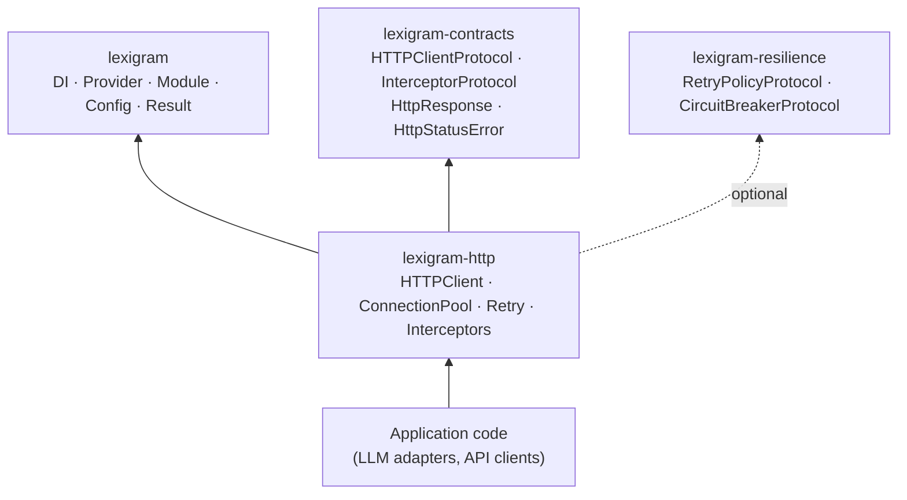
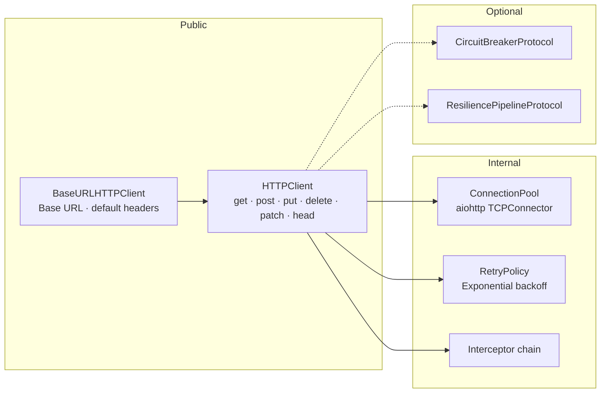
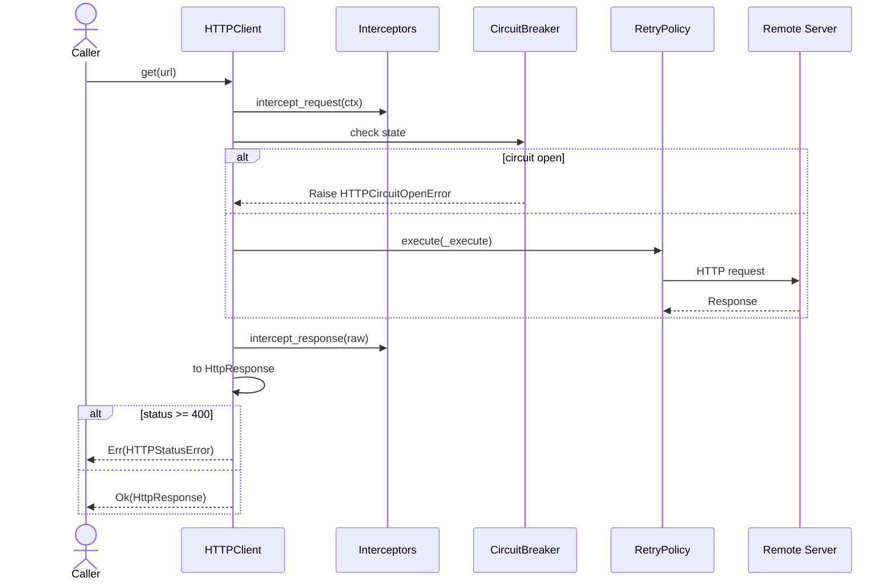

# Architecture

Internal design of the `lexigram-http` package.

---

## Role in the System



`lexigram-http` depends on `lexigram` and `lexigram-contracts`. Resilience is optional — resolved from the container at boot. Consumer code communicates through `HTTPClientProtocol`.

---

## Client Architecture



`HTTPClient` exposes a `request()` method (raises exceptions) and Result-returning verb methods for domain code. `BaseURLHTTPClient` wraps `HTTPClient` with base-URL resolution and default headers — designed for SDK-style callers.

### ConnectionPool

Wraps `aiohttp.TCPConnector` with configurable limits. Supports `warm_up(urls)` to pre-establish TLS handshakes for critical endpoints.

### RetryPolicy

Local implementation. Exponential backoff with optional jitter:

```python
config = RetryConfig(
    max_attempts=3, base_delay=1.0,
    max_delay=30.0, backoff_factor=2.0,
    jitter=0.5, retry_on=(TimeoutError, ConnectionError),
)
```

### Interceptors

Receive typed `RequestContext` and raw response objects:

```python
class LoggingInterceptor:
    async def intercept_request(self, ctx: RequestContext) -> RequestContext:
        logger.info("http.request", method=ctx.method, url=ctx.url)
        return ctx
    async def intercept_response(self, response: Any) -> Any:
        logger.info("http.response", status=getattr(response, "status", None))
        return response
```

---

## Request/Response Model



All consumers receive `HttpResponse` (from `lexigram-contracts`) — a dataclass decoupling them from `aiohttp`:

```python
@dataclass(frozen=True)
class HttpResponse:
    status: int
    headers: dict[str, str]
    body: bytes
    text: str                    # UTF-8 decoded
    json: Any | None             # Parsed JSON
    url: str
    method: str
    content_length: int | None
```

The client also provides `stream()` for byte-level streaming and `sse()` for `text/event-stream` parsing.

---

## Authentication

`lexigram-http` has no built-in auth handlers. Authentication uses standard HTTP header mechanisms:

| Approach | Implementation |
|----------|---------------|
| **Bearer token** | `Authorization: Bearer <token>` header per-request or via `BaseURLHTTPClient` defaults |
| **Basic auth** | `Authorization: Basic <base64>` directly |
| **API key** | Custom header (e.g. `X-API-Key`) per request |
| **OAuth 2.0** | Implement token-refresh interceptor using `InterceptorProtocol` |
| **Custom** | Implement `InterceptorProtocol.intercept_request()` to mutate `RequestContext.headers` |

```python
# Bearer token via BaseURLHTTPClient
client = BaseURLHTTPClient(
    base_url="https://api.example.com/v1",
    headers={"Authorization": "Bearer eyJhbGci..."},
)

# API key via interceptor
class ApiKeyInterceptor:
    async def intercept_request(self, ctx: RequestContext) -> RequestContext:
        ctx.headers["X-API-Key"] = self._api_key
        return ctx
    async def intercept_response(self, response: Any) -> Any:
        return response
```

---

## Error Handling

Two-layer error strategy:

- **Infrastructure** (`request()`) — raises `HTTPCircuitOpenError`, `HTTPRetryExhaustedError`
- **Domain** (verb methods) — returns `Result[HttpResponse, HTTPClientError]`

```
HTTPClientError (LEX_ERR_HTTP_001)
  ├── HTTPConnectionError (002)   HTTPTimeoutError (003)
  ├── HTTPInterceptorError (004)  HTTPCircuitOpenError (005)
  ├── HTTPRetryExhaustedError (006)
  └── HTTPStatusError (007)       # 4xx/5xx
```

Verb methods map 4xx/5xx to `Err(HTTPStatusError)` and transport failures to `Err(HTTPConnectionError | HTTPTimeoutError)`. Circuit-breaker open and retry-exhausted always propagate as exceptions.

---

## Contracts Used

| Protocol / Type | Source | Purpose |
|----------------|--------|---------|
| `HTTPClientProtocol` | `lexigram.contracts.web.http_protocols` | Outbound HTTP client interface |
| `InterceptorProtocol` | `lexigram.contracts.web.http_protocols` | Request/response interception |
| `InterceptorChainProtocol` | `lexigram.contracts.web.http_protocols` | Interceptor chain management |
| `HttpResponse` | `lexigram.contracts.web.http_models` | Transport-agnostic response |
| `HttpStatusError` | `lexigram.contracts.web.http_models` | 4xx/5xx error with response |
| `HTTPSessionProtocol` | `lexigram.contracts.web.http_protocols` | HTTP session abstraction |
| `ServerSentEvent` | `lexigram.contracts.web.sse` | SSE event dataclass |
| `RetryPolicyProtocol` | `lexigram.contracts.infra.resilience` | Retry policy (optional DI) |
| `CircuitBreakerProtocol` | `lexigram.contracts.infra.resilience` | Circuit breaker (optional DI) |
| `ResiliencePipelineProtocol` | `lexigram.contracts.infra.resilience` | Composable resilience (optional DI) |
| `MetricsRecorderProtocol` | `lexigram.contracts.observability` | Request metrics (optional DI) |

---

## Extension Points

| Point | Interface | Default | Customise by |
|-------|-----------|---------|--------------|
| Request interceptor | `InterceptorProtocol.intercept_request()` | None | Implement protocol, inject via constructor |
| Response interceptor | `InterceptorProtocol.intercept_response()` | None | Implement protocol, inject via constructor |
| Retry policy | `RetryPolicyProtocol` | Local `RetryPolicy` with defaults | Inject via constructor or register before boot |
| Circuit breaker | `CircuitBreakerProtocol` | None | Register `CircuitBreakerRegistryProtocol` before boot |
| Resilience pipeline | `ResiliencePipelineProtocol` | None | Register before boot |
| Metrics | `MetricsRecorderProtocol` | None | Inject via constructor |

All resilience dependencies are **optional** — the client works without them.

---

## DI Registration

```python
class HTTPProvider(Provider):
    name = "http"
    priority = ProviderPriority.INFRASTRUCTURE

    def __init__(self, config: HTTPClientConfig | None = None) -> None:
        self._config = config or HTTPClientConfig()
        self._client: HTTPClient | None = None

    async def register(self, container: ContainerRegistrarProtocol) -> None:
        container.singleton(HTTPClient, self._get_client)
        container.singleton(HTTPClientProtocol, self._get_client)

    async def boot(self, container: ContainerResolverProtocol) -> None:
        retry = await _try_resolve(container, RetryPolicyProtocol)
        cb = await _try_resolve_circuit_breaker(container)
        resilience = await _try_resolve(container, ResiliencePipelineProtocol)
        self._client = HTTPClient(config=self._config, retry_policy=retry, circuit_breaker=cb, resilience=resilience)
        await self._client.start()

    async def shutdown(self) -> None:
        if self._client:
            await self._client.stop()
```

Module registration:

```python
from lexigram.http import HTTPModule

app.add_module(HTTPModule.configure())  # defaults
app.add_module(HTTPModule.configure(    # custom
    HTTPClientConfig(pool=ConnectionPoolConfig(timeout=60.0))
))
```
