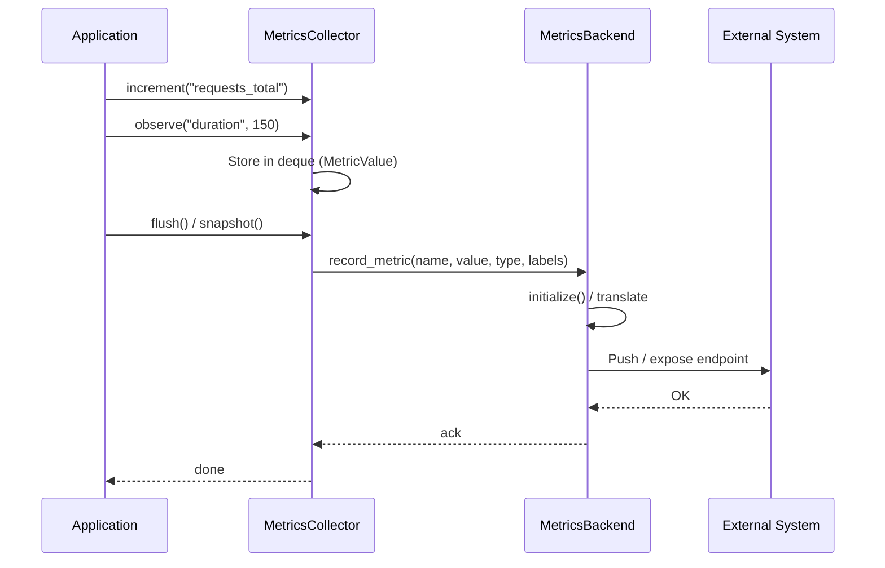
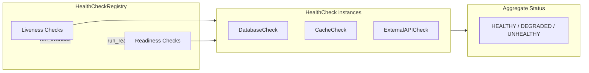
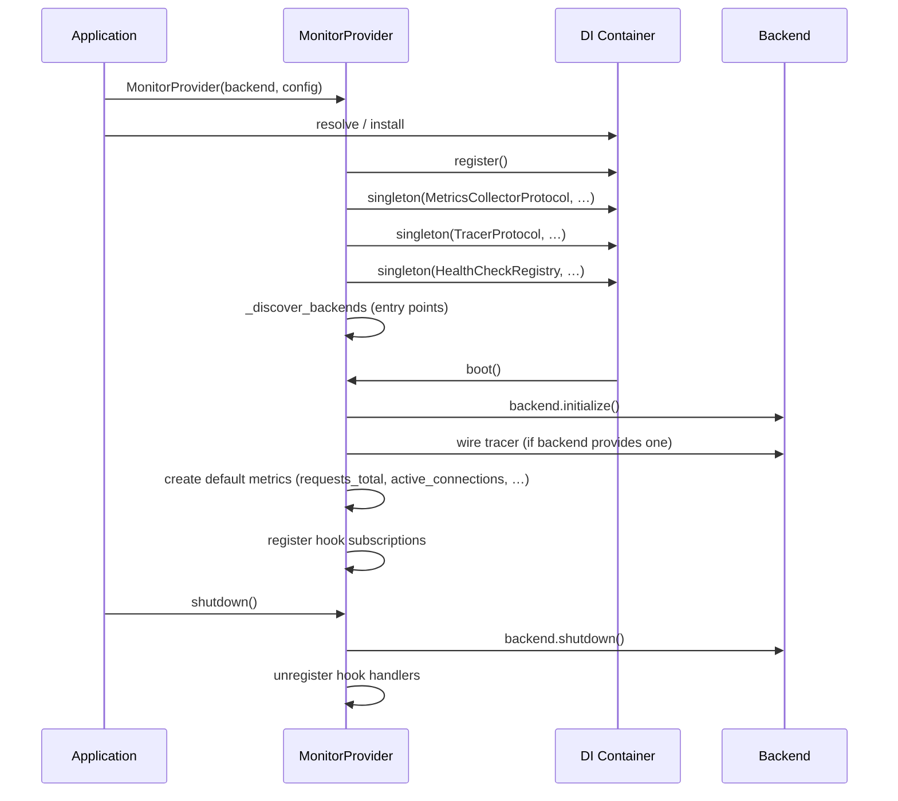

# Architecture

Internal design of the `lexigram-monitor` package.

---

## Role in the System

```mermaid
flowchart LR
    App[Application Code]
    Monitor[lexigram-monitor]
    Contracts[lexigram-contracts<br/>observability protocols]
    Prom[Prometheus]
    OTel[OpenTelemetry]
    Console[Console / Log]
    Mem[In-Memory]

    App -->|@traced @metered| Monitor
    Monitor -->|implements| Contracts
    Monitor -->|exports to| Prom
    Monitor -->|exports to| OTel
    Monitor -->|exports to| Console
    Monitor -->|exports to| Mem
```

`lexigram-monitor` replaces the framework's no-op observability stubs with real metric collection, tracing, and health-check infrastructure. It is activated by adding `MonitorModule` to the application's imports.

---

## Metrics Model

Four metric instrument types, each implementing `MetricProtocol` from `lexigram-contracts`:

| Type | Behavior | Use Case |
|------|----------|----------|
| **Counter** | Monotonically increasing | Request counts, error totals |
| **Gauge** | Up/down value | Active connections, memory usage |
| **Histogram** | Distribution with configurable buckets | Request duration, response sizes |
| **Summary** | Quantile-based distribution (planned) | Latency percentiles |

```python
collector = metrics_collector
collector.create_counter("http_requests_total", "Total HTTP requests")
collector.create_gauge("active_connections", "Current connections")
collector.create_histogram("request_duration_ms", "Duration in ms",
                           buckets=[10, 50, 100, 500])
```

Every metric carries optional labels and a timestamp. Labels are merged from defaults at creation time and per-observation overrides.

---

## Collection Pipeline



The collector stores observations in-memory (ring buffers capped at 10,000 per metric). Backends translate into their native format — Prometheus registers, OTel instruments, or console output — on `initialize()` and record on each observation.

---

## Health Checks



`HealthCheck` is an ABC with a single `async check() -> HealthCheckResult`. Checks are registered into `HealthCheckRegistry` with `liveness` and `readiness` flags. Critical checks that fail flip the aggregate status to `UNHEALTHY`; non-critical failures produce `DEGRADED`.

```python
class DatabaseCheck(HealthCheck):
    async def check(self) -> HealthCheckResult:
        try:
            await self.db.execute("SELECT 1")
            return HealthCheckResult(component="db", status=HealthStatus.HEALTHY)
        except ConnectionError as e:
            return HealthCheckResult(component="db", status=HealthStatus.UNHEALTHY, error=str(e))

registry = HealthCheckRegistry()
registry._register(DatabaseCheck("db"))
status, details = await registry.run_readiness()
```

---

## Backend Support

| Backend | Type | Init | Transport | Config Key |
|---------|------|------|-----------|------------|
| **In-Memory** | `NoOpMetricsBackend` | No-op | None | `memory` |
| **Prometheus** | `PrometheusBackend` | HTTP server on port `8000` | Pull (scrape) | `prometheus` |
| **OpenTelemetry** | `OpenTelemetryBackend` | OTel SDK providers | Push (OTLP) | `opentelemetry` |

The backend is selected via `MonitorConfig.backend_type` (default: `memory`). A `MonitorBackendRegistryManager` with `PrometheusBackendRegistry`, `OpenTelemetryBackendRegistry`, and `MemoryBackendRegistry` factories resolves the right backend from config.

---

## Provider Lifecycle



The provider runs at `ProviderPriority.INFRASTRUCTURE` so its singleton bindings override the core framework's no-op `ObservabilityProvider`. Third-party backend packages declare `lexigram.monitoring.backends` entry points discovered during `register()`.

---

## Contracts Used

| Contract (from `lexigram-contracts`) | Bound Implementation | Purpose |
|--------------------------------------|---------------------|---------|
| `MetricsCollectorProtocol` | `_ConcreteMetricsCollector` | Full metrics lifecycle |
| `MetricsRecorderProtocol` | `_ConcreteMetricsCollector` | Record-only (increment, gauge, histogram) |
| `MetricsFactoryProtocol` | `_ConcreteMetricsCollector` | Create-only (counter, gauge, histogram) |
| `MetricProtocol` | `Counter` / `Gauge` / `Histogram` / `Summary` | Single instrument |
| `MetricsBackendProtocol` | Backend instance | Backend-specific export |
| `TracerProtocol` | `Tracer` | Distributed tracing |
| `HealthCheckRegistryProtocol` | `HealthCheckRegistry` | Health check CRUD + execution |
| `AlertDispatcherProtocol` | `LoggingAlertDispatcher` | Operational alert routing |

---

## Extension Points

| Point | Mechanism |
|-------|-----------|
| Custom metric backend | Implement `MetricsBackendProtocol`, pass to `MonitorProvider(backend=...)` |
| Custom health check | Subclass `HealthCheck`, register via `HealthCheckRegistry._register()` |
| Custom instrumentation | Use `@traced` / `@metered` decorators, or write modules under `instrumentation/` |
| Entry-point backend | Third-party packages declare `lexigram.monitoring.backends` entry points |
| Alert dispatcher | Implement `AlertDispatcherProtocol` |
| Custom exporter | Implement `MetricsExporterRegistry` / `TracingExporterRegistry` |
