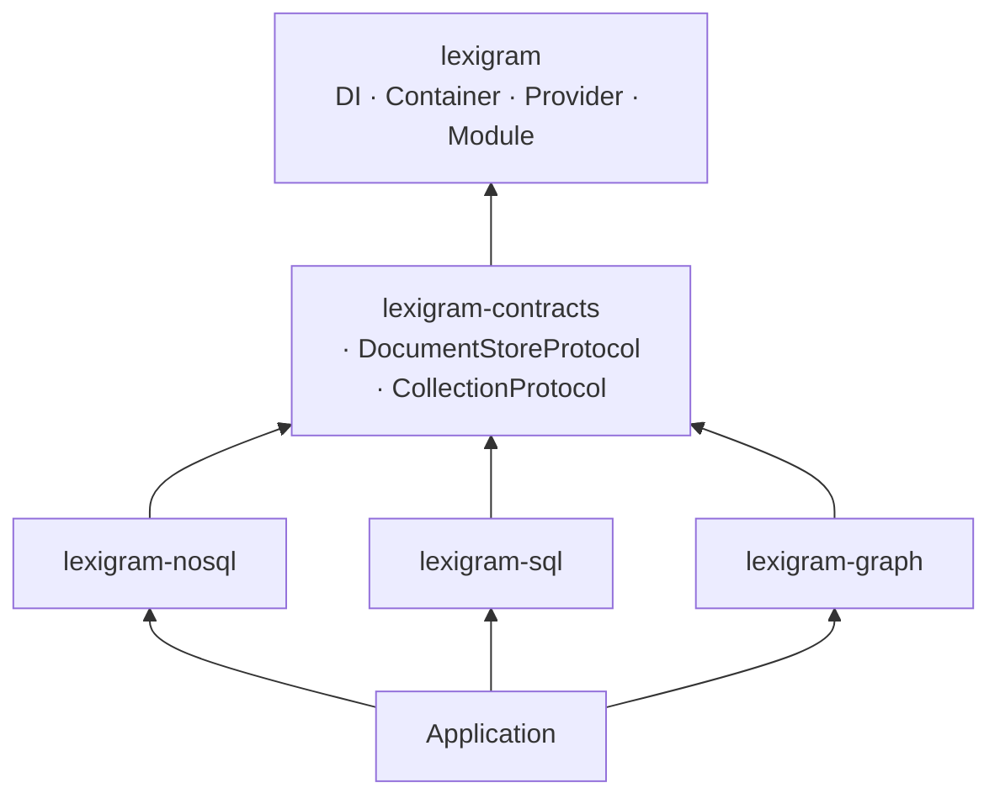
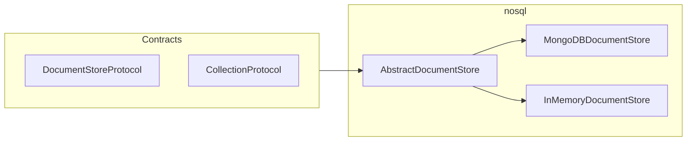
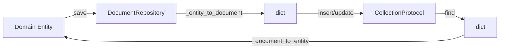
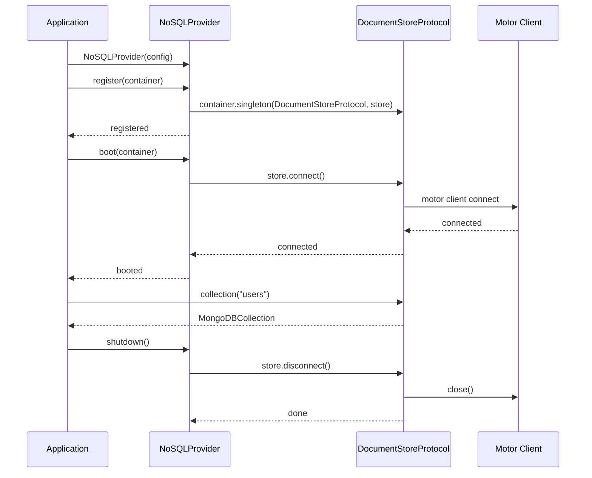

# Architecture

Internal design of the `lexigram-nosql` package.

---

## Role in the System

`lexigram-nosql` lives in the **Data & Persistence** tier alongside `lexigram-sql`. It implements `DocumentStoreProtocol` and `CollectionProtocol` from `lexigram-contracts` and provides pluggable backends for document-oriented storage.



**Dependency rule:** `lexigram-nosql` imports from `lexigram` and `lexigram-contracts` only. It never imports from `lexigram-sql`, `lexigram-graph`, or any other extension package.

---

## Backend Abstraction

Multiple document-store drivers behind a single `DocumentStoreProtocol`. Currently **MongoDB** (via motor) is the production backend. An in-memory backend is provided for testing.



### `AbstractDocumentStore`

```python
class AbstractDocumentStore(ABC):
    @abstractmethod
    async def connect(self) -> None: ...
    @abstractmethod
    async def disconnect(self) -> None: ...
    def collection(self, name: str) -> CollectionProtocol: ...
    @abstractmethod
    def session(self) -> AbstractAsyncContextManager: ...
    async def health_check(self, timeout=5.0) -> HealthCheckResult: ...
```

Subclasses override `_create_collection()` per driver. Collection handles are cached in `self._collections`.

### `MongoDBDocumentStore`

Wraps `motor.motor_asyncio.AsyncIOMotorClient` with connection pooling, BSON codec configuration, ACID transactions, health checks via `admin.command("ping")`, and configurable read/write concerns.

### `MongoDBCollection`

Wraps `AsyncIOMotorCollection` and translates driver results into framework types (`DocumentResult`, `BulkWriteResult`). Implements all `CollectionProtocol` methods including `bulk_write`, `aggregate`, `create_index`, and `distinct`. Duplicate-key errors raise `DuplicateKeyError`.

### In-memory backend

Used for unit tests. Stores documents in a `dict` of `list[dict]` keyed by collection name. Supports the full `CollectionProtocol` surface with soft delete semantics.

---

## Repository Pattern

`DocumentRepository[TEntity, TKey]` provides the same developer experience as `SQLRepository` from `lexigram-sql`, but operates on documents instead of SQL rows.



### Usage

```python
class UserRepository(DocumentRepository[User, str]):
    collection_name = "users"
    id_field = "_id"

    async def _document_to_entity(self, doc: dict) -> User:
        return User(**doc)
    async def _entity_to_document(self, entity: User) -> dict:
        return entity.to_dict()
```

### Operations

| Method | Description |
|--------|-------------|
| `get(document_id)` | Find by ID; returns `TEntity \| None` |
| `list(skip, limit, **filters)` | Paginated listing with equality filters |
| `find_by_filter(filter)` | Raw MongoDB-style filter |
| `find_by_spec(spec)` | Specification-to-filter conversion |
| `count(**filters)` | Document count |
| `save(entity)` | Upsert — insert or update |
| `delete(document_id)` | Hard or soft delete (`_deleted` flag) |
| `save_many(entities)` | Bulk insert |
| `delete_many(document_ids)` | Bulk delete |

**Soft delete:** adds `_deleted: {"$ne": True}` to all query filters and sets `_deleted=True` + `_deleted_at` on delete.

**Specification conversion** (`specification/document.py`):

```python
spec = FieldEq("status", "active") & FieldGt("age", 18)
filter_dict = to_filter(spec)
# → {"$and": [{"status": "active"}, {"age": {"$gt": 18}}]}
```

---

## Provider Lifecycle



### `NoSQLProvider`

```python
class NoSQLProvider(Provider):
    name = "nosql"
    priority = ProviderPriority.INFRASTRUCTURE
```

**Single-backend mode** (default): reads `NoSQLConfig.driver`, creates one store, registers unnamed `DocumentStoreProtocol`.

**Multi-backend mode**: iterates `NoSQLConfig.backends`, creates one store per entry, registers each under `Annotated[DocumentStoreProtocol, Named(entry.name)]`. The primary backend also receives the unnamed binding. All stores connect in parallel via `asyncio.gather` during boot.

### Health check

`health_check()` pings every registered store in parallel. Returns `UNHEALTHY` if any store is down, `DEGRADED` if nosql is disabled, `HEALTHY` otherwise.

---

## Session Management

The store's `session()` method returns an async context manager wrapping the driver's session primitive:

| Context manager | Description |
|---------------|-------------|
| `mongodb_session(client)` | Lightweight session with no active transaction |
| `mongodb_transaction(client)` | Session with auto-committed transaction; auto-aborts on exception |

Both raise `TransactionError` on failure.

```python
async with store.session() as session:
    users = store.collection("users")
    await users.insert_one({"name": "Alice"})
```

---

## Query Building

### Fluent query builder

`DocumentQueryBuilder` compiles to MongoDB-compatible filter expressions:

```python
query = (
    DocumentQueryBuilder()
    .where("status", "active")
    .where_gt("age", 18)
    .where_in("role", ["admin", "moderator"])
    .sort_by("created_at", descending=True)
    .skip(20)
    .limit(10)
    .select("name", "email")
    .build()
)
# query.filter → {"status": "active", "age": {"$gt": 18}, "role": {"$in": [...]}}
```

Eight `StrEnum` registries in `query/operators.py` centralize operator constants (`ComparisonOp`, `LogicalOp`, `UpdateOp`, `AggregationOp`, `AccumulatorOp`, `ArrayOp`, `ElementOp`, `EvaluationOp`).

### Aggregation pipeline

`AggregationPipeline` builds MongoDB aggregation pipelines fluently:

```python
pipeline = (
    AggregationPipeline()
    .match({"status": "active"})
    .group("$department", count={"$sum": 1})
    .sort("count", descending=True)
    .limit(10)
    .build()
)
```

---

## Contracts Used

| Contract | Source | How It's Used |
|----------|--------|---------------|
| `DocumentStoreProtocol` | `lexigram.contracts.data.nosql.nosql` | Registered by `NoSQLProvider`; injected into services |
| `CollectionProtocol` | `lexigram.contracts.data.nosql.nosql` | Returned by `store.collection()`; implemented by `MongoDBCollection` |
| `DocumentResult`, `BulkWriteResult` | `lexigram.contracts.data.nosql.nosql` | Return types for CRUD operations |
| `FilterExpression` (subclasses) | `lexigram.contracts.data.protocols` | Input to `to_filter()` for spec-to-query conversion |
| `HealthCheckResult` | `lexigram.contracts.core.health` | Returned by `health_check()` |
| `DomainEvent` | `lexigram.contracts.domain.events` | Base for lifecycle events |

### Exceptions

```
NoSQLError(LexigramError)
├── NoSQLConnectionError      # Connection failure
├── DocumentNotFoundError     # Document missing
├── DuplicateKeyError         # Unique constraint violation
├── DocumentValidationError   # Schema validation failure
└── TransactionError          # Multi-document transaction failure
```

All extend `NoSQLError` with unique `_code` strings. Store-layer failures raise exceptions (no `Result` wrapping).

---

## DI Registration

Provider binds config and store as singletons:

```python
class NoSQLProvider(Provider):
    async def register(self, container: ContainerRegistrarProtocol) -> None:
        container.singleton(NoSQLConfig, self._config)
        container.singleton(DocumentStoreProtocol, self._store)
        container.singleton(MongoDBDocumentStore, self._store)
```

Module registration:

```python
@module(imports=[NoSQLModule.configure(NoSQLConfig(driver="mongodb"))])
class AppModule(Module): ...
```

Repository scoping per feature module:

```python
@module(imports=[
    NoSQLModule.configure(config),
    NoSQLModule.scope(UserRepository, OrderRepository),
])
class BillingFeatureModule(Module): ...
```

---

## Events

Lifecycle events extend `DomainEvent`:

| Event | Payload | Fires When |
|-------|---------|------------|
| `NoSQLConnectedEvent` | `database`, `host` | Store connection established |
| `NoSQLDisconnectedEvent` | `database` | Store connection closed |
| `MigrationAppliedEvent` | `migration_name`, `database` | Migration executed |
| `MigrationFailedEvent` | `migration_name`, `database`, `error` | Migration failed |

---

## Migration System

`MigrationManager` provides ordered, idempotent schema migrations tracked in a `_migrations` collection:

```python
manager = MigrationManager(store)
manager.add("001", "Create email index",
    CreateIndex(collection="users", keys=[("email", 1)], unique=True))
await manager.migrate()
```

| Operation | Description |
|-----------|-------------|
| `CreateIndex` | Create single or compound index |
| `DropIndex` | Drop an index by name |
| `RenameField` | Rename a field across all documents |
| `AddField` | Add a field with default value |
| `DropCollection` | Drop an entire collection |

---

## Extension Points

| Point | Mechanism |
|-------|-----------|
| Custom backend | Implement `DocumentStoreProtocol` (or extend `AbstractDocumentStore`) and register via a custom provider |
| Custom serializer | Provide BSON codec configuration via `configure_codecs()` |
| Multi-backend | Configure `NoSQLConfig.backends` with named entries; resolve via `Annotated[DSP, Named("name")]` |
| Custom migration | Subclass `MigrationOperation`, implement `execute()`, register via `manager.add()` |
| Repository scoping | Use `NoSQLModule.scope(UserRepository)` per feature module |
| Lifecycle hooks | Subscribe to `NoSQLConnectedEvent`/`NoSQLDisconnectedEvent` via the event system |
