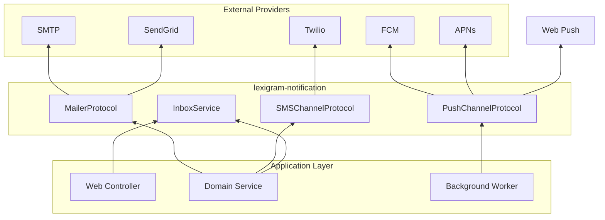
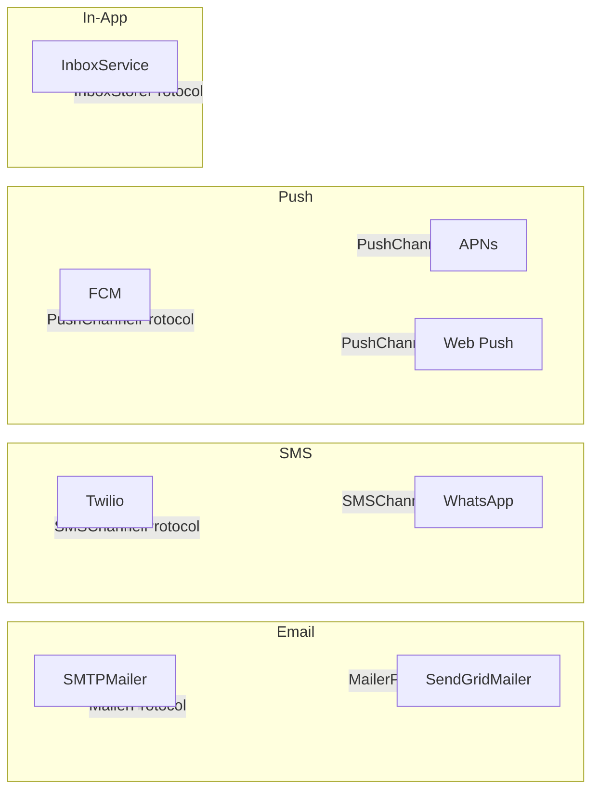
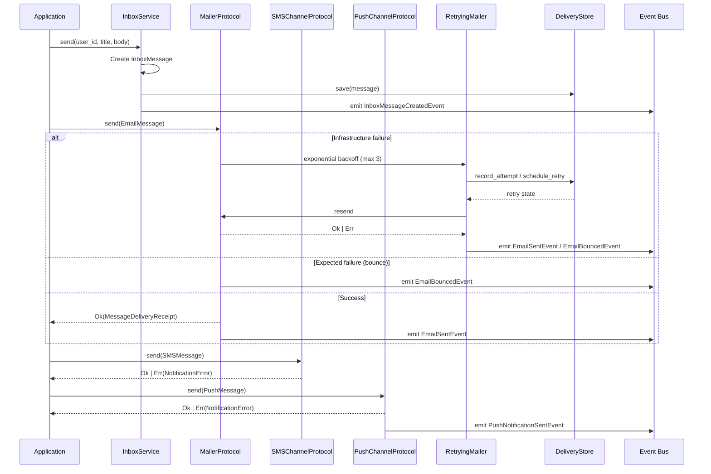
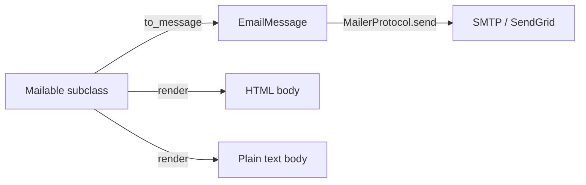
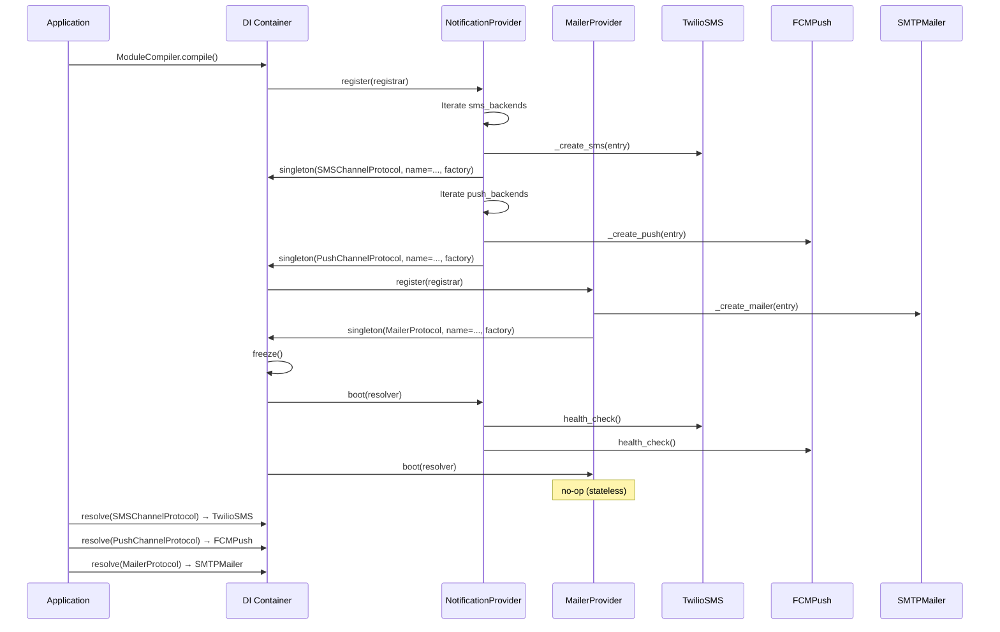

# Architecture

Internal design of the `lexigram-notification` package.

---

## Role in the System

`lexigram-notification` provides multi-channel notification delivery (SMS, push, email, in-app inbox) for Lexigram applications. It is an extension package depending only on `lexigram` and `lexigram-contracts`.



Import constraint: `lexigram-notification` imports only from `lexigram` and `lexigram-contracts`. No cross-extension imports.

---

## Channels

The package delivers notifications through four channel families, each backed by one or more providers:



**Channel routing** for backend selection is driven by **Named DI multi-backend**:

```python
# Primary backend (unnamed binding — auto-injected)
sms = await container.resolve(SMSChannelProtocol)

# Named backend — explicit routing by name
alerts_sms = await container.resolve(
    Annotated[SMSChannelProtocol, Named("alerts")]
)
```

Each channel family (SMS, push, email) supports multiple named backends. The primary backend gets the unnamed binding; named backends are addressed via `Annotated[Protocol, Named("name")]`.

---

## Notification Pipeline



**Delivery status tracking** follows this lifecycle:

```
PENDING → RETRYING → (DELIVERED | FAILED)
```

The `DeliveryStoreProtocol` (defined in `lexigram-contracts`) records every attempt. `RetryingMailer` wraps any `MailerProtocol` with exponential backoff (1s, 2s, 4s) up to 3 attempts. Infrastructure exceptions (timeout, network error) trigger retries; `Err(MailerError)` returns from the inner mailer are terminal — never retried.

---

## Template System

Email templates use the **Mailable** pattern — a lightweight strategy class that encapsulates template rendering for a single email type:

```python
class WelcomeMail(Mailable):
    def __init__(self, user_name: str, user_email: str) -> None:
        self.user_name = user_name
        self.user_email = user_email

    def to_message(self) -> EmailMessage:
        return EmailMessage(
            to=[self.user_email],
            subject=f"Welcome, {self.user_name}!",
            body=f"Hi {self.user_name}, welcome aboard.",
            html_body=f"<p>Hi <b>{self.user_name}</b>, welcome aboard.</p>",
        )
```



Channels without templates (SMS, push) construct `SMSMessage` / `PushMessage` value objects directly — no templating layer beyond simple string formatting. The `Mailable` base class ships in `lexigram.notification.mailer.mailable`.

---

## Provider Lifecycle

Two DI providers register notification backends:

### NotificationProvider (SMS + Push)

```python
class NotificationProvider(Provider):
    name = "notification"
    priority = ProviderPriority.INFRASTRUCTURE
```

### MailerProvider (Email)

```python
class MailerProvider(Provider):
    name = "mailer"
    priority = ProviderPriority.INFRASTRUCTURE
```

Discovered automatically via the `lexigram.providers` entry point (`mailer = lexigram.notification.di.mailer_provider:MailerProvider`).



---

## Contracts Used

| Protocol | Location (lexigram-contracts) | Implemented By |
|----------|-------------------------------|----------------|
| `SMSChannelProtocol` | `lexigram.contracts.notification.protocols` | `TwilioSMS` |
| `PushChannelProtocol` | `lexigram.contracts.notification.protocols` | `FCMPush`, `APNsPush`, `WebPushChannel` |
| `MailerProtocol` | `lexigram.contracts.mailer.protocols` | `SMTPMailer`, `SendGridMailer`, `RetryingMailer` |
| `InboxStoreProtocol` | `lexigram.contracts.notification.inbox` | `InMemoryInboxStore`, `DatabaseInboxStore` |
| `DeliveryStoreProtocol` | `lexigram.contracts.notification.delivery` | Application-provided (persistent tracking) |

**Value types shared across packages:**

| Type | Location | Used By |
|------|----------|---------|
| `SMSMessage` | `lexigram.contracts.notification.types` | SMS backends |
| `PushMessage` | `lexigram.contracts.notification.types` | Push backends |
| `EmailMessage` | `lexigram.contracts.mailer.types` | Mailer backends |
| `MessageDeliveryReceipt` | `lexigram.contracts.mailer.types` | All channels |
| `InboxMessage` | `lexigram.contracts.notification.inbox` | Inbox service and stores |

**Exception hierarchy:**

```
NotificationError (lexigram-contracts)
├── TwilioNotificationError
├── FCMNotificationError
├── APNsNotificationError
├── WebPushNotificationError
├── PermanentDeliveryFailure
├── InboxError
│   ├── InboxMessageNotFoundError
│   └── InboxPermissionError
MailerError (lexigram-contracts)
├── SMTPMailerError
└── SendGridMailerError
```

---

## Extension Points

| Point | Mechanism |
|-------|-----------|
| **Custom SMS driver** | Implement `SMSChannelProtocol`, add a `NamedSMSConfig` subclass |
| **Custom push driver** | Implement `PushChannelProtocol`, add a `NamedPushConfig` subclass |
| **Custom mailer** | Implement `MailerProtocol`, add a `NamedMailerConfig` subclass |
| **Custom inbox store** | Implement `InboxStoreProtocol` |
| **Custom delivery store** | Implement `DeliveryStoreProtocol` |
| **Retry wrapper** | `RetryingMailer` wraps any `MailerProtocol` with configurable retry (max 3 attempts, exponential backoff) |
| **Named multi-backend** | Declare multiple entries in `backends` / `sms_backends` / `push_backends` in config |
| **Hook points** | Register callbacks via `HookRegistryProtocol` for `NotificationSentHook`, `NotificationFailedHook`, `EmailDispatchedHook`, `EmailRenderedHook`, `InboxMessageCreatedHook`, `InboxMessageReadHook` |
| **Domain events** | Subscribe to `NotificationSentEvent`, `NotificationFailedEvent`, `EmailSentEvent`, `EmailBouncedEvent`, `InboxMessageCreatedEvent`, `InboxMessageReadEvent` |
