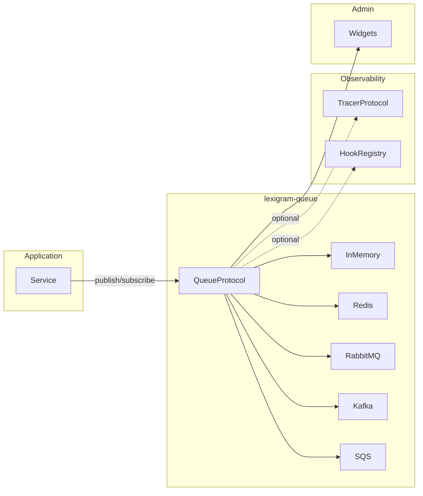
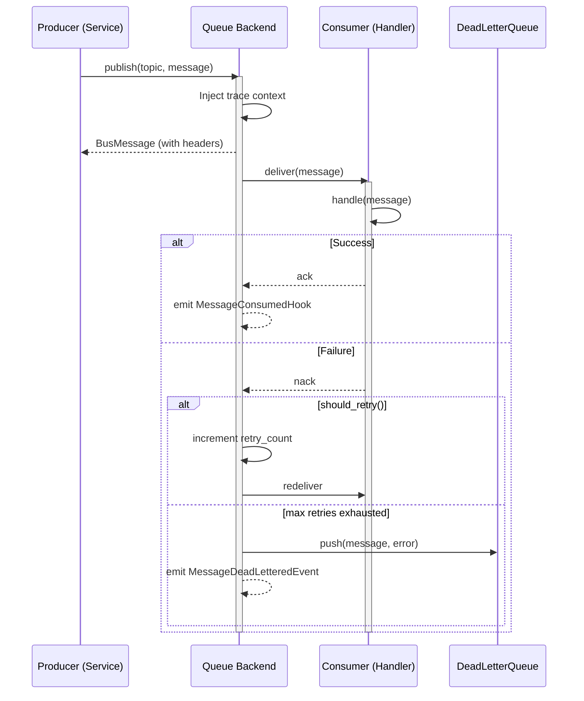
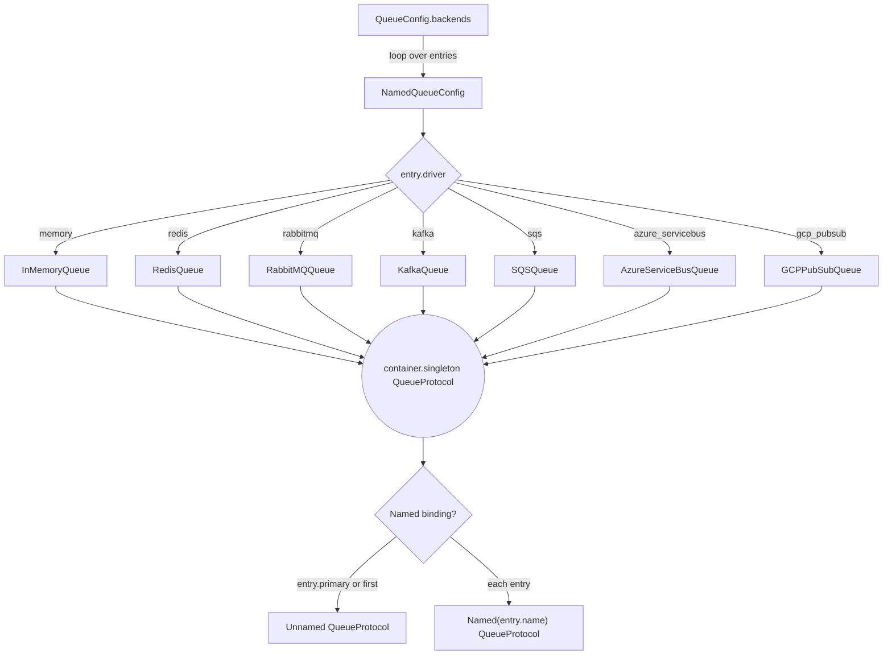
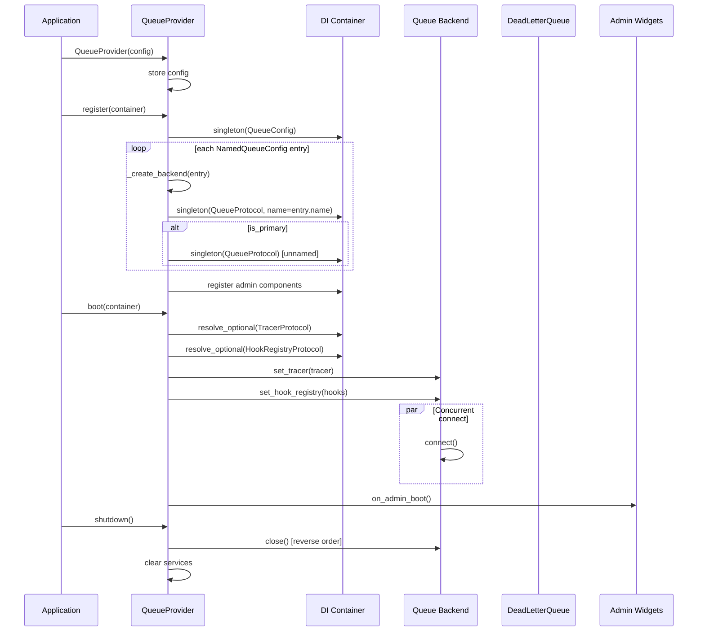

# Architecture

Internal design of the `lexigram-queue` package.

---

## Role in the System

`lexigram-queue` provides the **message bus and queue** abstraction for Lexigram applications. It sits in the Messaging tier alongside `lexigram-events` (CQRS/ES) and `lexigram-tasks` (background jobs).

- **Depends on:** `lexigram`, `lexigram-contracts`
- **No cross-extension imports** — communicates via `QueueProtocol` from contracts



---

## Message Model

Messages are defined as a frozen dataclass in `lexigram-contracts`:

```python
@dataclass(frozen=True)
class BusMessage:
    id: str                         # UUID4 default
    topic: str                      # Destination topic
    payload: Any                    # Serializable body
    headers: dict[str, str]         # Opaque broker headers
    timestamp: float                # Unix epoch (creation time)
    ttl: float | None               # Time-to-live (None = backend default)
    priority: int                   # Higher = more urgent
    delivery_guarantee: DeliveryGuarantee  # at_most_once, at_least_once, exactly_once
    retry_count: int                # Current retry attempt
    max_retries: int                # Max before DLQ (default 3)
```

| Method | Returns | Purpose |
|--------|---------|---------|
| `is_expired()` | `bool` | `timestamp + ttl` elapsed |
| `should_retry()` | `bool` | `retry_count < max_retries` and not expired |

**Delivery guarantees:** `AT_MOST_ONCE` (lost, never duped), `AT_LEAST_ONCE` (duped, never lost), `EXACTLY_ONCE` (best effort).

**Trace context:** When `TracerProtocol` is wired, backends inject W3C trace context into `BusMessage.headers` on publish and extract on subscribe.

---

## Producer/Consumer Pattern



### Consumer workers

Create a subscriber by subclassing `MessageConsumer`:

```python
class OrderCreatedConsumer(MessageConsumer):
    topic = "orders.created"

    async def handle(self, message: BusMessage) -> None:
        order = message.payload
        await process_order(order)
```

Registered via `QueueModule.scope()`:

```python
QueueModule.scope(OrderCreatedConsumer, PaymentConsumer)
```

`MessagePipeline` chains `MiddlewareBase.process()` calls around a terminal handler.

---

## Backend Support

### Driver table

| Driver | Class | Extra Install | Config Class |
|--------|-------|---------------|--------------|
| `memory` | `InMemoryQueue` | (built-in) | — |
| `redis` | `RedisQueue` | `lexigram-queue[redis]` | `RedisDriverConfig` |
| `rabbitmq` | `RabbitMQQueue` | `lexigram-queue[rabbitmq]` | `RabbitMQDriverConfig` |
| `kafka` | `KafkaQueue` | `lexigram-queue[kafka]` | `KafkaDriverConfig` |
| `sqs` | `SQSQueue` | `lexigram-queue[sqs]` | `SQSDriverConfig` |
| `azure_servicebus` | `AzureServiceBusQueue` | `lexigram-queue[azure]` | `AzureServiceBusDriverConfig` |
| `gcp_pubsub` | `GCPPubSubQueue` | `lexigram-queue[gcp]` | `GCPPubSubDriverConfig` |

### Backend selection flow



Each backend is registered under its own `Named()` DI key — resolvable via `Annotated[QueueProtocol, Named("events")]` — plus unnamed binding for the primary.

---

## Provider Lifecycle



Properties: `name = "queue"`, `priority = ProviderPriority.INFRASTRUCTURE`, `config_key = None` (config passed explicitly).

`health_check()` aggregates status across all backends with `asyncio.gather`, returning the worst `HealthStatus`.

---

## Contracts Used

All queue contracts live in `lexigram-contracts` and are consumed by `lexigram-queue` without redefining anything:

| Type | Location in Contracts | Purpose |
|------|-----------------------|---------|
| `QueueProtocol` | `queue.protocols` | Core queue abstraction — `connect`, `publish`, `subscribe`, `close`, `health_check` |
| `MessageConsumerProtocol` | `queue.protocols` | Consumer lifecycle — `start`, `stop` |
| `BusMessage` | `queue.types` | Frozen message value type with delivery metadata |
| `DeliveryGuarantee` | `queue.types` | `StrEnum`: `AT_MOST_ONCE`, `AT_LEAST_ONCE`, `EXACTLY_ONCE` |
| `QueueError` | `queue.errors` | Base domain error (`LEX_ERR_QUEUE_001`) |
| `TracerProtocol` | `observability.tracing` | Optional distributed tracing injection |
| `HookRegistryProtocol` | `core` | Optional lifecycle hook emission |
| `HealthCheckResult` | `core.health` | Health aggregate |

One leaf exception per backend (`RedisQueueError`, `RabbitMQQueueError`, `KafkaQueueError`, `SQSQueueError`, `AzureServiceBusQueueError`, `GCPPubSubQueueError`), all extending `QueueError` with codes `LEX_ERR_QUEUE_002`–`007`.

---

## Core Infrastructure

- **DeadLetterQueue** — stores failed `DeadLetterEntry` (message, error, timestamp, retry_count), bounded at 1000 entries (oldest evicted first).
- **TransactionalOutbox** — stages messages via `stage(topic, message)`, publishes atomically on `flush()`, then `clear()`.
- **Hook payloads:** `MessagePublishedHook`, `MessageConsumedHook`, `QueueDrainedHook` — each carries `queue_name`.
- **Domain events:** `MessageConsumedEvent`, `MessageDeadLetteredEvent`, `ConsumerRegisteredEvent` — extend `DomainEvent` from contracts.

---

The provider registers `QueueConfig` (singleton), `QueueProtocol` (named per backend + unnamed primary), admin widgets (`PackageWidgetRenderer`, `QueueDepthWidgetHandler`, `ConsumerLagWidgetHandler`, `FailedMessagesWidgetHandler`), and `QueueAdminContributor`.

---

## Extension Points

| Point | Mechanism |
|-------|-----------|
| Custom backend | Implement `QueueProtocol` from contracts |
| Custom consumer | Subclass `MessageConsumer`, override `handle()` |
| Custom middleware | Subclass `MiddlewareBase`, register on `MessagePipeline` |
| Custom serialization | Backend uses `lexigram.serialization` — swap via config |
| Custom hook handler | Register action/filter via `HookRegistryProtocol` |
| Admin widget | Subclass existing handler or contribute to `QueueAdminContributor` |
| Tracing integration | Provide `TracerProtocol` implementation in DI container |

Implement `QueueProtocol` from contracts, then register via `NamedQueueConfig` or `container.singleton(QueueProtocol, MyCustomQueue(), name="my_backend")`.

---

| Symbol | Value |
|--------|-------|
| `ENV_PREFIX` | `LEX_QUEUE__` |
| `DEFAULT_CONSUMER_CONCURRENCY` | 4 |
| `DEFAULT_CONSUMER_PREFETCH` | 10 |
| `DEFAULT_MAX_RETRIES` | 3 |
| `DEFAULT_VISIBILITY_TIMEOUT` | 30 (seconds) |
| `__version__` | from `importlib.metadata` |
