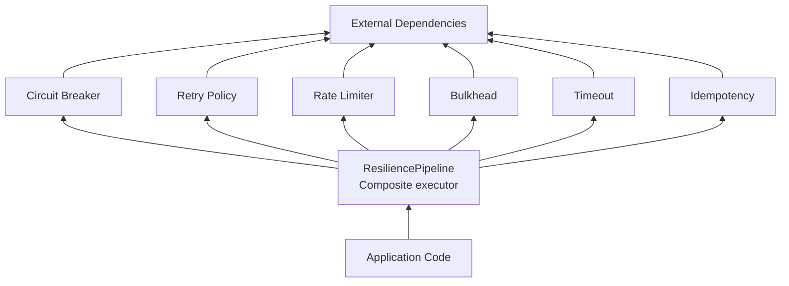
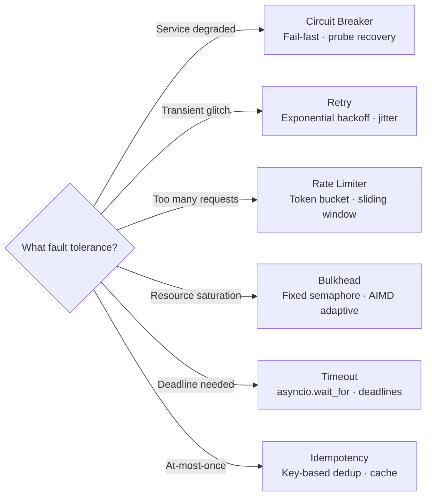
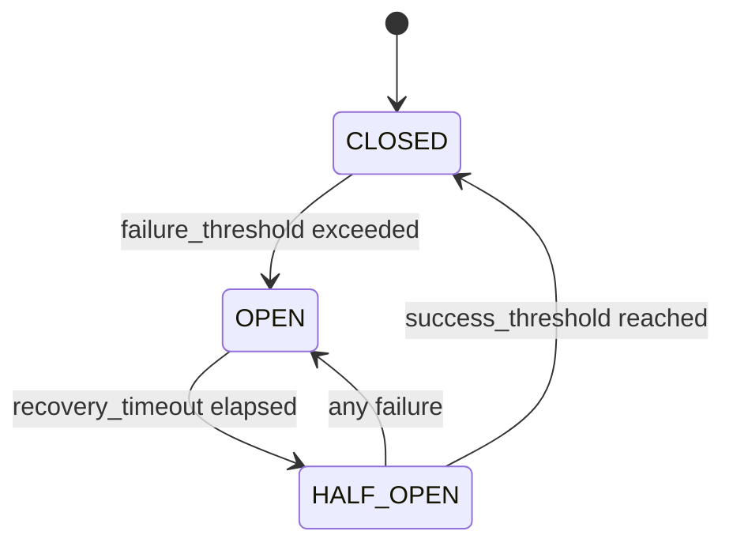
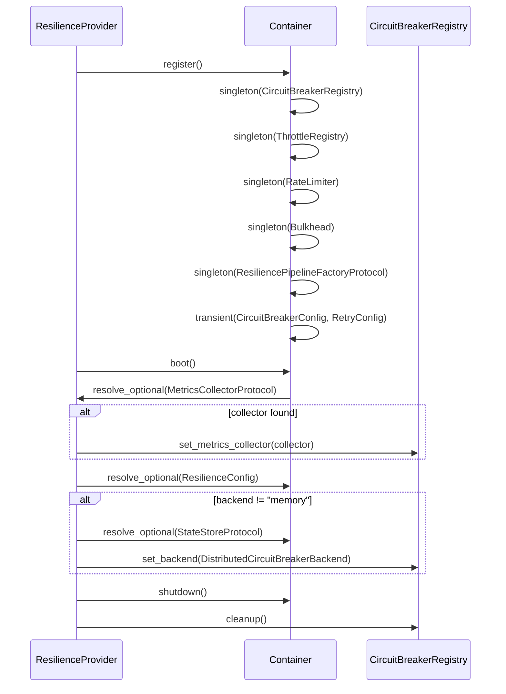

# Architecture

Internal design of the `lexigram-resilience` package.

---

## Role in the System

The resilience subsystem sits between application code and external dependencies, intercepting calls to apply fault-tolerance patterns:



**Import direction rule:** A pipeline may import circuit breakers, retry policies, and rate limiters. A circuit breaker may not import from the pipeline. All implementations import from `lexigram.contracts.infra.resilience` for protocols, configs, and enums.

---

## Patterns Overview



---

## Source Mapping

| Module | Contents |
|--------|----------|
| `circuit/` | `CircuitBreaker`, `CircuitBreakerRegistry`, distributed backends |
| `retry/` | `RetryPolicy`, `RetryManager`, `calculate_delay`, `should_retry` |
| `rate_limiter/` | `TokenBucket`, `RateLimiter`, `SlidingWindowLimiter`, `DistributedRateLimiter` |
| `bulkhead/` | `Bulkhead`, `AIMDBulkhead` (adaptive) |
| `throttle/` | `Throttler`, `ThrottleRegistry`, `throttle` decorator |
| `timeout/` | `TimeoutManager` — named timeout registry |
| `pipeline/` | `ResiliencePipeline` — composite executor |
| `fallback/` | `Fallback` — retry, degradation, alternative fallbacks |
| `idempotency/` | In-memory/Redis/Database stores, `idempotent` decorator |
| `di/` | `ResilienceProvider` |
| `decorators.py` | `bulkhead`, `circuit_breaker`, `with_timeout`, `retry`, `idempotent` |
| `config.py` | `ResilienceConfig`, `BulkheadConfig`, `IdempotencyConfig` |
| `exceptions.py` | Leaf exceptions (bases re-exported from contracts) |
| `module.py` | `ResilienceModule` |
| `hooks.py` | Hook payloads: `CircuitOpenedHook`, `CircuitClosedHook`, `RetryAttemptedHook` |
| `events.py` | Domain events: `CircuitOpenedEvent`, `CircuitClosedEvent`, `RetryExhaustedEvent` |

---

## Circuit Breaker

### State Machine



**CLOSED** — all requests pass through. A sliding window counter tracks failure rate and consecutive failures. **OPEN** — requests fail immediately with `CircuitOpenError`. **HALF_OPEN** — after `recovery_timeout`, one probe request is allowed (enforced by `asyncio.Semaphore(1)`). If it succeeds, the circuit closes after `success_threshold` consecutive successes; any failure returns to OPEN.

Supports both consecutive-failure and failure-rate-based tripping:

```python
CircuitBreakerConfig(
    failure_threshold=5,           # Consecutive failures to open
    recovery_timeout=60.0,         # Seconds before probe
    success_threshold=2,           # Consecutive successes to close
    failure_rate_threshold=0.5,    # 0.0–1.0: opens if exceeded
)
```

**Presets:** `CircuitBreaker.sensitive()` (trips after 3 failures, 30s recovery) and `CircuitBreaker.tolerant()` (10 failures, 120s recovery).

**Backends:** `InMemoryCircuitBreakerBackend` (single-process) or `DistributedCircuitBreakerBackend` via `StateStoreProtocol` (multi-process with Redis/Consul).

---

## Retry Policy

### Delay Calculation

```python
delay = base_delay * (backoff_factor ** attempt)
delay = min(delay, max_delay)
# Optional jitter: ±jitter_factor * delay (uniform random)
```

### Decision Chain

| Condition | Action |
|-----------|--------|
| `attempt >= max_attempts` | Stop — `RetryExhaustedError` |
| `result` matches `abort_if` | Stop — abort condition |
| `error` is instance of `abort_on` | Stop — non-retryable |
| `result` matches `retry_on_result` | Retry |
| `error` in `retry_on` + `retry_if` passes | Retry |
| Success, no predicate | Return result |

**Presets:** `RetryPolicy.aggressive()` (5 attempts, 100ms base, 1.5× backoff) and `RetryPolicy.conservative()` (3 attempts, 2s base, 2× backoff).

---

## Rate Limiter

**Token bucket** (`RateLimiter`): tokens refill at `rate / per` per second up to `burst` capacity. Refill computed from elapsed monotonic time — no timer needed.

```python
limiter = RateLimiter(rate=100, per=1.0, burst=200)
await limiter.acquire()          # Blocks
ok = await limiter.try_acquire() # Non-blocking
```

**Sliding window** (`SlidingWindowLimiter`): timestamps in a `deque`. Old entries pruned on each acquisition. More precise at low rates.

**Distributed:** `DistributedRateLimiter` via `StateStoreProtocol` for cross-process coordination.

---

## Bulkhead

**Fixed** (`Bulkhead`): two semaphores — `max_concurrent` for active slots, `queue_size` for queued waiters. `BulkheadRejectedError` when queue is full.

```python
Bulkhead(BulkheadConfig(max_concurrent=10, queue_size=100))
```

**Adaptive** (`AIMDBulkhead`): Netflix-style additive-increase/multiplicative-decrease. Increases slots when latency is low; halves on high latency or errors. Adjustment rate-limited to once per second.

---

## Provider Lifecycle



---

## Contracts Used

All protocols in `lexigram.contracts.infra.resilience`:

| Protocol | Purpose |
|----------|---------|
| `CircuitBreakerProtocol` | State machine: `call`, `protect`, `reset`, `force_open` |
| `CircuitBreakerRegistryProtocol` | Named breaker management |
| `RetryPolicyProtocol` | `execute` a callable with retry |
| `BulkheadProtocol` | Async context manager for concurrency limiting |
| `ResiliencePipelineProtocol` | `add` + `execute` for composed patterns |
| `ResiliencePipelineFactoryProtocol` | `__call__` factory from configs |
| `RateLimiterProtocol` | Token-bucket: `acquire`, `try_acquire`, `get_stats` |
| `ThrottlerProtocol` | Window-based: `acquire`, `try_acquire`, `get_stats` |

Config models and enums also live in contracts so any extension package can reference them without depending on `lexigram-resilience`:

| Model | Key Fields |
|-------|------------|
| `CircuitBreakerConfig` | `failure_threshold`, `recovery_timeout`, `success_threshold`, `failure_rate_threshold` |
| `RetryConfig` | `max_attempts`, `base_delay`, `max_delay`, `backoff_factor`, `jitter` |
| `TimeoutConfig` | `timeout` |
| `CircuitState` | `CLOSED`, `OPEN`, `HALF_OPEN` |

---

## Extension Points

| Point | Mechanism |
|-------|-----------|
| Custom circuit breaker backend | Implement `CircuitBreakerBackend`, call `registry.set_backend(...)` |
| Custom retry strategy | Subclass `RetryPolicy`, override `execute`; or use `ConfiguredRetryPolicy` |
| Custom idempotency store | Implement `IdempotencyStoreProtocol` from `lexigram.contracts.core.idempotency` |
| Pipeline order | Pass `order` to `ResiliencePipeline` (e.g., `["timeout", "circuit_breaker", "retry"]`) |
| Fallback strategies | Compose `Fallback.retry_fallback()`, `.degrade()`, `.alternative()` |
| Metrics integration | Resolve `MetricsRecorderProtocol` in `boot()` — auto-wired |
| Event hooks | Subscribe to `CircuitOpenedEvent`, `CircuitClosedEvent`, `RetryExhaustedEvent` |
