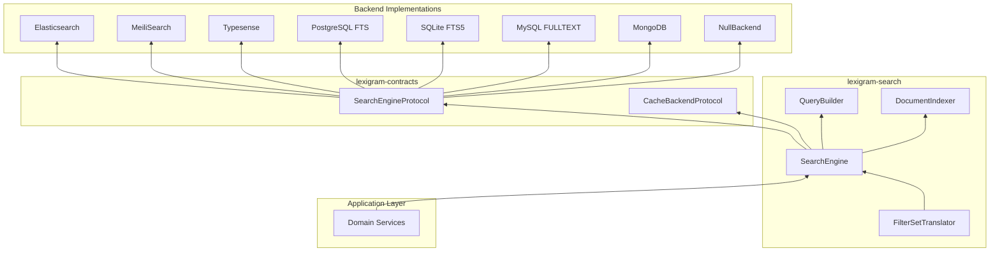
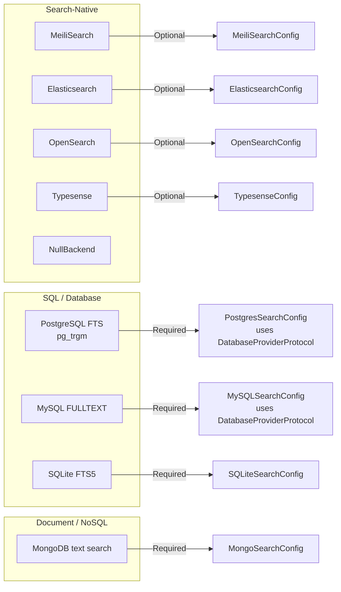
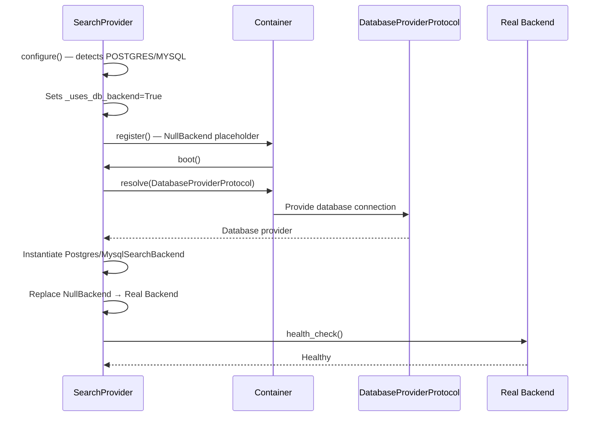
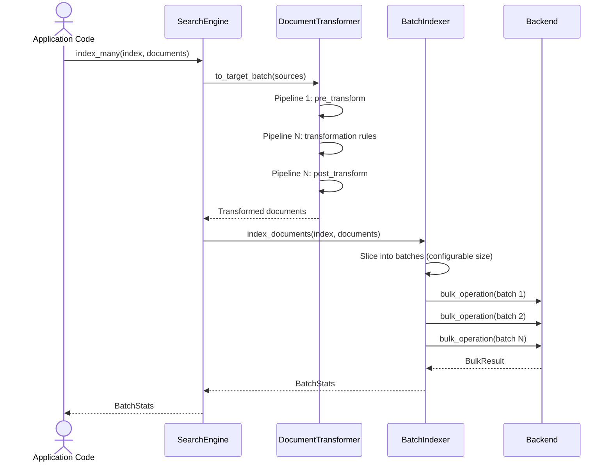
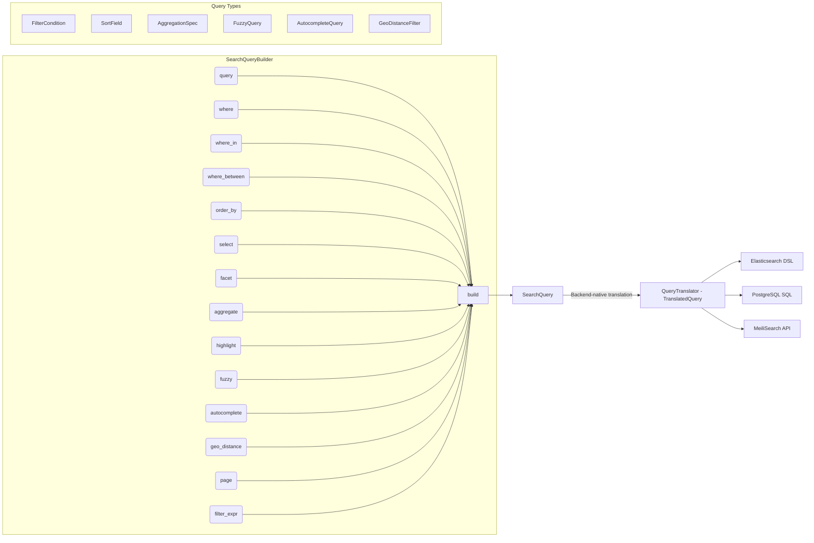
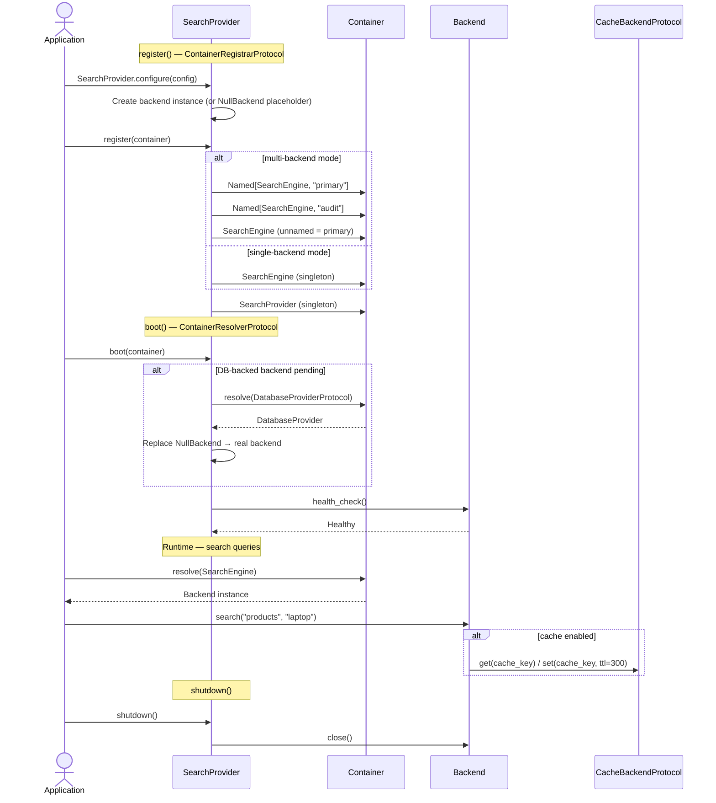
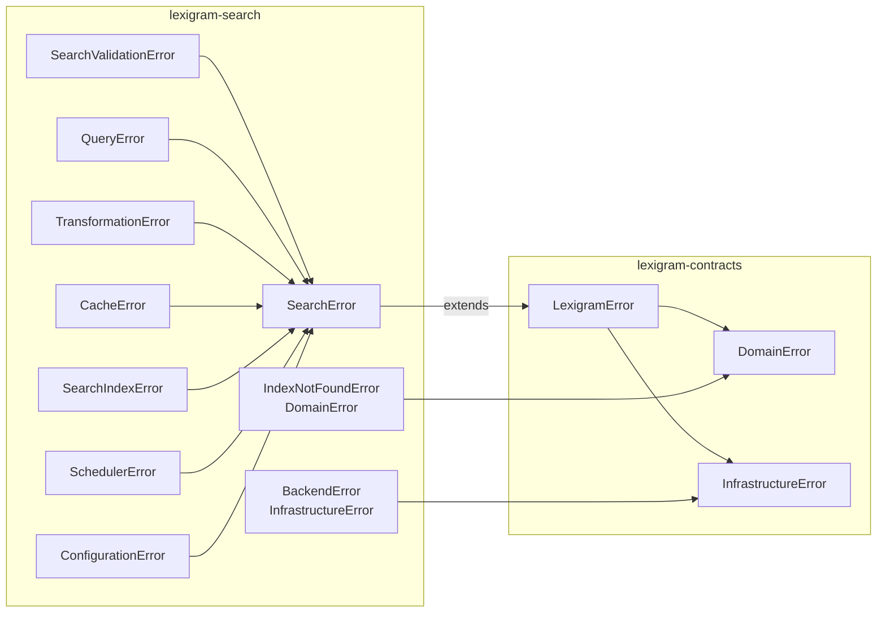

# Architecture

Internal design of the `lexigram-search` package.

---

## Role in the System

`lexigram-search` provides **full-text and faceted search** as a pluggable abstraction layer. It sits between domain services and search backends (Elasticsearch, MeiliSearch, Typesense, SQL-based FTS), translating `SearchEngineProtocol` calls into backend-specific operations.



**Import direction rule:** Arrows point toward the dependency. Application code depends on `SearchEngineProtocol` from contracts, NOT on backend implementations. Backend implementations satisfy `SearchEngine` structurally (protocol) — no inheritance required.

---

## Backend Abstraction

The package uses a **structural protocol** pattern with two layers:

### `SearchBackend` (structural protocol in `protocols.py`)

Defines the minimal contract every search backend must satisfy:

- `index(index_name, documents)` — bulk indexing
- `search(index_name, query, filters, limit, offset)` — query execution
- `health_check(timeout)` — operational health

### `SearchEngine` (abstract base in `engine/base.py`)

Extends the protocol with index lifecycle operations (create, delete, exist check) and a richer search signature. All concrete backends satisfy this interface.

### Supported Backends



SQL-backed backends (Postgres, MySQL) are resolved lazily during `boot()` — they register a `NullBackend` placeholder during `register()` and swap in the real backend resolved from the container's `DatabaseProviderProtocol` at boot time.



---

## Indexing Pipeline

Documents flow through a transformation pipeline before reaching the search backend:



The `DocumentTransformer` extends `ReadOnlyMapper[dict, dict]` from `lexigram.data.mapper`. Transformation pipelines consist of ordered `TransformationRule` instances, each with an optional condition and error handling:

| Component | Role |
|-----------|------|
| `TransformationRule` | A single field transform with optional condition |
| `TransformationPipeline` | Named sequence of rules, pre/post hooks |
| `DocumentTransformer` | Applies pipelines via `to_target()` / `to_target_batch()` |
| `FieldMapper` | Renames document fields before indexing |
| `ValueTransformer` | Transforms individual field values |

---

## Search Query Model

Search queries are built through a **fluent builder** that composes filters, facets, pagination, sorting, and advanced query types:



The builder exposes a chained API:

```python
query = (
    SearchQueryBuilder()
    .query("python")
    .where("status", "active")
    .where_between("score", 80, 100)
    .facet("category")
    .order_by_desc("score")
    .highlight(fields=["title", "description"])
    .page(1, 20)
    .build()
)
result = await engine.search("documents", query)
```

### Filter Expression Support

Beyond simple flat conditions, the builder accepts composable `FilterExpression` trees (`AndExpression`, `OrExpression`, `NotExpression`) from `lexigram.contracts.data` via `filter_expr()`.

### Admin-Facing FilterSet

The `FilterSetTranslator` converts an admin-facing `FilterSet` (with `FilterOperator` enum) into a `SearchQuery`:

```python
fs = FilterSet(
    conditions=(
        FilterCondition("status", FilterOperator.EQ, "active"),
        FilterCondition("score", FilterOperator.GTE, 80),
    ),
    order_by="name",
    page=1, page_size=10,
    search_query="python",
)
search_query = FilterSetTranslator().translate(fs)
```

---

## Provider Lifecycle

`SearchProvider` is registered at `ProviderPriority.DOMAIN` — after infrastructure (database, cache) but before presentation (web).



### Provider Priorities

`SearchProvider` uses `ProviderPriority.DOMAIN` — it boots after infrastructure (database, cache) but before presentation (web).

### Multi-Backend Mode

When `SearchConfig.backends` is non-empty, the provider registers each entry as `Annotated[SearchEngineProtocol, Named(entry.name)]`. The primary backend receives both the named binding and the unnamed default binding for backward compatibility.

```python
config = SearchConfig(backends=[
    NamedSearchConfig(name="primary", primary=True, backend_type="meilisearch"),
    NamedSearchConfig(name="audit", backend_type="postgres", database="audit_db"),
])
```

---

## Contracts Used

| Protocol | Location in Contracts | Implemented By |
|----------|----------------------|---------------|
| `SearchEngineProtocol` | `lexigram.contracts.search` | `SearchEngine` ABC, `DefaultSearchEngine`, `FederatedSearchEngine`, each backend, `CachedSearchBackend` |
| `SearchableProtocol` | `lexigram.contracts.search` | `SearchableModel` |
| `IndexManagerProtocol` | `lexigram.contracts.search` | Per-backend index managers |
| `SearchAnalyticsProtocol` | `lexigram.contracts.search` | `SearchAnalyticsRecorder` |
| `DocumentTransformerProtocol` | `lexigram.contracts.search` | `DocumentTransformer`, `DefaultDocumentTransformer` |
| `DatabaseSearchBackendProtocol` | `lexigram.contracts.search` | Postgres/MySQL backends |
| `CacheBackendProtocol` | `lexigram.contracts.infra.cache` | `CachedSearchBackend` (wraps an inner backend) |
| `DatabaseProviderProtocol` | `lexigram.contracts.data` | Resolved at boot for SQL-backed backends |
| `FilterExpression` | `lexigram.contracts.data` | `SearchQueryBuilder.filter_expr()` |
| `HookRegistryProtocol` | `lexigram.contracts.hooks` | `SearchIndexedHook`, `SearchQueryExecutedHook` |
| `EventBusProtocol` | `lexigram.contracts.events` | `IndexingCompletedEvent`, `SearchExecutedEvent` |

---

## Exception Convention



Domain search errors use the `Result[T, E]` pattern — every `search()`, `index()`, and `create_index()` call returns `Result[..., SearchError]`. Infrastructure failures (connection lost, timeout) propagate as exceptions from `BackendError`.

---

## Cached Backend

`CachedSearchBackend` decorates any `SearchEngine` with a cache-aside pattern:

```python
from lexigram.search.backends.cached import CachedSearchBackend

backend = CachedSearchBackend(
    inner=NullBackend(),
    cache=cache_backend,  # resolved from container
    ttl=300,
)
```

- **Read path**: Cache key is a deterministic hash of `(index, query, filters, limit, offset, sort)`. Cache hit returns `Ok(response)` without touching the backend.
- **Write path**: Index/update/delete operations pass through and invalidate the affected index's cache entries.
- **Failure isolation**: Cache unavailability (connection error, timeout) logs a warning and falls through to the inner backend — never fails the search.

---

## Query Translation

Each backend with non-trivial query syntax (Elasticsearch, PostgreSQL) implements a `QueryTranslator` subclass that converts the unified `SearchQuery` into backend-native format:

| Translator | Output Format |
|------------|---------------|
| `PostgresQueryTranslator` | Raw SQL with `websearch_to_tsquery` parameters |
| `ElasticsearchQueryTranslator` | Elasticsearch Query DSL dict |
| (MeiliSearch, Typesense, SQLite) | Direct API calls via their SDK |

The `TranslatedQuery` dataclass carries the translated query, params, options, aggregations, and highlight definitions.

---

## Search Suggestions

`SuggestionEngine` provides query suggestion/autocomplete capabilities:

```python
from lexigram.search.query import SuggestionEngine

engine = SuggestionEngine(search_backend=backend)
suggestions = await engine.suggest("pyth")
# → ["python", "python django", "python async"]
```

Supports per-query result limiting, and can be backed by any registered search backend.

---

## Federation

`FederatedSearchEngine` wraps a `SearchEngineProtocol` and searches across multiple indices simultaneously, combining results:

```python
federated = FederatedSearchEngine(engine=search_engine, indices=["products", "documents"])
results = await federated.search_across("laptop", limit_per_index=10)
```

Supports per-index limits, total result caps, index-specific filtering, and **fallback search** — if primary indices return insufficient results, secondary indices are queried automatically.

---

## Reindexing

`ReindexManager` performs zero-downtime index rebuilds:

1. Creates a **shadow index** (`{name}_reindex_{timestamp}`)
2. Streams documents from an `AsyncIterator` in batches
3. **Swaps** atomically using aliases (Elasticsearch) or drop-and-rename (other backends)

```python
manager = ReindexManager(engine=search_engine, batch_size=500)

async def my_source():
    async for item in db.stream_all():
        yield item.to_dict()

await manager.reindex("users", source=my_source())
```

---

## Indexing Scheduler

`IndexingScheduler` runs periodic indexing jobs:

- Configurable interval, batch size, concurrency, and retry
- `asyncio`-based scheduler loop with semaphore-limited concurrency
- Tracks per-job stats (processed, failed, throughput)
- Supports immediate execution via `run_job_now()`

---

## Source Layout

```
src/lexigram/search/
├── __init__.py              # Lazy public API exports
├── config.py                # SearchConfig, BackendType, per-backend configs
├── constants.py             # Default values, backend name strings
├── exceptions.py            # SearchError, BackendError, QueryError, …
├── types.py                 # SearchResult, SearchResponse, SearchQuery, SearchStrategy
├── protocols.py             # SearchBackend, Indexer, QueryBuilder (structural)
├── module.py                # SearchModule — DynamicModule wrapper
├── di/
│   └── provider.py          # SearchProvider — register, boot, shutdown
├── engine/
│   ├── base.py              # SearchEngine protocol (structural)
│   ├── engine.py            # DefaultSearchEngine, BulkOperationResult, BulkResult
│   ├── federation.py        # FederatedSearchEngine, FederatedResults
│   ├── models.py            # SearchableModel
│   └── validation.py        # Query length, structure validation
├── backends/
│   ├── base/backend.py      # SearchBackendBase (ABC + AbstractReadOnlyRepository)
│   ├── factory.py           # Backend factory (get_backend)
│   ├── cached.py            # CachedSearchBackend (decorator)
│   ├── translate.py         # QueryTranslator ABC, PostgresQueryTranslator, ES translator
│   ├── null.py              # NullBackend (in-memory noop)
│   ├── meilisearch/         # MeiliSearchBackend
│   ├── elasticsearch/       # Elasticsearch / OpenSearch backends
│   ├── typesense/           # Typesense backend
│   ├── sqlite/              # SQLite FTS5 backend
│   ├── postgres/            # PostgreSQL FTS backend (resolved via DatabaseProviderProtocol)
│   ├── mysql/               # MySQL FULLTEXT backend
│   └── mongodb/             # MongoDB text search backend
├── query/
│   ├── builder.py           # SearchQueryBuilder (fluent API)
│   ├── types.py             # FilterCondition, SortField, AggregationSpec, FuzzyQuery, …
│   ├── operator_registry.py # Query operator registry
│   ├── filters.py           # Filter utilities
│   ├── safe_query.py        # SafeSearchQuery validation
│   ├── suggestions.py       # SuggestionEngine
│   └── validation.py        # Query validation
├── filterset/
│   ├── types.py             # FilterCondition, FilterOperator, FilterSet
│   └── translator.py        # FilterSetTranslator
├── indexing/
│   ├── transformer.py       # DocumentTransformer, TransformationPipeline, FieldMapper
│   ├── batch.py             # BatchIndexer, BatchConfig, BatchStats
│   ├── reindex.py           # ReindexManager
│   └── scheduler.py         # IndexingScheduler, IndexingJob, ScheduleConfig
├── analytics/
│   └── recorder.py          # SearchAnalyticsRecorder, InMemorySearchAnalyticsRecorder
├── repository/
│   └── entity_repository.py # SearchEntityRepository
├── validation/
│   ├── validator.py         # SearchQueryValidator
│   └── functions.py         # sanitize_search_query, validate_index_name, …
├── hooks.py                 # SearchIndexedHook, SearchQueryExecutedHook
└── events.py                # IndexingCompletedEvent, SearchExecutedEvent
```

---

## Extension Points

| Point | Mechanism |
|-------|-----------|
| Custom backend | Implement `SearchBackend` protocol (structural) — no subclass required |
| Custom document transformer | Subclass `DocumentTransformer`, override `to_target()` |
| Custom query builder | Implement `QueryBuilder` protocol, register via `SearchProvider` |
| Custom query translator | Subclass `QueryTranslator`, implement `translate_search()` |
| Custom analytics | Implement `SearchAnalyticsProtocol`, pass to `SearchAnalyticsRecorder` |
| Custom filter set translator | Subclass `FilterSetTranslator` for backend-specific filter syntax |
| Index lifecycle hooks | Subscribe to `SearchIndexedHook` / `SearchQueryExecutedHook` |
| Domain events | Subscribe to `IndexingCompletedEvent` / `SearchExecutedEvent` via `EventBusProtocol` |
| Search result caching | Wrap any backend with `CachedSearchBackend` + `CacheBackendProtocol` |
| Periodic indexing | Add a `IndexingJob` to `IndexingScheduler` with a data source callable |
