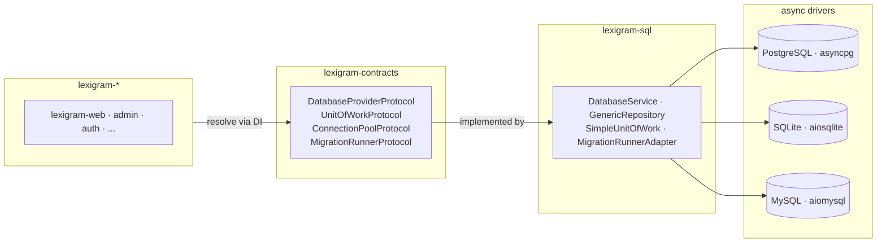
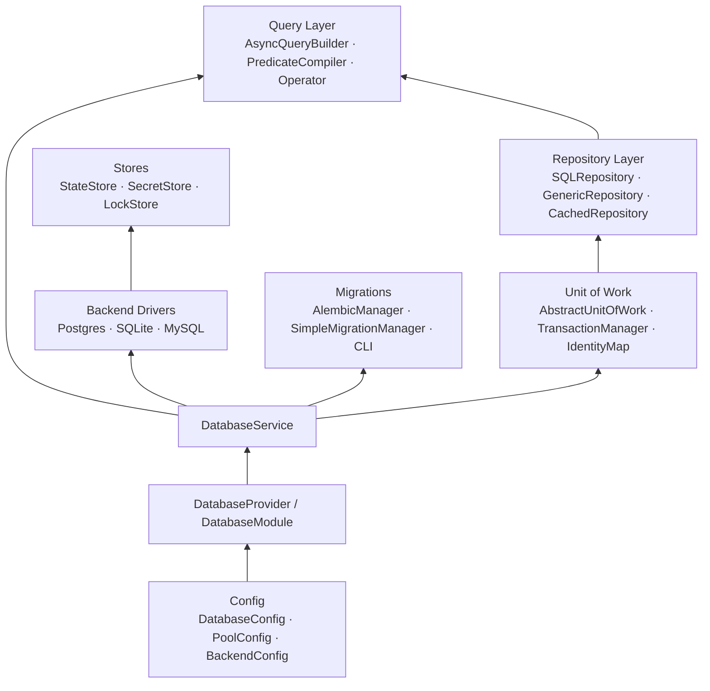
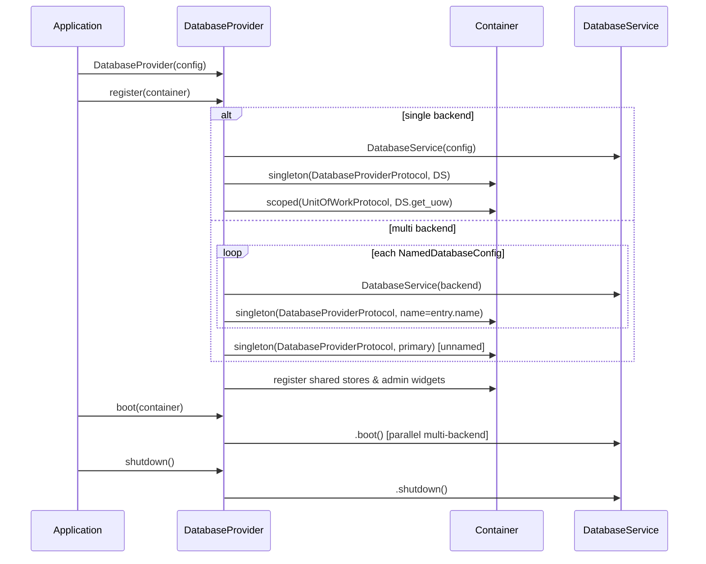
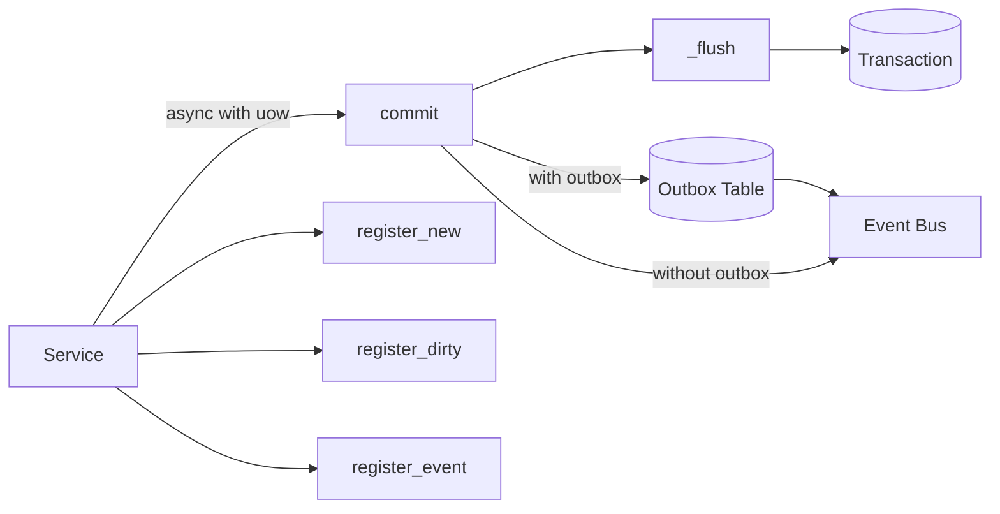

# Architecture

Internal design of the `lexigram-sql` package.

---

## Role in the System



`lexigram-sql` is an **infrastructure-layer** extension providing async SQL database access. Other extensions consume `DatabaseProviderProtocol` from contracts through the container — never `lexigram-sql` directly.

---

## Architecture Overview



### Source Map

| Module | Purpose |
|--------|---------|
| `di/provider.py` | `DatabaseProvider` — registers all database services |
| `config.py` | `DatabaseConfig`, `DatabasePoolConfig`, `NamedDatabaseConfig` |
| `providers/database_service.py` | `DatabaseService` — unified facade over driver backends |
| `providers/*_provider.py` | `PostgresProvider`, `SQLiteProvider`, `MySQLProvider` |
| `repositories/base.py` | `SQLRepository` — mixin-based repository base |
| `repositories/generic_repository.py` | `GenericRepository[T, TKey]` — typed CRUD |
| `repositories/cached.py` | `CachedRepository` — cache-aside decorator |
| `query/builder.py` | `QueryBuilder` / `Query` — immutable query descriptor |
| `query/compiler.py` | `PredicateCompiler` — filter → parameterized SQL |
| `query/operators.py` | `Operator` — `Eq`, `Gt`, `Lt`, `In`, `Like`, `Between` |
| `unit_of_work/base.py` | `AbstractUnitOfWork` — change tracking, events, outbox |
| `unit_of_work/manager.py` | `SimpleTransactionManager` — `ContextVar`-scoped txn |
| `migrations/api.py` | `AlembicManager` — Alembic async wrapper |
| `migrations/runner.py` | `MigrationRunnerAdapter` — protocol-compliant runner |
| `migrations/manager.py` | `SimpleMigrationManager` — version-tracked applier |
| `cli/commands.py` | `db` CLI: `status`, `migrate run/rollback/history` |
| `stores/` | `DatabaseStateStore`, `DatabaseSecretStore`, `DatabaseLockStore` |
| `exceptions.py` | 31 leaf exceptions under `DatabaseError` (`LEX_ERR_SQL_001`–`031`) |
| `hooks.py` | `SQLConnectionReadyHook`, `SQLTransactionBegunHook`, `SQLTransactionEndedHook` |
| `identifiers.py` | `Table`, `Column`, `Schema` — type-safe SQL identifiers |

---

## Provider Lifecycle



| Phase | What happens |
|-------|-------------|
| `register()` | Registers `DatabaseService`, protocol bindings, admin widgets, shared stores. Multi-backend: named bindings per backend. |
| `boot()` | Connects all backends (parallel in multi-backend). Wires optional observability and resilience. |
| `shutdown()` | Disconnects backends in reverse registration order. |
| `health_check()` | Aggregate health across all backends. |

`DatabaseProvider` runs at `ProviderPriority.INFRASTRUCTURE` (10).

---

## Session & Transaction Management

`SimpleTransactionManager` uses a `ContextVar` for per-task isolation:

```python
async with provider.transaction():
    await provider.execute_query("INSERT INTO users ...")
    # auto-commit or rollback on exception
```

`AbstractUnitOfWork` extends this with change tracking and event collection:

| Operation | Method |
|-----------|--------|
| Track new entity | `register_new(entity)` |
| Track modified entity | `register_dirty(entity)` |
| Track deleted entity | `register_deleted(entity)` |
| Collect domain events | `register_event(event)` |

On `commit()`: `collect_events()` → `_flush()` (persist changes) → write events to outbox or publish via event bus → reset tracking state. `IdentityMap` ensures one entity instance per row per unit of work.



`SimpleUnitOfWork` provides the SQL-backed `_flush()` that delegates to `DatabaseProviderProtocol`.

---

## Repository Pattern

```
AbstractRepository[T, TKey]
    └── SQLRepository[T, TKey]       (mixin-based)
        ├── _ReadMixin               find_by_id · find_many · paginate
        ├── _WriteMixin              create · update · delete · soft_delete
        ├── _FilterMixin             apply filters
        ├── _AdvancedMixin           bulk_insert · upsert
        └── _RLSMixin                row-level security
            └── GenericRepository[T, TKey]
            └── CachedRepository
            └── AppendLogRepository
```

```python
class UserRepository(GenericRepository[User, str]):
    def __init__(self, provider: DatabaseProviderProtocol):
        super().__init__(provider, table_name="users", entity_class=User)

class UserService:
    def __init__(self, repo: UserRepository):
        self.repo = repo
    async def find_active(self) -> list[User]:
        return await self.repo.find_many(status="active", offset=0, limit=100)
```

Query building with `AsyncQueryBuilder`:

```python
from lexigram.sql.query import AsyncQueryBuilder, Operator
query = (AsyncQueryBuilder().select("id", "name").from_table("users")
    .where("status", Operator.EQ, "active").order_by("created_at", "DESC").limit(20))
sql, params = query.build()
```

`PredicateCompiler` translates filter expressions (`FieldEq`, `FieldGt`, `FieldIn`, etc.) from contracts into parameterized SQL.

---

## Migration System

```mermaid
flowchart LR
    subgraph CLI["lexigram db migrate"]
        RUN[run] --> RB[rollback] --> HIST[history]
    end
    subgraph Adapter[Adapter Layer]
        RA[MigrationRunnerAdapter<br/>MigrationRunnerProtocol]
    end
    subgraph Core[Core]
        SMM[SimpleMigrationManager<br/>apply_pending · get_applied · initialize_table]
        AB[AlembicManager<br/>upgrade · downgrade · create_revision]
    end
    subgraph DB[(Database)]
        MT[ schema_migrations ]
    end
    CLI --> RA --> SMM --> DB
    AB --> DB
```

```bash
lexigram db migrate run                  # Apply pending migrations
lexigram db migrate rollback --steps 1   # Roll back one migration
lexigram db migrate history              # Show migration history
lexigram db status                       # Database and migration status
```

---

## Backend Support

| Backend | Provider | Driver | Key Features |
|---------|----------|--------|-------------|
| PostgreSQL | `PostgresProvider` | `asyncpg` | SSL, FTS, JSONB, LISTEN/NOTIFY |
| SQLite | `SQLiteProvider` | `aiosqlite` | WAL, in-memory, foreign keys |
| MySQL | `MySQLProvider` | `aiomysql` | TLS, charset config, FTS |

Backend selection by URL prefix (`postgresql://` → PostgresProvider, etc.). Multi-backend via `DatabaseConfig.backends` resolved via `Annotated[DatabaseProviderProtocol, "analytics"]`.

---

## Contracts Used

| Protocol | Purpose | Implementation |
|----------|---------|----------------|
| `DatabaseProviderProtocol` | Primary DB interface | `DatabaseService` |
| `ConnectionPoolProtocol` | Pool management | `SimpleConnectionPool`, backend pools |
| `QueryLoggerProtocol` | SQL query logging | `ConsoleQueryLogger`, `FileQueryLogger` |
| `UnitOfWorkProtocol` | Transaction + change tracking | `AbstractUnitOfWork`, `SimpleUnitOfWork` |
| `MigrationManagerProtocol` | Migration management | `SimpleMigrationManager` |
| `MigrationRunnerProtocol` | Migration execution | `MigrationRunnerAdapter` |
| `StateStoreProtocol` | State persistence | `DatabaseStateStore` |
| `AsyncSecretStoreProtocol` | Secret storage | `DatabaseSecretStore` |
| `LockStoreProtocol` | Distributed locks | `DatabaseLockStore` |
| `IdGeneratorProtocol` | Entity ID generation | Resolved optionally |
| `TracerProtocol` | Distributed tracing | Resolved optionally |
| `MetricsCollectorProtocol` | Render/query metrics | Resolved optionally |
| `ResiliencePipelineFactoryProtocol` | Circuit breaker, retry | Resolved optionally |
| `HookRegistryProtocol` | DB lifecycle hooks | Resolved optionally |

---

## Exception Convention

Database errors extend `DatabaseError` from contracts. All 31 leaf types carry `_code` strings (`LEX_ERR_SQL_001`–`031`). Sub-hierarchy: `DatabaseConnectionError` (refused/timeout/pool), `QueryError` (syntax/binding), `IntegrityError` (duplicate key/fk/null/check), `TransactionError` (serialization/deadlock/rollback), `SchemaError` (table/column not found), `RepositoryError`, `UnitOfWorkError`, `DriverError`, `LockError`, `DatabaseTimeoutError`.

---

## Extension Points

| Point | Mechanism |
|-------|-----------|
| Custom backend | Implement provider interface, register via `DatabaseService` |
| Custom migration | Subclass `SimpleMigrationManager`, override `apply_pending_migrations()` |
| Custom query logger | Implement `QueryLoggerProtocol`, register in container |
| Custom repository | Subclass `SQLRepository` or `GenericRepository` |
| Custom filter operator | Add to `Operator` enum + `PredicateCompiler` dispatch |
| Custom dialect | Implement `SQLDialect` from contracts, register with `PredicateCompiler` |
| Row-level security | Configure `RowLevelSecurityPolicy` + `ScopeColumn`, pass to repository |
| Admin widget | Register widget handler in `SqlAdminContributor` |
| DB lifecycle hooks | Subscribe to `SQLConnectionReadyHook` etc. via `HookRegistryProtocol` |
| Resilience | `DatabaseResilienceHandler` auto-wires circuit breaker/retry if registered |

```python
class MyRepository(GenericRepository[MyEntity, str]):
    def __init__(self, provider: DatabaseProviderProtocol):
        super().__init__(provider, table_name="my_entities", entity_class=MyEntity)

    async def find_by_custom(self, value: str) -> list[MyEntity]:
        result = await self.provider.execute_query(
            "SELECT * FROM my_entities WHERE custom_field = $1", [value]
        )
        return [self._row_to_entity(row) for row in result.rows]
```

---

## DI Registration

```python
@module()
class DatabaseModule(Module):
    @classmethod
    def configure(cls, config=None, migration_dir="migrations") -> DynamicModule:
        return DynamicModule(
            module=cls, providers=[DatabaseProvider(config=config, migration_dir=migration_dir)],
            exports=[DatabaseProviderProtocol, UnitOfWorkProtocol],
        )

    @classmethod
    def scope(cls, *repositories: type) -> DynamicModule:
        """Register repo classes for injection without new DB connections."""
        ...

    @classmethod
    def stub(cls, config=None) -> DynamicModule:
        """In-memory SQLite backend for testing."""
        ...
```

Usage: `@module(imports=[DatabaseModule.configure("postgresql://...")])` or combined with `scope()` for feature modules.

---

## Constants

`constants.py` defines:

| Symbol | Value |
|--------|-------|
| `ENV_PREFIX` | `LEX_SQL__` |
| `DEFAULT_POOL_MIN_SIZE` | 1 |
| `DEFAULT_POOL_MAX_SIZE` | 10 |
| `DEFAULT_MIGRATIONS_DIR` | `migrations` |
| `DEFAULT_MIGRATIONS_TABLE` | `schema_migrations` |
| `BACKEND_SQLITE` | `sqlite` |
| `BACKEND_POSTGRES` | `postgres` |
| `BACKEND_MYSQL` | `mysql` |
| `DEFAULT_PAGE_SIZE` | 20 |
| `MAX_PAGE_SIZE` | 1000 |
