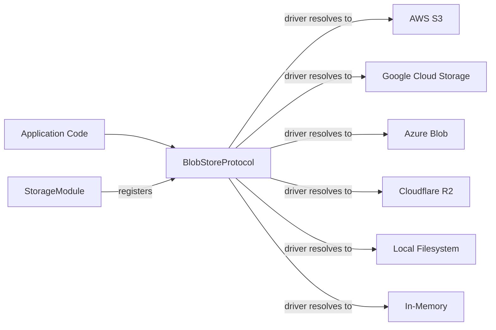
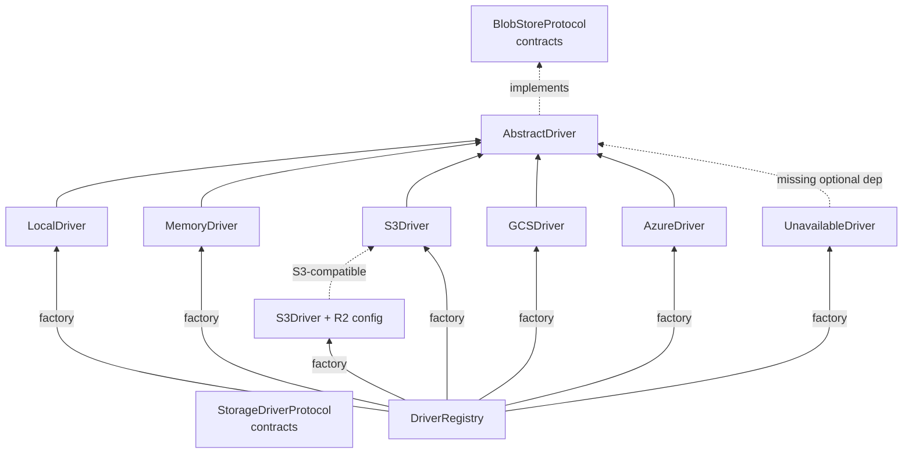
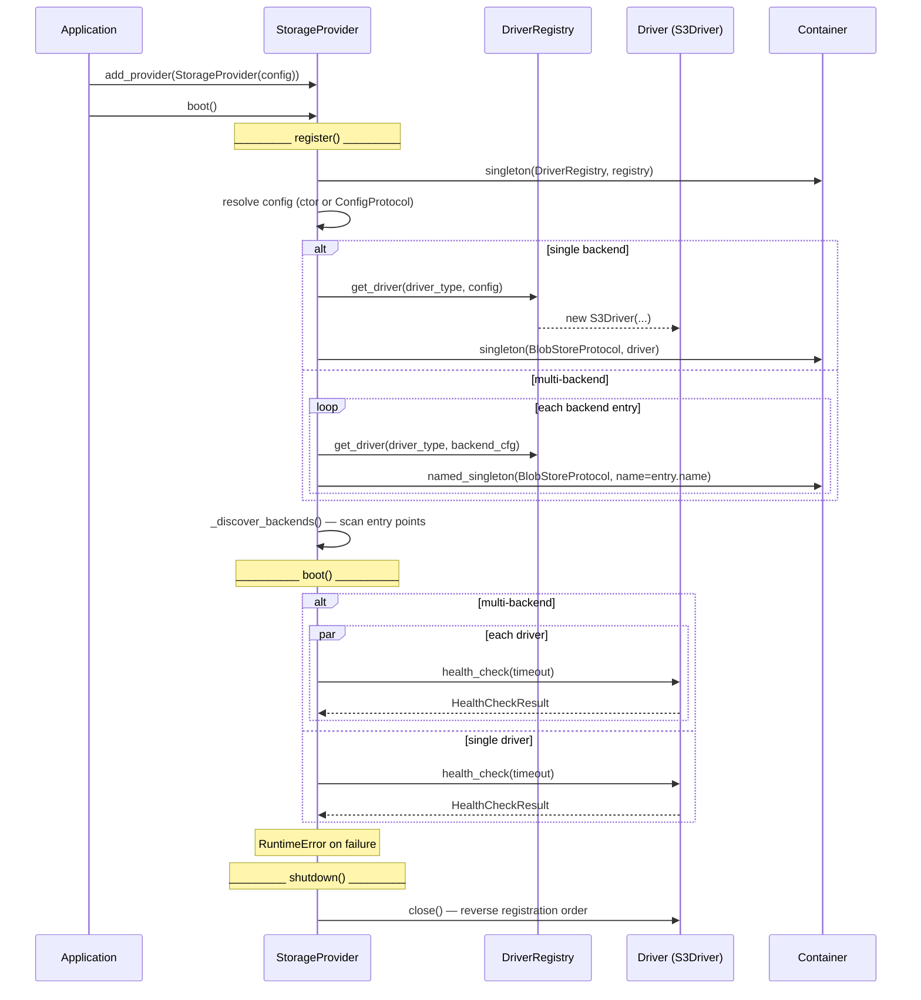

# Architecture

Internal design of the `lexigram-storage` package.

---

## Role in the System

`lexigram-storage` lives in the **Data & Persistence** tier. It implements `BlobStoreProtocol` and `StorageDriverProtocol` from `lexigram-contracts` and provides pluggable drivers for S3, GCS, Azure Blob, Cloudflare R2, local filesystem, and in-memory storage.



Application code depends on `BlobStoreProtocol` (a protocol from contracts), never on concrete driver classes. The `StorageProvider` binds the configured driver during registration.

---

## Backend Abstraction



### AbstractDriver

`AbstractDriver` (`backends/base.py`) is an abstract base class that subclasses `BlobStoreProtocol`:

```python
class AbstractDriver(ABC, BlobStoreProtocol):
    async def upload(self, path, data, content_type=None, **options) -> FileInfo: ...
    async def download(self, path) -> bytes: ...
    async def stream(self, path, chunk_size=8192) -> AsyncGenerator[bytes]: ...
    async def delete(self, path) -> None: ...
    async def exists(self, path) -> bool: ...
    async def info(self, path) -> FileInfo: ...
    def list(self, prefix="") -> AsyncGenerator[FileInfo]: ...
    async def get_url(self, path) -> str: ...
    async def get_presigned_url(self, path, expires_in, method) -> str: ...
    async def health_check(self, timeout) -> HealthCheckResult: ...
```

Optional enrichment methods with fallback implementations:

| Method | Default Implementation | Override When |
|--------|----------------------|---------------|
| `write_stream()` | Buffers into memory, calls `upload()` | S3 multipart, GCS resumable |
| `copy()` | Download + re-upload | Server-side copy available |
| `move()` | `copy()` + `delete()` | Atomic rename available |

### DriverRegistry

The `DriverRegistry` (`backends/registry.py`) maps driver-type strings to factory callables:

```python
registry = DriverRegistry()
driver = registry.get_driver("s3", config)  # → S3Driver instance
```

Built-in factories:

| Driver | Factory | Optional Dep |
|--------|---------|-------------|
| `memory` | `_create_memory` | None |
| `local` | `_create_local` | None |
| `s3` | `_create_s3` | `aiobotocore` |
| `gcs` | `_create_gcs` | `gcloud-aio-storage` |
| `azure` | `_create_azure` | `azure-storage-blob` |
| `r2` | `_create_r2` (wraps `S3Driver`) | `aiobotocore` |

Missing optional dependencies produce clear `ImportError` messages rather than silent failures.

---

## File Operations

Every driver exposes the same core operations through `BlobStoreProtocol`:

### Upload

```python
info = await store.upload("photos/avatar.png", image_bytes, content_type="image/png")
```

Accepts `Uploadable` (bytes, str, BinaryIO, or AsyncIterator). Returns `FileInfo` with path, size, etag, and content type.

### Download

```python
data = await store.download("photos/avatar.png")
```

### Stream

```python
async for chunk in store.stream("videos/large.mp4", chunk_size=65536):
    await response.write(chunk)
```

### Delete

```python
await store.delete("temp/expired.txt")
```

### List

```python
async for info in store.list(prefix="photos/2024/"):
    print(info.path, info.size)
```

### Signed URLs

```python
public = await store.get_url("static/logo.png")
# → "http://localhost:8000/storage/static/logo.png"

signed = await store.get_presigned_url("secure/report.pdf", expires_in=timedelta(minutes=5))
# → "https://s3.amazonaws.com/bucket/secure/report.pdf?X-Amz-Signature=..."
```

---

## Provider Lifecycle



### `StorageProvider` (`di/provider.py`)

| Phase | What Happens |
|-------|-------------|
| `__init__` | Accepts optional `StorageConfig`; creates empty `DriverRegistry` |
| `register()` | Resolves config; validates driver config; creates driver via `DriverRegistry`; binds `BlobStoreProtocol` (singleton). In multi-backend mode, registers named bindings per entry. Discovers `lexigram.storage.backends` entry points |
| `boot()` | Health-checks all registered drivers in parallel. Raises `RuntimeError` on any failure |
| `shutdown()` | Calls `close()` on all drivers in reverse registration order |
| `health_check()` | Pings all drivers; returns worst `HealthStatus` |

### `StorageModule` (`module.py`)

```python
@module()
class StorageModule(Module):
    @classmethod
    def configure(cls, config: StorageConfig | None = None) -> DynamicModule:
        return DynamicModule(
            module=cls,
            providers=[StorageProvider(config=config)],
            exports=[BlobStoreProtocol],
        )

    @classmethod
    def stub(cls, config: StorageConfig | None = None) -> DynamicModule:
        """In-memory backend, no external dependencies. For tests."""
```

---

## Contracts Used

| Contract | Source | How It's Used |
|----------|--------|---------------|
| `BlobStoreProtocol` | `lexigram.contracts.infra.storage.protocols` | Registered by `StorageProvider`; injected into application services |
| `StorageDriverProtocol` | `lexigram.contracts.infra.storage.protocols` | Extended by `AbstractDriver` — adds `copy`, `move`, `copy_batch` |
| `FileInfo` | `lexigram.contracts.infra.storage.models` | Return type for upload, info, download, list |
| `Uploadable` | `lexigram.contracts.infra.storage.models` | Union type: `bytes \| str \| BinaryIO \| AsyncIterator` |
| `UploadOptions` | `lexigram.contracts.infra.storage.models` | Upload metadata: content_type, public, metadata, cache_control |
| `HealthCheckResult` | `lexigram.contracts.core` | Return type for driver health checks |

---

## Source Layout

```
lexigram-storage/src/lexigram/storage/
├── __init__.py              # Lazy-exported public API
├── config.py                # StorageConfig, driver-specific configs
├── constants.py             # Env prefix, driver names, defaults
├── exceptions.py            # StorageError hierarchy
├── types.py                 # UploadOptions
├── protocols.py             # Re-exports from contracts + StreamingBodyProtocol
├── module.py                # StorageModule
├── events.py                # FileUploadedEvent, FileDownloadedEvent, FileDeletedEvent
├── hooks.py                 # ObjectStoredHook, ObjectDeletedHook payloads
├── decorators.py            # Decorator scaffold
├── di/
│   └── provider.py          # StorageProvider
├── backends/
│   ├── base.py              # AbstractDriver (ABC), BlobStoreProtocol enrichment
│   ├── protocols.py         # StreamingBodyProtocol, _S3ClientProtocol
│   ├── registry.py          # DriverRegistry (factory)
│   ├── local.py             # LocalDriver
│   ├── memory.py            # MemoryDriver
│   ├── s3.py                # S3Driver
│   ├── gcs.py               # GCSDriver
│   ├── azure.py             # AzureDriver
│   ├── unavailable.py       # UnavailableDriver fallback
│   └── _s3_upload_mixin.py  # S3 multipart upload helpers
├── kv/                      # Key-value storage (in-memory, JSON-file-backed)
├── lib/
│   ├── content_type.py      # MIME type detection
│   ├── hashing.py           # Checksum utilities
│   └── paths.py             # Path manipulation helpers
└── cli/
    ├── checks.py            # Storage health checks
    ├── contributor.py       # CLI contributor
    ├── doctor.py            # Diagnostic commands
    └── generators/          # Code generators
```

---

## Events

Domain events fire on every write operation:

| Event | Fields | Consumed By |
|-------|--------|-------------|
| `FileUploadedEvent` | `file_key`, `bucket`, `size_bytes`, `occurred_at` | Audit logging, quota tracking |
| `FileDownloadedEvent` | `file_key`, `bucket`, `occurred_at` | Download tracking, usage analytics |
| `FileDeletedEvent` | `file_key`, `bucket`, `occurred_at` | Cleanup tracking, quota reclamation |

Hook payloads (`ObjectStoredHook`, `ObjectDeletedHook`) are available for synchronous filter/action pipelines.

---

## Exception Convention

```mermaid
flowchart LR
    subgraph Contracts[lexigram-contracts]
        LE[LexigramError]
        DE[DomainError]
    end
    subgraph Storage[lexigram-storage]
        SE[StorageError]
        FE[StorageFileNotFoundError]
        UE[StorageUnavailableError]
        QE[QuotaExceededError]
        IE[InvalidPathError]
        CE[ChecksumMismatchError]
        TE[TransactionError]
    end

    LE --> DE
    LE --> SE
    SE --> FE
    SE --> UE
    SE --> QE
    SE --> IE
    SE --> CE
    SE --> TE
```



| Exception | Code | Meaning |
|-----------|------|---------|
| `StorageError` | 001 | Base storage error |
| `StorageFileNotFoundError` | 002 | File does not exist in backend |
| `StorageUnsupportedOperationError` | 003 | Operation not supported by driver |
| `TransactionError` | 004 | Multi-operation transaction failed |
| `QuotaExceededError` | 005 | File size or storage quota exceeded |
| `InvalidPathError` | 006 | Path traversal or invalid characters |
| `StorageUnavailableError` | 007 | Backend unreachable (network, auth, timeout) |
| `ChecksumMismatchError` | 008 | Upload/download checksum verification failed |

---

## Constants

`constants.py` defines:

| Symbol | Description |
|--------|-------------|
| `ENV_PREFIX` | `LEX_STORAGE__` |
| `DEFAULT_DRIVER` | `"local"` |
| `DEFAULT_LOCAL_ROOT_DIR` | `"./storage"` |
| `DEFAULT_LOCAL_BASE_URL` | `"http://localhost:8000/storage"` |
| `DEFAULT_MAX_FILE_SIZE_MB` | `10` |
| `SUPPORTED_DRIVERS` | `("local", "s3", "gcs", "azure", "memory", "r2")` |
| `INSECURE_SECRET_VALUES` | Known-weak placeholder credentials rejected in production |
| `__version__` | Package version from `importlib.metadata` |

---

## Extension Points

| Point | Mechanism |
|-------|-----------|
| Custom driver | Implement `BlobStoreProtocol`, register via `DriverRegistry` or `lexigram.storage.backends` entry point |
| Entry point registration | `[project.entry-points."lexigram.storage.backends"]` in `pyproject.toml` → Provider subclass |
| Custom URL signing | Override `get_url()` / `get_presigned_url()` in driver subclass |
| Encryption type | Configure via `EncryptionConfig` (`AES256`, `aws:kms`, `gcs:cmek`) |
| Event subscription | Register handlers for `FileUploadedEvent`, `FileDeletedEvent`, `FileDownloadedEvent` |
| Hook action/filter | Register against `ObjectStoredHook` / `ObjectDeletedHook` payloads |
| Named backends | Multiple `NamedStorageConfig` entries → `Annotated[BlobStoreProtocol, Named("name")]` DI bindings |
