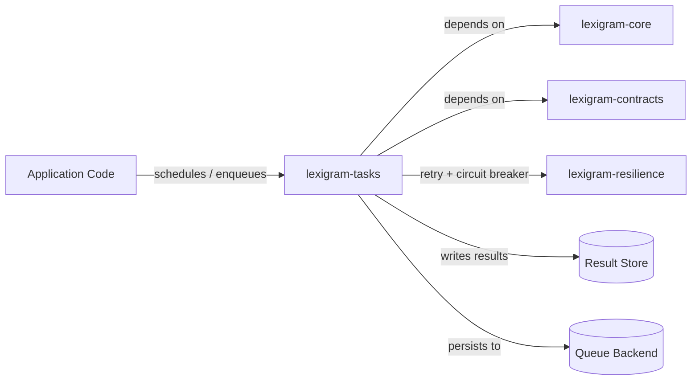
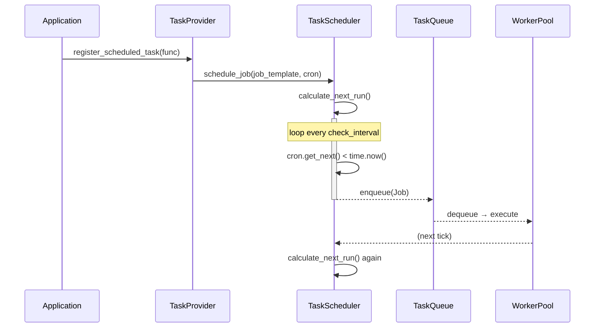
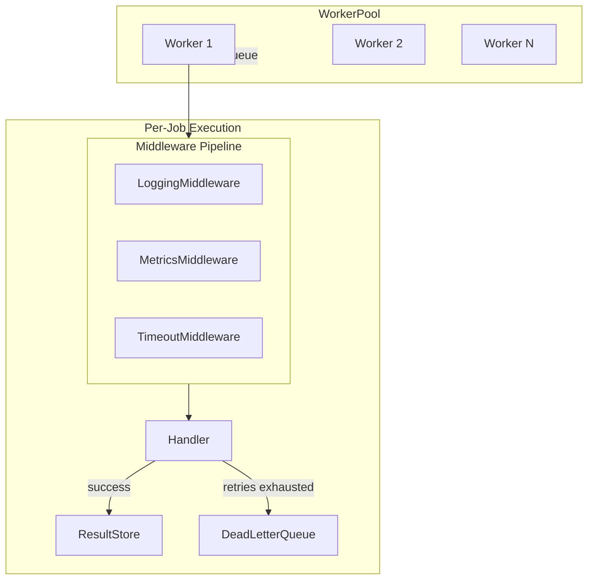
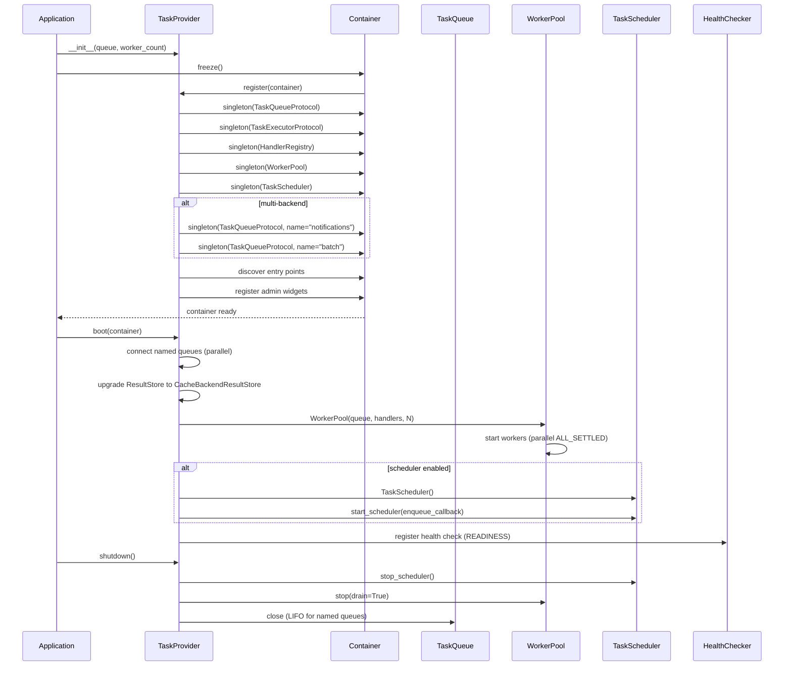

# Architecture

Internal design of the `lexigram-tasks` package.

---

## Role in the System

`lexigram-tasks` provides background asynchronous job processing within a Lexigram application. It is an extension package that depends on `lexigram` + `lexigram-contracts` and imports from `lexigram-resilience` for fault-tolerance primitives (the documented exception for cross-extension imports).



Tasks operate outside the request-response cycle — they are deferred, retried, monitored, and managed through a dedicated worker pool.

---

## Architecture Overview

The system follows a four-component pipeline:

```
scheduler → queue → worker → result
```

```mermaid
flowchart LR
    subgraph App[Application]
        Dec[@task decorator]
        Ts[TaskScheduler]
    end
    subgraph Queue[Queue Layer]
        Q[TaskQueueProtocol]
        DLQ[DeadLetterQueue]
    end
    subgraph Workers[Worker Pool]
        W1[Worker 1]
        W2[Worker 2]
        WN[Worker N]
    end
    subgraph Storage[Storage]
        RS[ResultStore]
        PS[ProgressStore]
    end

    Dec -->|enqueue| Q
    Ts -->|enqueue at cron time| Q
    Q -->|dequeue| W1
    Q -->|dequeue| W2
    Q -->|dequeue| WN
    W1 -->|success| RS
    W1 -->|permanent failure| DLQ
    W2 -->|progress updates| PS
```

**Dispatch (`dispatch/`)** provides the public `delay()` helper that resolves the queue from DI and enqueues a job in one call.

---

## Task Definition

Tasks are defined with the `@task` decorator which wraps a function with enqueue metadata and registry methods:

```python
from lexigram.tasks import task

@task(name="send_email", max_retries=3, timeout=30)
async def send_email(to: str, subject: str, body: str):
    # handler logic
    ...
```

### Decorator Attributes (`decorators.py`)

| Attribute | Default | Description |
|-----------|---------|-------------|
| `name` | function name | Unique task identifier |
| `priority` | `Priority.NORMAL` | Queue ordering (LOW=0, NORMAL=5, HIGH=10, CRITICAL=20) |
| `max_retries` | 3 | Retry attempts before DLQ |
| `timeout` | None | Execution timeout in seconds |
| `queue` | `"default"` | Target queue name |
| `idempotency_key` | None | Key for deduplication |

### Methods on decorated tasks

```python
# Direct call (no queue)
result = await send_email(to="a@b.com", ...)

# Signature without executing
job = send_email.signature(to="a@b.com", ...)

# Enqueue to a specific queue (async)
job = await send_email.apply_async(queue_instance, to="a@b.com", ...)
```

### Handler Registry (`execution/registry.py`)

The `HandlerRegistry` maps task names to handler functions and satisfies `TaskExecutorProtocol`:

```python
registry = HandlerRegistry()

# As decorator
@registry.register("send_email")
async def handle_send_email(to: str, ...):
    ...

# Direct registration
registry.register("send_email", handle_send_email)

# Execute by task name
result = await registry.execute(task)
```

The registry supports both sync and async handlers, raises `TaskNotFoundError` for unregistered tasks, and is injected into `WorkerPool` so workers pick up handlers registered after pool creation.

---

## Schedule Management

Recurring tasks use cron expressions via the `@scheduled` decorator:

```python
from lexigram.tasks import scheduled

@scheduled(cron="0 9 * * 1-5", name="daily_report", timeout=120)
async def generate_daily_report():
    ...
```

### TaskScheduler (`scheduling/scheduler.py`)

The scheduler maintains a dict of `ScheduledJob` entries, each with a cron expression and next-run timestamp. On each tick (default 60s interval) it checks all enabled jobs, enqueues any that are due, and recalculates their next run.



### Scheduling Features

| Feature | Implementation |
|---------|----------------|
| Cron expressions | `CronExpression` parser supports standard 5-field cron |
| Dependency ordering | `DependencyResolver` validates acyclic graph at schedule time |
| Persistence | `SchedulerStore` interface for durable schedule state |
| Enable/disable | Per-job toggle via `enable_job()` / `disable_job()` |
| Restore on restart | `restore_from_store()` reloads persisted schedules |

### Delay / One-off Scheduling

One-off delayed jobs use `asyncio.create_task` with the `dispatch` module. There is no separate "delay" queue — delayed enqueue is the caller's responsibility.

---

## Backend Support

`lexigram-tasks` supports four built-in queue backends via a registry pattern (`backends/registry.py`):

```python
registry = TaskBackendRegistry.with_defaults()
# Registered: memory, redis, rabbitmq, postgres
queue = registry.create_backend(config)  # → TaskQueueProtocol instance
```

| Backend | Factory | Extra | Pros | Cons |
|---------|---------|-------|------|------|
| **Memory** | `_create_memory` | None | Zero deps, instant setup | Volatile, restart loses jobs |
| **Redis** | `_create_redis` | `lexigram-tasks[redis]` | Fast, persistent, pub/sub patterns | Requires Redis server |
| **RabbitMQ** | `_create_rabbitmq` | `lexigram-tasks[rabbitmq]` | Durable, routing, ACK semantics | Heavier infra |
| **Postgres** | `_create_postgres` | `lexigram-tasks[postgres]` | No extra service, transactional | Poll-based, higher latency |

### Multi-Backend Named DI

`TaskConfig.backends` supports declaring multiple named queues. Each gets registered under `Annotated[TaskQueueProtocol, Named(name)]`:

```python
queue = await container.resolve(
    Annotated[TaskQueueProtocol, Named("notifications")]
)
```

The primary backend (first entry, or `primary=True`) also receives the unnamed `TaskQueueProtocol` binding for backward compatibility.

### Dead Letter Queue (`dlq/`)

When a job exhausts its retries it is routed to the `DeadLetterQueue` for manual inspection or automated replay:

```python
class DLQProtocol:
    async def add(self, job, error, attempt_count) -> None
    async def retry(self, job_id) -> bool          # back to main queue
    async def purge(self, job_id) -> bool           # permanent delete
```

---

## Worker Model

The `WorkerPool` manages `N` concurrent `TaskWorker` instances:



### WorkerPool (`execution/pool.py`)

```python
pool = WorkerPool(
    queue=redis_queue,
    handler_registry=registry,
    size=4,
    dead_letter_queue=DeadLetterQueue(),
)
await pool.start()
await pool.scale_to(8)  # dynamic scaling
await pool.stop(drain=True, timeout=30)  # graceful shutdown
```

| Feature | Mechanism |
|---------|-----------|
| Concurrency | `asyncio` — N workers each pulling from the same queue |
| Dynamic scaling | `scale_to(N)` — adds or removes workers at runtime |
| Graceful drain | `stop(drain=True)` — finish current job before exit |
| Metrics | `get_pool_stats()` — active workers, jobs succeeded/failed, avg processing time |
| System metrics | Optional `psutil` integration for CPU/memory per worker |

### TaskWorker (`execution/worker.py`)

Each worker loops: `dequeue → resolve dependencies → middleware pipeline → execute handler → record result`.

#### Retry and Error Handling

```python
# Retry policy from lexigram-resilience (injected via DI)
if self._retry_policy is not None:
    result = await self._retry_policy.execute(_execute)
else:
    result = await _execute()  # single attempt
```

| Failure Scenario | Handling |
|------------------|----------|
| `TimeoutError` | Caught by `TimeoutMiddleware`, recorded as `TaskTimeoutError` |
| `TaskNotFoundError` | No handler registered — immediate fail |
| `TaskExecutionError` | Handler raised — retry if policy configured |
| Permanent failure | After retries exhausted → `DeadLetterQueue` + `TaskFailedHook` |
| Infrastructure failure | Raised as exception (not `Result`) — propagates up |

### Middleware Pipeline (`middleware/core.py`)

Built-in middleware stack runs per-job:

1. **LoggingMiddleware** — structured log with job id, name, duration
2. **MetricsMiddleware** — counters / timing to `TaskMetricsCollector`
3. **TimeoutMiddleware** — `asyncio.wait_for` with capping at `max_timeout`

Custom middleware implements `TaskMiddleware` and is added to the pipeline.

---

## Provider Lifecycle

`TaskProvider` integrates with the Lexigram DI lifecycle:



### Priority

`ProviderPriority.INFRASTRUCTURE` (value 10) — boots early, after config and diagnostics.

### Health Check

The provider exposes a `READINESS` health check that probes `get_task_count()` on the queue and aggregates worker pool stats. In multi-backend mode the overall status is the worst individual status across all named queues.

---

## Contracts Used

All protocols consumed by `lexigram-tasks` live in `lexigram.contracts.infra.tasks`:

| Protocol | Import Path | Usage |
|----------|-------------|-------|
| `TaskQueueProtocol` | `lexigram.contracts.infra.tasks` | Core queue contract — enqueue, dequeue, ack, nack, close |
| `TaskExecutorProtocol` | `lexigram.contracts.infra.tasks` | Handler dispatch — execute, register_handler, get_handler |
| `TaskProviderProtocol` | `lexigram.contracts.infra.tasks` | Provider lifecycle — register, boot, shutdown, health_check |
| `JobProtocol` | `lexigram.contracts.infra.tasks` | Job data model — id, name, args, kwargs, priority, status |
| `JobTemplateProtocol` | `lexigram.contracts.infra.tasks` | Recurring job template — name, args, kwargs, depends_on |
| `TaskWorkerProtocol` | `lexigram.contracts.infra.tasks` | Worker contract — start, stop |
| `DLQProtocol` | `lexigram.contracts.infra.tasks` | Dead-letter queue — add, get, retry, purge |
| `ProgressTrackerProtocol` | `lexigram.contracts.infra.tasks.progress` | Progress reporting for long-running jobs |
| `CacheBackendProtocol` | `lexigram.contracts.infra.cache` | Optional upgrade for distributed result storage |
| `RetryConfig` | `lexigram.contracts.infra.resilience.models` | Retry policy configuration |
| `HookRegistryProtocol` | `lexigram.contracts.core` | Lifecycle hooks for task events |
| `HealthCheckResult` | `lexigram.contracts.core.health` | Health check data structure |

---

## Extension Points

| Point | Mechanism |
|-------|-----------|
| **Custom backend** | Implement `TaskQueueProtocol` + register via `lexigram.tasks.backends` entry point, or use `TaskBackendRegistry.register()` |
| **Custom middleware** | Subclass `TaskMiddleware` and add to `TaskMiddlewarePipeline` |
| **Custom result store** | Implement `ResultStore` and inject via DI |
| **Custom progress store** | Implement `ProgressTrackerProtocol` and inject via DI |
| **Custom error handler** | Use `RetryPolicyProtocol` from `lexigram-resilience` for custom retry/backoff |
| **Workflows** | Use `TaskChain`, `TaskGroup`, `TaskChord` for composed task graphs |
| **Admin widgets** | Extend `TasksAdminContributor` or register widget handlers |
| **CLI commands** | Extend `TasksCliContributor` |
| **Scheduler store** | Implement `SchedulerStore` for durable schedule persistence |
| **Named multi-backend** | Declare `backends` in `TaskConfig` — each gets a named DI binding |
