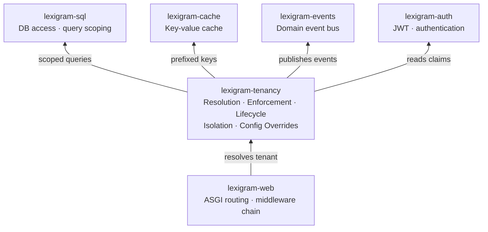
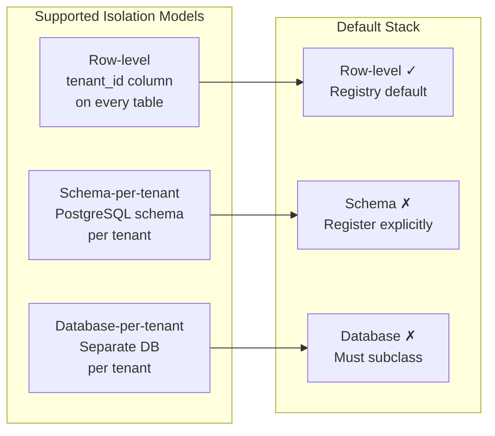
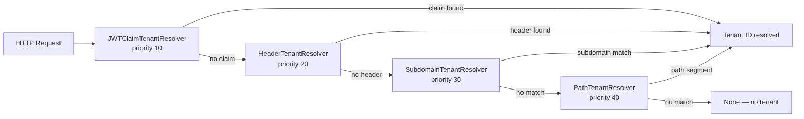
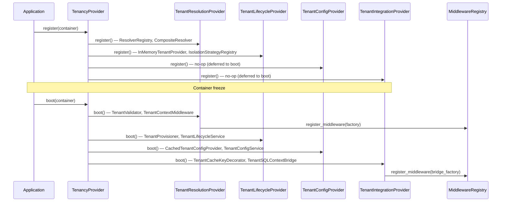
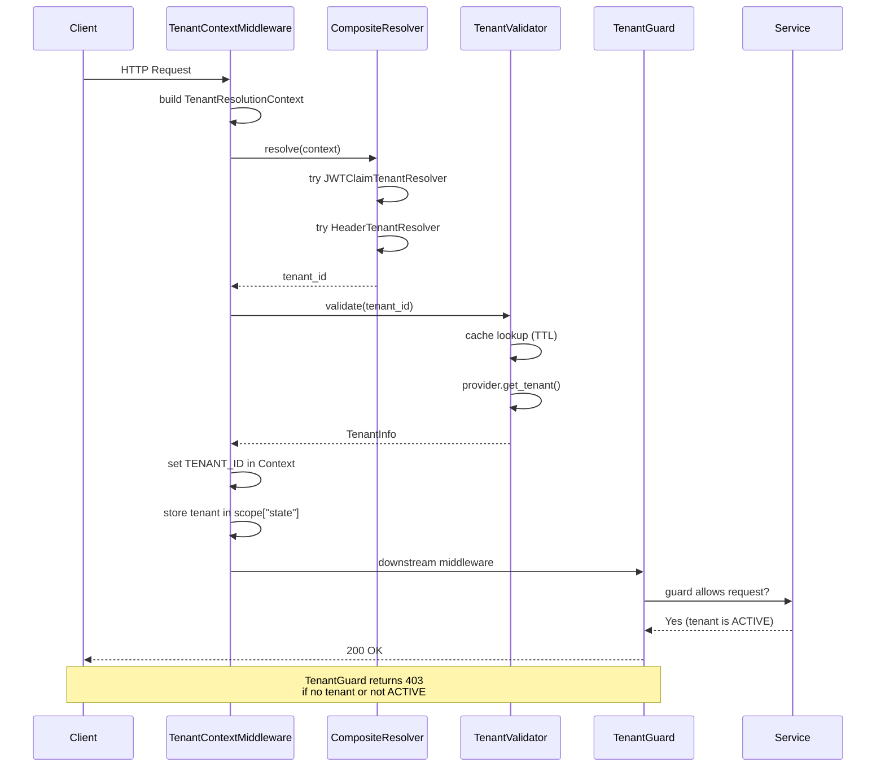

# Architecture

Internal design of the `lexigram-tenancy` package.

---

## Role in the System



---

## Tenancy Models



Row-level isolation is the default and requires no provisioning. Schema-per-tenant (`SchemaIsolationStrategy`) and database-per-tenant (`DatabaseIsolationStrategy`) are reference implementations that must be explicitly registered or subclassed.

---

## Tenant Resolution

The `CompositeResolver` iterates registered resolvers in priority order and returns the first non-`None` result. Priority is a trust signal — lower numbers are tried first.



### Built-in resolvers

| Resolver | Source | Priority | Config Key |
|----------|--------|----------|-----------|
| `JWTClaimTenantResolver` | Decoded JWT `claims["tenant_id"]` | 10 (highest trust) | `jwt_claim_key` |
| `HeaderTenantResolver` | HTTP header (default `x-tenant-id`) | 20 | `header_name` |
| `SubdomainTenantResolver` | Host subdomain (e.g. `acme.app.com`) | 30 | `subdomain_pattern` |
| `PathTenantResolver` | URL path segment (e.g. `/tenants/{tenant_id}/`) | 40 | `path_pattern` |

Resolution produces an immutable `TenantResolutionContext` (headers, host, path, claims) passed to every resolver. The resolved tenant ID is set in the shared `Context` under `TENANT_ID` and stored in `scope["state"]["tenant"]`.

---

## Provider Lifecycle

The bundle provider delegates to four focused sub-providers:



Registration order is deterministic: resolution → lifecycle → config → integration. Boot follows the same order. Shutdown runs in reverse.

The sub-provider pattern mirrors `lexigram-auth`'s `AuthBundleProvider` — each sub-provider has a single responsibility and can be reasoned about independently.

---

## Contracts Used

From `lexigram-contracts` (`lexigram.contracts.tenancy.*`):

| Symbol | Kind | Purpose |
|--------|------|---------|
| `TenantResolverProtocol` | Protocol | Resolve tenant ID from request context |
| `TenantProviderProtocol` | Protocol | CRUD operations on tenant records |
| `TenantConfigProviderProtocol` | Protocol | Per-tenant key-value config store |
| `TenantIsolationStrategyProtocol` | Protocol | Pluggable data isolation mechanics |
| `TenantInfo` | Type | Core tenant identity record (frozen dataclass) |
| `TenantResolutionContext` | Type | Immutable request snapshot for resolution |
| `TenantStatus` | Enum | `ACTIVE`, `INACTIVE`, `SUSPENDED`, `PROVISIONING` |
| `CreateTenantCommand` | Type | Command to create a new tenant |
| `UpdateTenantCommand` | Type | Command to update mutable tenant fields |
| `TenantProvisioned` | Event | Published after tenant creation + provisioning |
| `TenantActivated` | Event | Published when tenant is activated |
| `TenantDeactivated` | Event | Published when tenant is deactivated |
| `TenantSuspended` | Event | Published when tenant is suspended |
| `TenantConfigChanged` | Event | Published on per-tenant config mutation |
| `TenantError` | Exception | Base tenancy domain error |
| `TenantNotFoundError` | Exception | Tenant not found |
| `TenantInactiveError` | Exception | Operation on inactive tenant |
| `TenantResolutionError` | Exception | Resolution failure |
| `TenantProvisioningError` | Exception | Isolation provisioning failure |
| `TenantSlugConflictError` | Exception | Duplicate slug on creation |
| `TenantSuspendedError` | Exception | Operation on suspended tenant |
| `TenantConfigError` | Exception | Config access/mutation failure |

---

## DI Registration

The `TenancyConfig` has four sub-configs loaded from the `tenancy:` key in `application.yaml` with `LEX_TENANCY__*` env var overrides:

```python
# lexigram/tenancy/di/provider.py
class TenancyProvider(Provider):
    name = "tenancy"
    priority = ProviderPriority.INFRASTRUCTURE

    def __init__(self, config: TenancyConfig | None = None) -> None:
        self._sub_providers: list[Provider] = [
            TenantResolutionProvider(self._config.resolution),
            TenantLifecycleProvider(self._config.lifecycle),
            TenantConfigProvider(self._config.overrides),
            TenantIntegrationProvider(self._config.integration),
        ]
```

Registration creates the resolver chain (populated via `ResolverRegistry.from_config()`), the default in-memory tenant store, the isolation strategy registry, the cached config provider, and integration bridges (cache key prefixing and SQL context propagation). Boot wires the ASGI middleware into `lexigram-web`'s middleware registry when available.

---

## Enforcement Flow



The middleware **never rejects** — it only resolves and sets context. `TenantGuard` performs route-level rejection via `@use_guards(TenantGuard)`.

---

## Constants

| Symbol | Description |
|--------|-------------|
| `ENV_PREFIX` | `LEX_TENANCY__` |
| `ENV_NESTED_DELIMITER` | `__` |
| `DEFAULT_HEADER_NAME` | `x-tenant-id` |
| `DEFAULT_PATH_PATTERN` | `/tenants/{tenant_id}/` |
| `DEFAULT_JWT_CLAIM_KEY` | `tenant_id` |
| `DEFAULT_VALIDATOR_CACHE_TTL` | 300 seconds |
| `DEFAULT_CONFIG_CACHE_TTL` | 60 seconds |
| `__version__` | Package version |

---

## Extension Points

| Point | Interface | Default | Customise by |
|-------|-----------|---------|--------------|
| Tenant store | `TenantProviderProtocol` | `InMemoryTenantProvider` | Register your own singleton before boot |
| Config store | `TenantConfigProviderProtocol` | `CachedTenantConfigProvider` wrapping in-memory store | Register your own implementation |
| Resolvers | `TenantResolverProtocol` | Built-in: JWT claim, header, subdomain, path | Implement protocol, register in `ResolverRegistry` |
| Isolation | `TenantIsolationStrategyProtocol` | Row-level (no-op) | Implement protocol, register in `IsolationStrategyRegistry` |
| Validation | `TenantValidator` | Built-in (status check with TTL cache) | Subclass or replace via container override |
| Lifecycle hooks | Hook names (`tenant.resolved`, etc.) | None | Subscribe via framework hook registry |
| Event handling | Domain events (TenantProvisioned, etc.) | Published to event bus | Subscribe via lexigram-events handlers |
| CLI generators | `lexigram tenancy gen resolver` | Resolver scaffold | Extend `cli/generators/resolver.py` |

Custom resolvers implement `TenantResolverProtocol` (requires `name`, `priority`, and `resolve(context) -> str | None`). Register via `ResolverRegistry.register()` in a provider override or with `ResolverRegistry.from_config()` by extending the `from_config` classmethod.
