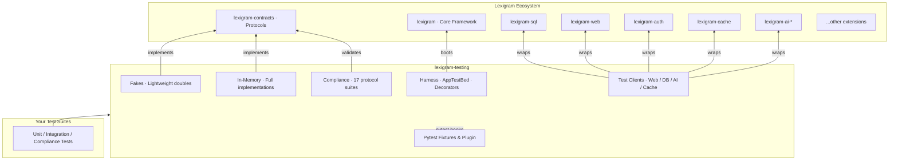
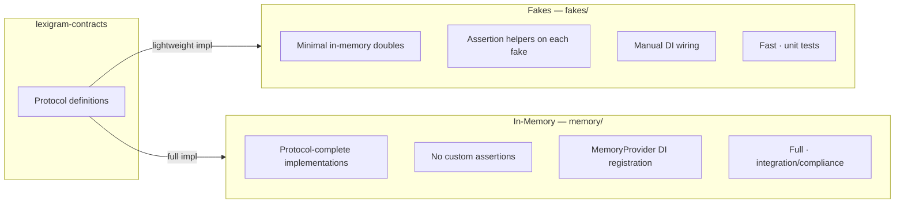
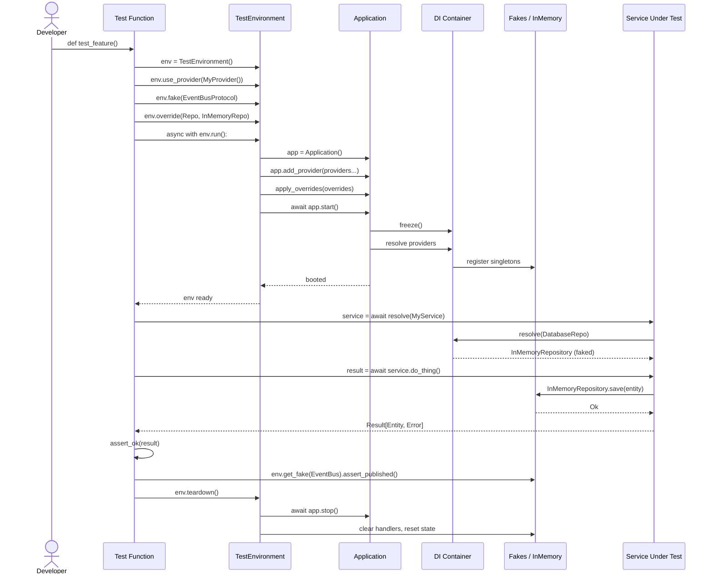
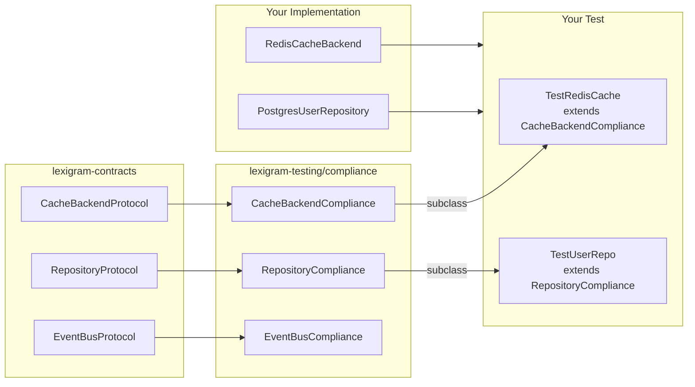
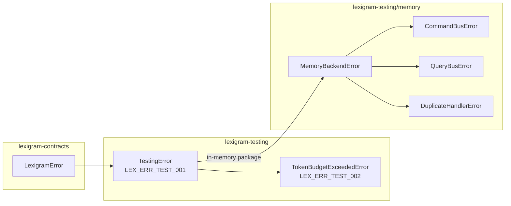

# Architecture

Internal design of the `lexigram-testing` package.

---

## Role in the System

`lexigram-testing` is the **cross-package testing toolkit** for the Lexigram Framework. Unlike every other extension package, it **may import from any extension package** — its purpose is providing test doubles, compliance suites, and test clients for the entire framework. All cross-package imports are declared as optional dependencies.



**Import rule:** `lexigram-testing` is the one package allowed to import directly from any other extension. All consumed extension packages are optional dependencies in `pyproject.toml`.

---

## Testing Philosophy

The framework's testing strategy rests on these principles:

| Principle | Rationale |
|-----------|-----------|
| **Fake at the contract boundary** | Test doubles implement a `Protocol` from `lexigram-contracts`, never mock internals |
| **No global state** | Every test gets a fresh container, fresh fakes, isolated state |
| **Deterministic clock** | `FixedClock` replaces `datetime.now()` so time-sensitive tests are repeatable |
| **Compliance over ad-hoc** | Protocol implementations validate against shared compliance suites, not per-project test code |
| **Lightweight fakes, full in-memory** | Fakes (`fakes/`) are minimal for fast assertions; in-memory (`memory/`) are complete protocol implementations for integration tests |
| **Result-aware assertions** | `assert_ok()`, `assert_err()`, `assert_err_type()` give explicit, informative failures for `Result[T, E]` |

---

## Module Layout

```
src/lexigram/testing/
├── __init__.py              # Public API — re-exports from all submodules
├── clock.py                 # FixedClock — deterministic time for tests
├── config.py                # TestingConfig — Pydantic config model
├── constants.py             # Version, env prefix, default timeouts, marker names
├── exceptions.py            # TestingError, TokenBudgetExceededError
├── module.py                # TestingModule — DI module descriptor
├── plugin.py                # pytest_configure — registers custom markers
├── protocols.py             # Testing-specific protocols (empty — uses contracts)
├── types.py                 # Type aliases: OverrideDict, ServiceEndpoint, SnapshotName
├── events.py                # Testing domain events (empty — no custom events)
├── hooks.py                 # Lifecycle hooks (empty — reserved)
│
├── fakes/                   # Lightweight test doubles
│   ├── audit.py             # FakeAuditLogger
│   ├── buses.py             # FakeCommandBus, FakeQueryBus
│   ├── cache.py             # FakeCache, FakeStateStore
│   ├── clock.py             # FakeClock, SystemClock, Clock
│   ├── config.py            # FakeConfig
│   ├── events.py            # FakeEventBus
│   ├── lifecycle.py         # FakeUnitOfWork
│   ├── logging.py           # FakeLogger, LogEntry
│   ├── monitoring.py        # FakeMetricsCollector
│   └── tracing.py           # FakeTracer, FakeSpan
│
├── memory/                  # Full in-memory implementations
│   ├── audit.py             # InMemoryAuditLogger
│   ├── blob_store.py        # InMemoryBlobStore
│   ├── cache.py             # InMemoryCacheBackend
│   ├── cqrs.py              # InMemoryCommandBus, InMemoryQueryBus
│   ├── event_bus.py         # InMemoryEventBus
│   ├── lock.py              # InMemoryDistributedLock, InMemoryAsyncLock
│   ├── outbox.py            # InMemoryOutbox, OutboxRelay
│   ├── repository.py        # InMemoryRepository (generic)
│   ├── uow.py               # InMemoryUnitOfWork
│   ├── config/              # Memory config models
│   ├── constants.py         # DEFAULT_REPOSITORY_CAPACITY, etc.
│   ├── exceptions.py        # CommandBusError, DuplicateHandlerError, etc.
│   ├── types.py             # Memory-specific types
│   └── di/
│       └── provider.py      # MemoryProvider — DI registration
│
├── compliance/              # Parameterized protocol compliance suites (17)
│   ├── audit.py
│   ├── blob_store.py
│   ├── cache.py
│   ├── database.py
│   ├── distributed_lock.py
│   ├── event_bus.py
│   ├── flags.py
│   ├── middleware.py
│   ├── notification.py
│   ├── queue_backend.py
│   ├── repository.py
│   ├── search.py
│   ├── task_queue.py
│   ├── vector_store.py
│   └── webhook.py
│
├── harness/                 # Test bootstrapping
│   ├── testbed.py           # AppTestBed — boots full app with DI overrides
│   ├── environment.py       # IntegrationEnvironment — pre-wired for real services
│   ├── container.py         # LexigramContainerHarness — isolated container for unit tests
│   ├── overrides.py         # override() — context manager for temporary DI overrides
│   └── decorators.py        # @testbed, @override — class/method decorators
│
├── testkit/                 # Developer-friendly test environment
│   ├── environment.py       # TestEnvironment — pre-wired container with all fakes
│   ├── fixtures.py          # test_environment, test_container, test_event_bus fixtures
│   ├── assertions.py        # assert_ok, assert_err, assert_err_type, assert_err_contains
│   └── fakes.py             # Additional fake factories
│
├── fixtures/                # Pytest fixtures
│   ├── core.py              # test_bed, fake_cache, fake_clock, fake_event_bus, etc.
│   ├── container.py         # ContainerTestFixture
│   ├── containers.py        # ContainerFactory — common protocol registration
│   ├── bed.py               # TestEnvironment — provider-level test environment
│   ├── db.py                # Database fixtures (conditional on lexigram-sql)
│   ├── web.py               # Web fixtures (conditional on lexigram-web)
│   ├── tasks.py             # Task fixtures (conditional on lexigram-tasks)
│   ├── ai.py                # AI fixtures (conditional on lexigram-ai-*)
│   └── messaging.py         # Messaging fixtures
│
├── clients/                 # Test clients for extension packages
│   ├── web/                 # WebTestClient, WebTestBed
│   ├── db/                  # DatabaseTestClient, DatabaseTestBed
│   ├── cache/               # Cache test client
│   ├── auth/                # Auth test client
│   ├── events/              # Events test client
│   ├── tasks/               # TaskTestClient, TaskTestBed
│   ├── ai/                  # AITestClient, AITestBed
│   ├── search/              # Search test client
│   ├── storage/             # Storage test client
│   └── ui/                  # UI test client
│
├── lib/                     # General-purpose test utilities
│   ├── assertions.py        # TestAssertions, assert_result_ok/err, assert_healthy
│   ├── async_helper.py      # AsyncTestHelper — wait_for_condition, polling
│   ├── factory.py           # TestDataFactory — fixture data generation
│   ├── snapshots.py         # SnapshotAsserter — snapshot testing
│   ├── stubs.py             # Protocol stubs
│   └── admin_helpers.py     # AdminTestClient, AdminResponse
│
├── integration/             # Integration test support
│   ├── markers.py           # requires_redis, requires_postgres, etc.
│   ├── probes.py            # ServiceProbe — TCP/HTTP service availability probing
│   ├── config.py            # Integration config models
│   ├── cleanup.py           # Integration test cleanup
│   └── fixtures.py          # Integration-specific fixtures
│
├── plugins/
│   └── pytest/              # Pytest plugin internals
│
├── mocks/                   # Base mock provider classes
│   ├── base.py              # MockProvider — base class
│   └── test_provider.py     # Mock provider for testing
│
├── workflow/
│   └── harness.py           # Workflow testing harness
│
└── websocket/
    └── client.py            # WebSocket test client
```

---

## Key Components

### Fakes (`fakes/`) vs In-Memory (`memory/`)



| Aspect | Fakes (`fakes/`) | In-Memory (`memory/`) |
|--------|------------------|----------------------|
| Complexity | Minimal — just enough for assertions | Full protocol implementation |
| Assertion Helpers | `assert_event_raised()`, `assert_has_key()` | None — standard protocol methods |
| DI Wiring | Manual `container.singleton(...)` | Via `MemoryProvider` |
| Use Case | Unit tests with fast setup | Integration / compliance tests |
| Examples | `FakeCache`, `FakeEventBus`, `FakeTracer` | `InMemoryCacheBackend`, `InMemoryEventBus`, `InMemoryRepository` |

### FixedClock

Deterministic clock replacing `datetime.now()` in tests:

```python
from lexigram.testing.clock import FixedClock
from lexigram.primitives import clock

with clock.use(FixedClock(datetime(2026, 1, 1, tzinfo=UTC))):
    assert clock.now().year == 2026
    clock.advance(hours=2)
    assert clock.now().hour == 2
```

### AppTestBed

One-line integration test harness that boots the full application with DI overrides:

```python
async with AppTestBed.from_factory(
    "my_app.app:create_app",
    overrides={EmailService: MockEmailService()},
) as bed:
    response = await bed.client.get("/api/v1/users/1")
    assert response.status_code == 200
```

### TestEnvironment (fixtures/bed.py)

Provider-level test environment for isolated service testing:

```python
env = TestEnvironment("my-test")
env.use_provider(MyProvider())
env.fake(EventBusProtocol)
env.override(DatabaseProtocol, MockDatabase())

async with env.run():
    service = await env.container.resolve(MyService)
    result = await service.process()
```

### IntegrationEnvironment

Extends `TestEnvironment` with factory methods for real backing services:

```python
# SQLite in-memory + everything else faked
async with IntegrationEnvironment.with_database() as env:
    repo = await env.resolve(UserRepository)
    ...

# Real Redis + fakes
async with IntegrationEnvironment.with_cache(backend="redis", url="redis://...") as env:
    ...
```

### Decorators (`@testbed`, `@override`)

NestJS-inspired class/method decorators reducing boilerplate:

```python
@testbed("my_app.app:create_app")
class TestUserFlow:

    @override(EmailService, MockEmailService())
    async def test_welcome_email(self, bed):
        resp = await bed.client.post("/users", json={"name": "Alice"})
        assert resp.status_code == 201
```

### Test Clients

Domain-specific test clients wrapping DI-booted applications:

| Client | Package Dependency | Purpose |
|--------|-------------------|---------|
| `WebTestClient` | `lexigram-web` | HTTP integration testing with ASGI |
| `DatabaseTestClient` | `lexigram-sql` | Database query/transaction testing |
| `AITestClient` | `lexigram-ai-*` | LLM/RAG pipeline testing with token budget |
| `TaskTestClient` | `lexigram-tasks` | Background task testing |
| `WebSocketClient` | `lexigram-web` | WebSocket integration testing |

---

## How Testing Works



---

## Contracts Used

| Protocol | Source | Fake | In-Memory |
|----------|--------|------|-----------|
| `EventBusProtocol` | `lexigram.contracts.events` | `FakeEventBus` | `InMemoryEventBus` |
| `CommandBusProtocol` | `lexigram.contracts.events` | `FakeCommandBus` | `InMemoryCommandBus` |
| `QueryBusProtocol` | `lexigram.contracts.events` | `FakeQueryBus` | `InMemoryQueryBus` |
| `DomainEventPublisherProtocol` | `lexigram.contracts.events` | `FakeEventBus` | `InMemoryEventBus` |
| `CacheBackendProtocol` | `lexigram.contracts.cache` | `FakeCache` | `InMemoryCacheBackend` |
| `AuditLoggerProtocol` | `lexigram.contracts.audit` | `FakeAuditLogger` | `InMemoryAuditLogger` |
| `RepositoryProtocol` | `lexigram.contracts.data` | — | `InMemoryRepository` |
| `UnitOfWorkProtocol` | `lexigram.contracts.data` | `FakeUnitOfWork` | `InMemoryUnitOfWork` |
| `DistributedLockProtocol` | `lexigram.contracts.resilience` | — | `InMemoryDistributedLock` |
| `LoggerProtocol` | `lexigram.contracts.logging` | `FakeLogger` | — |
| `ConfigProtocol` | `lexigram.contracts.core.config` | `FakeConfig` | — |
| `StateStoreProtocol` | `lexigram.contracts.state` | `FakeStateStore` | — |
| `MetricsCollectorProtocol` | `lexigram.contracts.metrics` | `FakeMetricsCollector` | — |
| `TracerProtocol` | `lexigram.contracts.tracing` | `FakeTracer` | — |
| `ClockProtocol` | `lexigram.contracts.core.clock` | `FakeClock`, `FixedClock` | — |
| `BlobStoreProtocol` | `lexigram.contracts.storage` | — | `InMemoryBlobStore` |
| `OutboxProtocol` | `lexigram.contracts.events` | — | `InMemoryOutbox` |

---

## DI Registration

### MemoryProvider

Registers all in-memory bus implementations as container singletons via the standard Provider pattern:

```python
class MemoryProvider(Provider):
    name = "memory"
    priority = ProviderPriority.INFRASTRUCTURE

    async def register(self, container: ContainerRegistrarProtocol) -> None:
        event_bus = InMemoryEventBus()
        container.singleton(EventBusProtocol, instance=event_bus)
        container.singleton(DomainEventPublisherProtocol, instance=event_bus)
        container.singleton(CommandBusProtocol, instance=InMemoryCommandBus())
        container.singleton(QueryBusProtocol, instance=InMemoryQueryBus())
        container.singleton(AuditLoggerProtocol, instance=InMemoryAuditLogger())
```

### AppTestBed Override Provider

Test overrides are injected via a late-running provider (priority 999) that runs `after` all regular providers register, ensuring overrides always win:

```python
class _OverrideProvider(Provider):
    def __init__(self) -> None:
        super().__init__(name="_testbed_overrides")
        self.priority = 999

    async def register(self, container: Any) -> None:
        for svc_type, instance in overrides.items():
            container.singleton(svc_type, instance)
```

### TestingModule

```python
@module()
class TestingModule(Module):
    @classmethod
    def configure(cls, **kwargs: Any) -> DynamicModule:
        return DynamicModule(
            module=cls,
            providers=[],
            exports=[],
        )
```

---

## Compliance Testing

The compliance framework in `compliance/` provides **parameterized pytest base classes** that validate any implementation of a given protocol.



Each compliance suite requires only a factory method from the subclass:

```python
class TestRedisCacheCompliance(CacheBackendCompliance):
    async def create_backend(self):
        return RedisCacheBackend("redis://localhost:6379/15")

class TestInMemoryUserRepo(RepositoryCompliance[User]):
    async def create_repository(self):
        return InMemoryUserRepository()

    def create_entity(self, **overrides):
        return User(id=str(uuid4()), name="Alice", **overrides)
```

The 17 available compliance suites:

| Suite | Protocol Validated | Tests |
|-------|-------------------|-------|
| `CacheBackendCompliance` | `CacheBackendProtocol` | set/get/delete/clear/ttl/various types |
| `RepositoryCompliance` | `RepositoryProtocol[T]` | save/get/delete/list |
| `EventBusCompliance` | `EventBusProtocol` | publish/subscribe/unsubscribe |
| `AuditLoggerCompliance` | `AuditLoggerProtocol` | log/query/clear |
| `AuditStoreCompliance` | `AuditStoreProtocol` | store/retrieve/prune |
| `BlobStoreCompliance` | `BlobStoreProtocol` | upload/download/delete |
| `DatabaseProviderCompliance` | `DatabaseProviderProtocol` | query/execute/connection |
| `DistributedLockCompliance` | `DistributedLockProtocol` | acquire/release/expiry |
| `FlagProviderCompliance` | `FlagProviderProtocol` | get/set/enable/disable |
| `MiddlewareCompliance` | `MiddlewareProtocol` | process/chain |
| `NotificationChannelCompliance` | `NotificationChannelProtocol` | send/deliver |
| `QueueBackendCompliance` | `QueueBackendProtocol` | enqueue/dequeue/ack |
| `SearchEngineCompliance` | `SearchEngineProtocol` | index/search/delete |
| `TaskQueueCompliance` | `TaskQueueProtocol` | enqueue/process/retry |
| `VectorStoreCompliance` | `VectorStoreProtocol` | upsert/search/delete |
| `WebhookDeliveryStoreCompliance` | `WebhookDeliveryStoreProtocol` | store/deliver/retry |
| `WebhookSubscriptionStoreCompliance` | `WebhookSubscriptionStoreProtocol` | subscribe/unsubscribe/list |

---

## Exception Convention



- `TestingError` — base for all testing utilities errors
- `TokenBudgetExceededError` — raised when `AITestClient` would exceed its configured token budget (prevents runaway LLM costs)
- `MemoryBackendError` — base for in-memory implementation errors (duplicate handlers, handler not found, etc.)

---

## Extension Points

| Point | Mechanism |
|-------|-----------|
| New fake | Implement any protocol from `lexigram-contracts`, add to `fakes/`, register in `fake()` lookup |
| New in-memory backend | Implement protocol in `memory/`, register via `MemoryProvider` or a custom provider |
| New compliance suite | Create a base class in `compliance/` with `@abstractmethod` factory + `@pytest.mark.asyncio` test methods |
| Custom test environment | Subclass `TestEnvironment` (fixtures/bed.py), override `setup()` |
| Custom integration env | Subclass `IntegrationEnvironment`, add `with_*` factory methods |
| Custom test client | Create a client class in `clients/`, import in `__init__.py` |
| Pytest fixtures | Add fixtures in `fixtures/core.py`, export via `fixtures/__init__.py` |
| DI override decorators | Use `@override` / `@testbed` on class/method |
| Integration markers | Add to `integration/markers.py`, register in `plugin.py` |
| Service availability probe | Add to `integration/probes.py`, use `ServiceProbe` base class |

---

## Constants

| Symbol | Description |
|--------|-------------|
| `ENV_PREFIX` | `LEX_TESTING__` |
| `ENV_NESTED_DELIMITER` | `__` |
| `DEFAULT_PROBE_TIMEOUT` | 30.0s — default service probe timeout |
| `DEFAULT_PROBE_INTERVAL` | 0.5s — default probe polling interval |
| `DEFAULT_HTTP_TIMEOUT` | 10.0s — default HTTP test client timeout |
| `DEFAULT_REDIS_PORT` | 6379 |
| `DEFAULT_POSTGRES_PORT` | 5432 |
| `DEFAULT_RABBITMQ_PORT` | 5672 |
| `MARKER_REDIS` | `"redis"` — pytest marker name |
| `MARKER_POSTGRES` | `"postgres"` |
| `DEFAULT_REPOSITORY_CAPACITY` | In-memory repository capacity limit |
| `__version__` | Package version from `importlib.metadata` |
