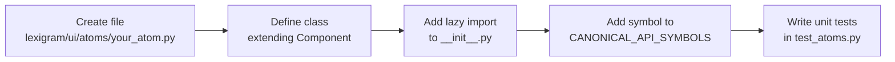
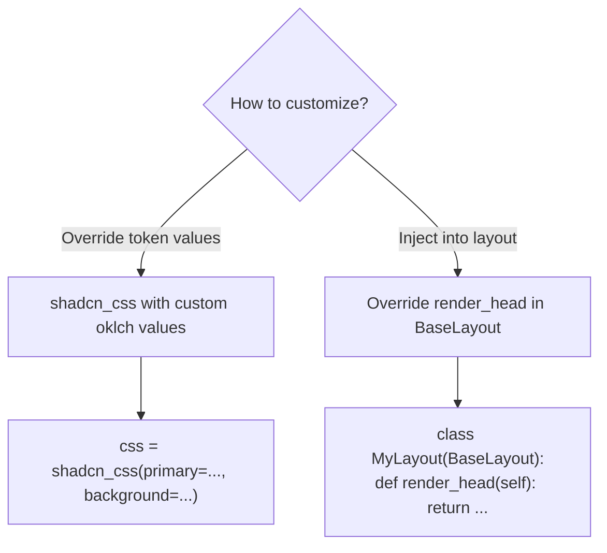
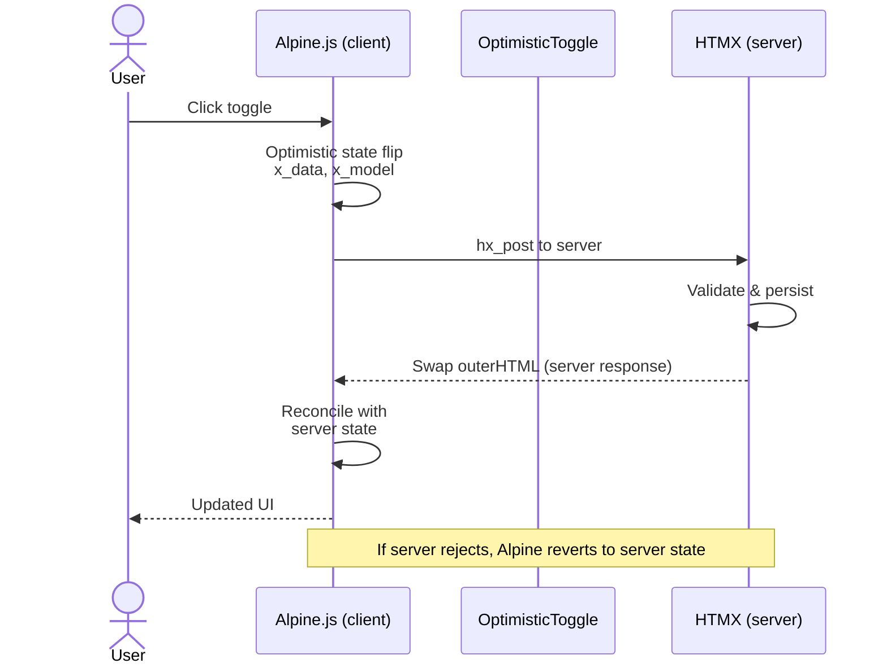

# How-To Guides

Concrete recipes for common tasks.

---

## How to Add a New Atom



1. Create a file in `lexigram/ui/atoms/your_atom.py`
2. Define a class extending `Component`:

```python
from __future__ import annotations

from lexigram.ui import Component, el

class Avatar(Component):
    """Circular avatar image."""

    def __init__(self, src: str, alt: str = "", size: str = "md") -> None:
        super().__init__(src=src, alt=alt, size=size)
        self.src = src
        self.alt = alt
        self.size = size

    def render(self):
        sizes = {"sm": "size-8", "md": "size-12", "lg": "size-16"}
        cls = f"rounded-full object-cover {sizes.get(self.size, sizes['md'])}"
        return el("img", src=self.src, alt=self.alt, class_=cls)
```

3. Add the lazy import to `lexigram/ui/__init__.py`
4. Add the symbol to `CANONICAL_API_SYMBOLS` in `tests/integration/test_public_api.py`
5. Write unit tests in `tests/unit/test_atoms.py`

**Note:** Use CSS variable utility classes (e.g., `bg-card`, `text-foreground`, `border-border`) instead of hardcoded Tailwind colors so components adapt to theme changes.

---

## How to Add a New Input Type

Subclass `AbstractInput`:

```python
from lexigram.ui import AbstractInput, el

class ColorInput(AbstractInput):
    """Color picker input."""

    def __init__(self, name: str, value: str = "#000000", **kwargs) -> None:
        super().__init__(name=name, **kwargs)
        self._value = value

    def render_input(self, id: str, name: str, **attrs) -> str:
        return str(
            el("input", type="color", id=id, name=name, value=self._value, **attrs)
        )
```

Override `render_input()` — the base class handles wrapping with label, errors, and help text.

---

## How to Customize the Theme



### Override specific CSS variables

```python
from lexigram.ui.styles.theme import shadcn_css

# Full custom theme
css = shadcn_css(
    primary="oklch(0.55 0.25 320)",       # Magenta primary
    background="oklch(0.99 0.005 90)",     # Warm off-white
    foreground="oklch(0.15 0.02 90)",       # Warm dark text
    radius="0.75rem",
    success="oklch(0.65 0.2 145)",         # Custom green
    warning="oklch(0.8 0.15 75)",          # Custom amber
    info="oklch(0.6 0.15 260)",            # Custom blue
)
```

### Inject into a layout

```python
from lexigram.ui.layouts import BaseLayout
from lexigram.ui import raw

class MyLayout(BaseLayout):
    def render_head(self):
        custom_css = shadcn_css(primary="oklch(0.5 0.2 200)")
        return super().render_head() + raw(f"<style>{custom_css}</style>")
```

---

## How to Use the Component CLI

```bash
# List available components and options
lexigram-ui add --help

# Add a card component to the default location
lexigram-ui add card

# Add a modal to a custom directory with force overwrite
lexigram-ui add modal --output src/components/ui --force
```

The CLI output:

```
✓ Copied 3 files for "modal" to src/components/ui/
  - modal.py
  - button.py (dependency)
  - card.py (dependency)
```

---

## How to Use the `asChild` Pattern

### Button as an `<a>` tag

```python
from lexigram.ui import Button

Button(as_child=True, children=[
    el("a", "Go to Profile", href="/profile")
])
# Renders: <a href="/profile" class="...button classes...">Go to Profile</a>
```

### Card as a clickable link

```python
from lexigram.ui import Card

Card(
    title="Dashboard",
    as_child=True,
    children=[
        el("a", "View Dashboard", href="/dashboard")
    ],
)
```

### Custom component as child target

Any `Component` subclass supports `as_child` — create custom wrappers:

```python
class FancyButton(Component):
    def render(self):
        return el("button", el("Slot"), class_="fancy bg-primary text-primary-foreground")
```

---

## How to Apply CSS Variables to Your Components

Use ShadCN utility classes instead of Tailwind literals:

```python
# ❌ Hardcoded — won't adapt to theme
el("div", class_="bg-white text-gray-900 p-4")

# ✅ CSS variable — adapts to light/dark
el("div", class_="bg-card text-card-foreground p-4 rounded-lg shadow-sm")

# ✅ Border and input styles
el("input", class_="bg-background border-input text-foreground")
```

Available utility prefixes:

| Prefix | Maps to |
|--------|---------|
| `bg-{token}` | `background-color: var(--{token})` |
| `text-{token}` | `color: var(--{token})` |
| `border-{token}` | `border-color: var(--{token})` |
| `ring-{token}` | `--tw-ring-color: var(--{token})` |

Token names: `background`, `foreground`, `card`, `card-foreground`, `popover`, `popover-foreground`, `primary`, `primary-foreground`, `secondary`, `secondary-foreground`, `muted`, `muted-foreground`, `accent`, `accent-foreground`, `destructive`, `destructive-foreground`, `border`, `input`, `ring`.

---

## How to Register a New HTMX Zone

```python
from lexigram.ui import Zone, Zones, SwapMode

# Add a new zone to the canonical registry:
Zones.APPEND = Zone("append-target", swap=SwapMode.BEFORE_END)
```

Use in a route handler:

```python
html = render_to_string(el("div", "New item"))
headers = {"HX-Retarget": Zones.APPEND.selector, "HX-Reswap": Zones.APPEND.swap_mode.value}
return html, 200, headers
```

For custom zones outside the canonical `Zones` class, create a `Zone` instance directly:

```python
custom_zone = Zone("my-custom-target", swap=SwapMode.OUTER_HTML)
```

---

## How to Wire a Server-Driven Toast via X-Toast Header

On the server, return a custom header in your HTMX response:

```python
def my_handler(request):
    # ... business logic ...
    headers = {
        "X-Toast": json.dumps({
            "title": "Success",
            "message": "Item created",
            "variant": "success",
        })
    }
    return html, 201, headers
```

The client-side `ServerToastChannel` picks up this header and renders the toast. No explicit JS needed.

For programmatic toasts from non-HTTP contexts:

```python
from lexigram.ui import ServerToastChannel

channel = ServerToastChannel()
await channel.push("success", "Background job completed")
```

---

## How to Configure CSP for lexigram-ui

Reference the built-in CSP requirements:

```python
from lexigram.ui.constants import UI_CSP_REQUIREMENTS

# Use UI_CSP_REQUIREMENTS to build your CSP header
csp = {
    "default-src": ["'self'"],
    **UI_CSP_REQUIREMENTS,
}
```

This ensures HTMX CDN, Alpine.js, icon libraries, and Tailwind CDN are all permitted.

---

## How to Write a Component That Participates in Optimistic Updates



```python
from lexigram.ui import Component, el

class OptimisticToggle(Component):
    """Toggle with optimistic update support."""

    def __init__(self, name: str, checked: bool = False, **kwargs):
        super().__init__(name=name, checked=checked, **kwargs)
        self.name = name
        self.checked = checked

    def render(self):
        return el(
            "input",
            type="checkbox",
            name=self.name,
            checked=self.checked or None,  # None = omit if False
            class_="toggle accent-primary",
            # HTMX: swap the parent on change
            hx_post=f"/toggle/{self.name}",
            hx_target="closest .toggle-wrapper",
            hx_swap="outerHTML",
            # Alpine: optimistic state management
            x_data=f"{{ checked: {str(self.checked).lower()} }}",
            x_model="checked",
            x_on_change="checked = !checked",
        )
```
