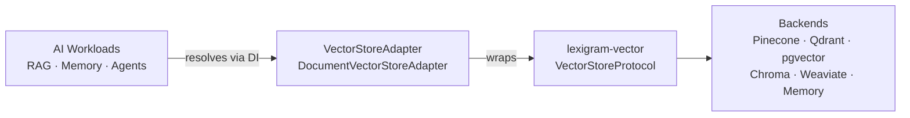
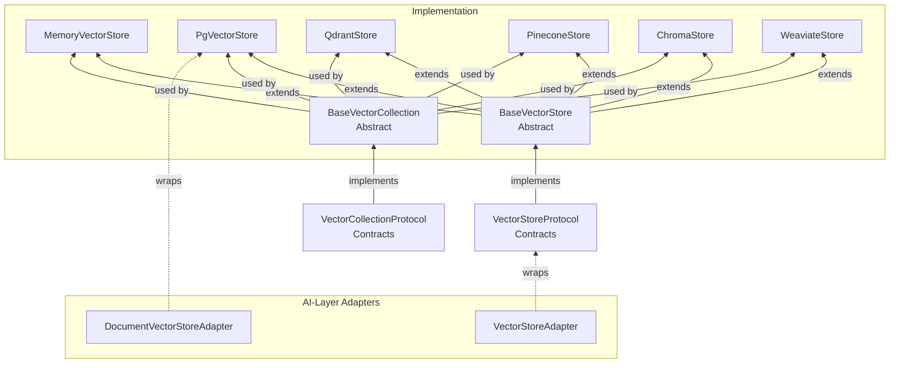
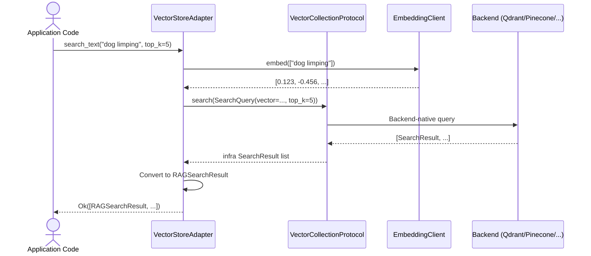
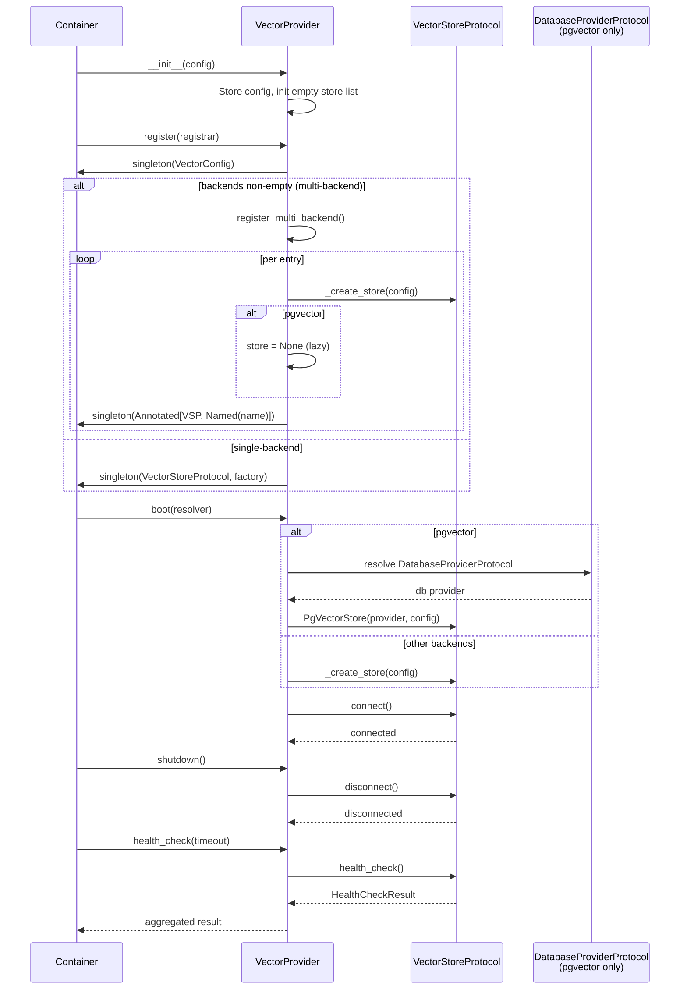
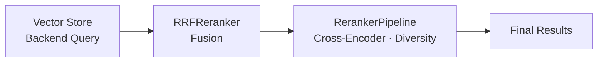
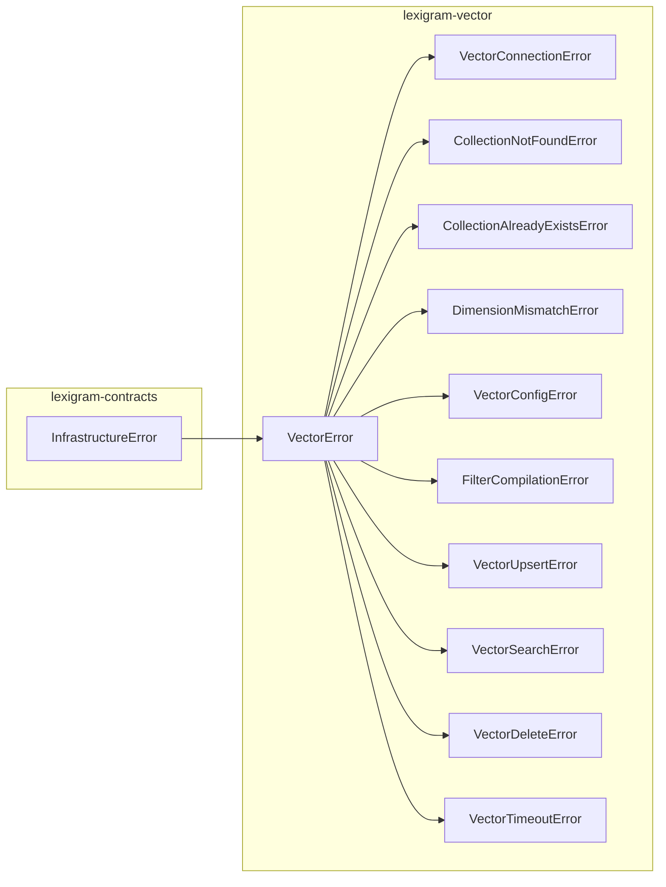

# Architecture

Internal design of the `lexigram-vector` package.

---

## Role in the System

`lexigram-vector` is the vector store abstraction layer. It implements `VectorStoreProtocol` and `VectorCollectionProtocol` from `lexigram-contracts`, providing pluggable backends for embedding storage and similarity search. It is an infrastructure dependency for AI workloads (RAG, memory, agents) and is consumed through DI — never imported directly.



**Import direction:** AI packages depend on `lexigram-vector` through contracts and DI — no direct imports. The `VectorStoreProtocol` lives in `lexigram-contracts`; `lexigram-vector` provides implementations.

---

## Backend Abstraction

All backends implement `VectorStoreProtocol` (collection lifecycle) and `VectorCollectionProtocol` (vector CRUD) from `lexigram.contracts.data.vector.protocols`. The abstract base classes `BaseVectorStore` and `BaseVectorCollection` provide shared initialization logic.



**Backend selection** is configured via `VectorConfig.backend`. The `VectorProvider` instantiates the correct driver at boot. `pgvector` is special — it requires a `DatabaseProviderProtocol` resolved from the container and is created lazily during `boot()` rather than during `register()`.

---

## Core Operations

### VectorStoreProtocol — Collection Lifecycle

| Operation | Description |
|-----------|-------------|
| `connect()` / `disconnect()` | Network lifecycle |
| `create_collection(config)` | Create a named, dimensioned collection |
| `delete_collection(name)` | Remove collection and all vectors |
| `collection_exists(name)` | Existence check |
| `get_collection(name)` | Return a `VectorCollectionProtocol` handle |
| `list_collections()` | List all collections with metadata |
| `health_check(timeout)` | Connectivity and readiness probe |

### VectorCollectionProtocol — Vector CRUD

| Operation | Description |
|-----------|-------------|
| `upsert(records)` | Insert or update vectors (idempotent by ID) |
| `search(query)` | Similarity search with metadata filtering |
| `get(ids)` | Retrieve vectors by ID |
| `delete(ids)` | Delete vectors by ID |
| `delete_by_filter(filter)` | Delete vectors matching metadata filter |
| `count()` | Number of vectors in the collection |
| `update_metadata(id, metadata)` | Partial metadata update without re-upload |
| `add_texts(texts, embeddings, ...)` | Convenience: embed + upsert in one call |

### Semantic Search Sequence



---

## Provider Lifecycle

### `VectorProvider` — priority `INFRASTRUCTURE`



### Provider Phases

| Phase | What happens |
|-------|-------------|
| `__init__(config)` | Stores `VectorConfig`, initialises empty store / service list |
| `register(container)` | Registers `VectorConfig` singleton + `VectorStoreProtocol` binding (lazy). For multi-backend mode, registers each entry under `Annotated[VectorStoreProtocol, Named(name)]` |
| `boot(container)` | Connects to the vector store(s). pgvector stores resolve `DatabaseProviderProtocol` from the container. All stores connect in parallel with `asyncio.gather`. Partial failure disconnects successful stores before re-raising |
| `shutdown()` | Disconnects all stores in LIFO order. Errors are suppressed so every store attempts cleanup |
| `health_check(timeout)` | Runs health checks in parallel across all backends. Returns worst status (UNHEALTHY > DEGRADED > HEALTHY) |

### Multi-Backend Registration

`VectorConfig.backends` enables multiple named vector stores. Each entry:

1. Gets a `NamedVectorConfig` with driver-specific config
2. Creates the store instance (or `None` for pgvector, resolved at boot)
3. Registers under `Annotated[VectorStoreProtocol, Named(name)]`
4. If `primary=True` (or it's the first entry), also gets the unnamed binding

---

## Source Layout

```
src/lexigram/vector/
├── __init__.py              # Public API — lazy imports
├── module.py                # VectorModule — DynamicModule wrapper
├── config.py                # VectorConfig, PgVectorConfig, QdrantConfig, etc.
├── constants.py             # Backend name constants, defaults, env prefix
├── exceptions.py            # VectorError, CollectionNotFoundError, etc.
├── types.py                 # Internal types (CollectionState, BatchProgress)
├── protocols.py             # Reranker, VectorRetriever, Tokenizer (package-internal)
├── events.py                # VectorIndexedEvent, VectorSearchedEvent, VectorDeletedEvent
├── hooks.py                 # VectorIndexedHook, VectorSearchedHook
├── decorators.py            # Decorators (placeholder)
├── di/
│   ├── provider.py          # VectorProvider — register + boot + multi-backend
│   └── factories.py         # create_vector_store — AI-layer factory
├── backends/
│   ├── base.py              # BaseVectorStore, BaseVectorCollection abstract classes
│   ├── memory.py            # MemoryVectorStore (testing/dev)
│   ├── pgvector.py          # PgVectorStore (PostgreSQL + pgvector)
│   ├── qdrant.py            # QdrantStore
│   ├── pinecone.py          # PineconeStore
│   ├── chroma.py            # ChromaStore
│   └── weaviate.py          # WeaviateStore
├── adapters/
│   ├── vector_store.py      # VectorStoreAdapter — bridges infra → AI layer
│   └── document_store.py    # DocumentVectorStoreAdapter — adds document types
├── embedding/
│   ├── client.py            # OpenAICompatibleEmbeddingClient
│   ├── cache.py             # EmbeddingCache, InMemoryEmbeddingCache
│   └── config.py            # EmbeddingClientConfig
├── search/
│   ├── hybrid.py            # BM25Retriever, HybridRetriever, RRFReranker
│   └── reranking.py         # CrossEncoderReranker, DiversityReranker, etc.
├── filters/
│   └── compiler.py          # FilterCompiler — backend-agnostic filter translation
├── batch/
│   └── processor.py         # BatchProcessor — concurrent batched upsert/delete
├── cli/
│   ├── contributor.py       # CLI contributor for lexigram-cli
│   ├── commands.py          # Vector management commands
│   ├── checks.py            # Health check
│   ├── doctor.py            # Doctor check
│   └── generators/          # Code generators (vector_collection)
└── testing/
    └── mocks.py             # MockVectorStore, MockVectorStoreWithErrors
```

---

## Contracts Used

From `lexigram-contracts`:

| Protocol / Type | Module |
|----------------|--------|
| `VectorStoreProtocol` | `lexigram.contracts.data.vector.protocols` |
| `VectorCollectionProtocol` | `lexigram.contracts.data.vector.protocols` |
| `DistanceMetric` | `lexigram.contracts.data.vector.enums` |
| `IndexType` / `IndexState` | `lexigram.contracts.data.vector.enums` |
| `CollectionConfig` / `CollectionInfo` | `lexigram.contracts.data.vector.types` |
| `SearchQuery` / `SearchResult` | `lexigram.contracts.data.vector.types` |
| `VectorRecord` / `UpsertResult` / `DeleteResult` | `lexigram.contracts.data.vector.types` |
| `MetadataCondition` / `MetadataConditionGroup` / `Filter` | `lexigram.contracts.data.vector.filters` |
| `FilterOperator` / `MetadataFilter` | `lexigram.contracts.data.vector.filters` |
| `Document` / `RAGSearchResult` | `lexigram.contracts.ai.vector` |
| `DatabaseProviderProtocol` | `lexigram.contracts.data.sql.database` (pgvector only) |
| `CacheBackendProtocol` | `lexigram.contracts.infra.cache` (optional) |
| `HealthCheckResult` / `HealthStatus` | `lexigram.contracts.core.health` |
| `ProviderPriority` | `lexigram.contracts.core` |

---

## Embedding Client

The `OpenAICompatibleEmbeddingClient` supports any endpoint exposing the OpenAI `/v1/embeddings` API:

- **OpenAI format** — `{"input": [...], "model": "..."}` (default)
- **FastEmbed format** — `{"texts": [...], "model": "..."}`
- **Cohere format** — `{"texts": [...], "model": "..."}`

Texts are split into batches of `config.batch_size` and embedded in sequence. An optional `EmbeddingCache` (backed by `CacheBackendProtocol`) avoids re-embedding previously-seen texts using SHA-256-based cache keys.

---

## Search Pipeline

The search pipeline supports two optional post-retrieval stages:



| Component | Strategy | Description |
|-----------|----------|-------------|
| `RRFReranker` | Reciprocal Rank Fusion | Merges multiple ranked result lists (BM25 + vector) |
| `CrossEncoderReranker` | Neural re-scoring | Re-ranks with a cross-encoder model (high accuracy) |
| `DiversityReranker` | MMR | Maximises diversity among top results |
| `SimilarityReranker` | TF-IDF scoring | Fast fallback when no cross-encoder is available |
| `RerankerPipeline` | Composable | Chains multiple rerankers with configurable strategy |

---

## Exception Convention



All vector exceptions extend `VectorError(InfrastructureError)` — infrastructure failures that propagate. Domain errors (e.g., document not found) are surfaced via `Result[T, E]` in the AI-layer adapters.

---

## DI Registration

```python
# lexigram/vector/di/provider.py
class VectorProvider(Provider):
    name = "vector"
    priority = ProviderPriority.INFRASTRUCTURE

    async def register(self, container):
        container.singleton(VectorConfig, self._config)
        container.singleton(VectorStoreProtocol, factory=self._get_store)
        if self._config.backends:
            self._register_multi_backend(container)

    async def boot(self, container):
        if self._config.backend == BACKEND_PGVECTOR:
            db = await container.resolve(Annotated[DatabaseProviderProtocol, Named(name)])
            self._store = PgVectorStore(provider=db, config=self._config.pgvector)
        else:
            self._store = self._create_store(self._config)
        await self._store.connect()
```

```python
# lexigram/vector/module.py
VectorModule.configure(config=VectorConfig(backend="qdrant"))
VectorModule.stub()  # in-memory backend for testing
```

---

## Extension Points

| Point | Mechanism | Example |
|-------|-----------|---------|
| New backend | Implement `BaseVectorStore` + `BaseVectorCollection` | `class MyStore(BaseVectorStore): ...` |
| Custom embedding client | Provide an OpenAI-compatible `/v1/embeddings` endpoint | `OpenAICompatibleEmbeddingClient(config)` |
| Custom reranker | Implement the `Reranker` protocol | `CrossEncoderReranker(model_name=...)` |
| Hybrid search strategy | Configure `HybridRetriever` with custom BM25 or RRF | `BM25Retriever(tokenizer=...)`, `RRFReranker(k=60)` |
| Filter compiler | Subclass `FilterCompiler` for backend-native translation | `class QdrantFilterCompiler(FilterCompiler): ...` |
| Embedding cache | Provide `CacheBackendProtocol` to `EmbeddingCache` | `EmbeddingCache(cache_service=redis_cache, ttl=3600)` |
| CLI commands | Add entries via `VectorCliContributor` | `lexigram vector status` |
| Testing mocks | Use `MockVectorStore` or `MockVectorStoreWithErrors` | `from lexigram.vector.testing.mocks import MockVectorStore` |
