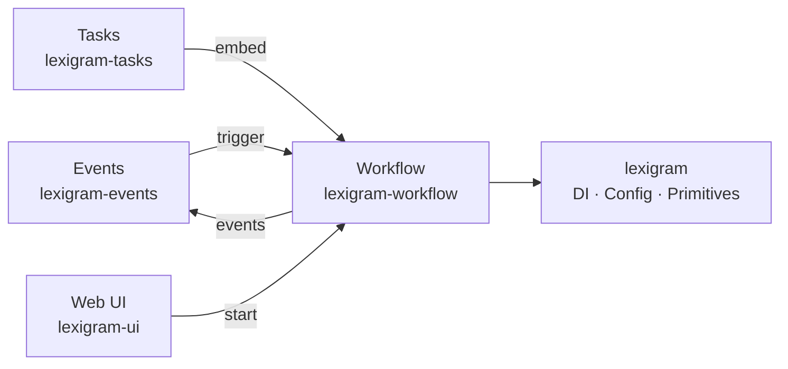
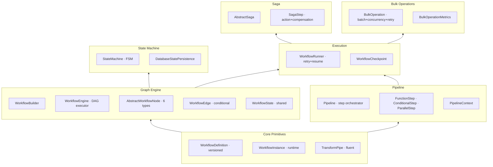
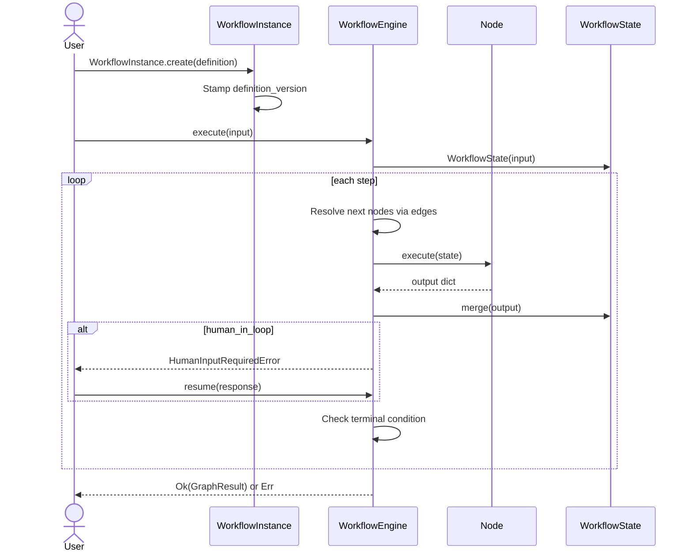
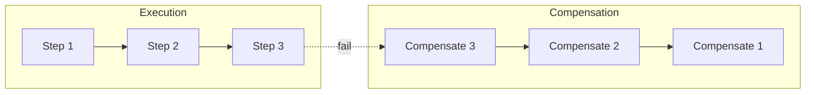
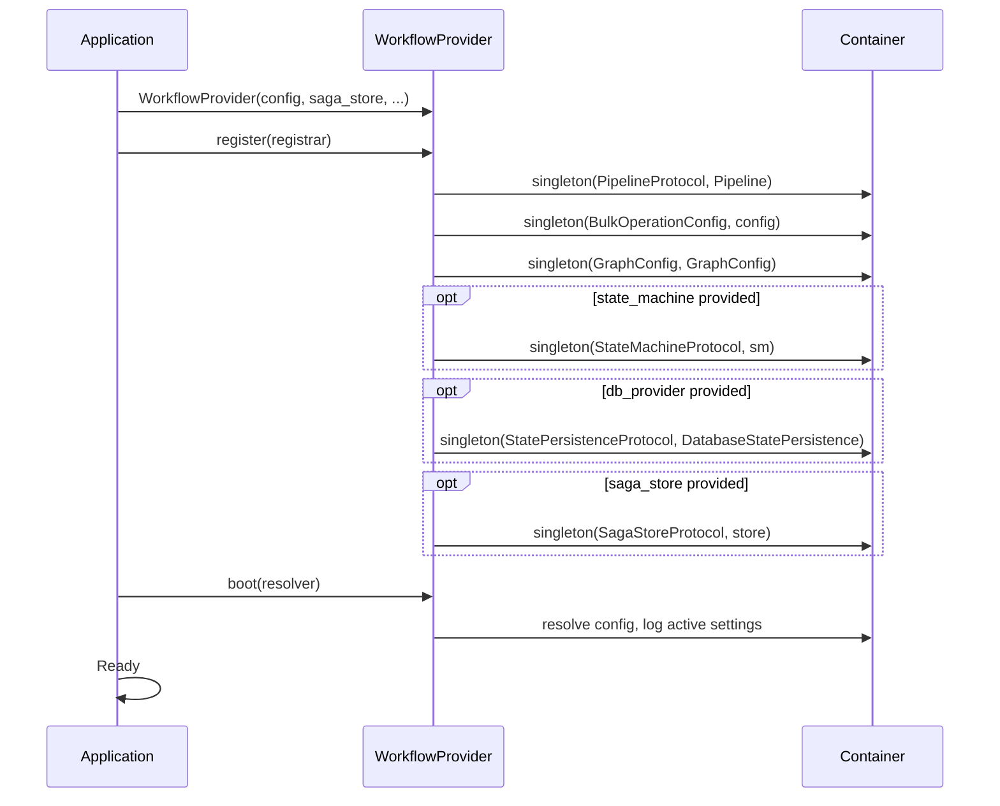

# Architecture

Internal design of the `lexigram-workflow` package.

---

## Role in the System



`lexigram-workflow` provides the orchestration layer for multi-step business processes: pipeline execution (sequential/parallel step chains), directed-graph workflow engines (node-based DAG traversal with conditional routing), saga orchestration (compensating transactions), state machines, and bulk batch processing. Controllers and event handlers invoke workflows, which orchestrate domain services.

---

## Architecture Overview



**Two orchestration models** coexist:

1. **Pipeline** — linear/conditional/parallel steps with explicit dependency ordering. Best for deterministic business processes (validation → enrichment → persistence).
2. **Graph** — directed-graph workflow with conditional edge routing and state merging. Best for AI agent workflows, human-in-the-loop, and non-deterministic branching.

Both share `WorkflowRunner` and checkpointing, and can be composed together.

---

## Workflow Lifecycle



Lifecycle: **Definition** (name + version) → **Instance** (stamps version) → **Build** (nodes, edges, entry/terminal) → **Execute** (graph traversal) → **Pause/Resume** (HumanNode raises `HumanInputRequiredError`) → **Complete** (terminal node reached). On resume, `WorkflowInstance.validate_definition_version()` detects incompatible definition changes.

---

## Pipeline System

`Pipeline` orchestrates steps with dependency ordering:

| Step | Purpose | Execution |
|------|---------|-----------|
| `FunctionStep` | User-provided callable | Dependency-ordered sequential |
| `ConditionalStep` | Branch on predicate, sub-step | Sequential within branch |
| `ParallelStep` | Multiple sub-steps concurrently | `asyncio.gather`, fail-fast |

1. Topological sort resolves execution order from declared dependencies
2. Each step checks `should_skip()`, executes with optional timeout/resilience
3. On failure: `on_error()` may recover; `fail_fast` aborts on first failure
4. Results stored in `PipelineContext`; checkpointed to optional `CacheBackendProtocol`
5. `cleanup()` runs after each step

```python
pipeline = Pipeline("onboarding", steps=[
    FunctionStep("validate", validate_input),
    ConditionalStep("route", is_premium,
        FunctionStep("premium", handle_premium),
        FunctionStep("standard", handle_standard),
    ),
    ParallelStep("notify", [
        FunctionStep("email", send_email),
        FunctionStep("sms", send_sms),
    ]),
])
result = await pipeline.execute(context)
```

### TransformPipe

A lightweight, immutable, generically-typed pipe for inline data transformation (separate from `Pipeline`):

```python
result = await (TransformPipe[Request]()
    .pipe(validate).pipe_if(lambda r: r.is_authenticated, enrich)
    .tap(logger.info).catch(error_handler).execute(request))
```

---

## Node Types

| Node | `NodeType` | Purpose | Input | Output |
|------|-----------|---------|-------|--------|
| `AgentNode` | `AGENT` | Execute a Lexigram agent | `state[input_key]` | `state[output_key]` |
| `GateNode` | `GATE` | No-op routing node | None | `{}` |
| `HumanNode` | `HUMAN` | Pause for human input | `state[input_key]` | `state[output_key]` |
| `LLMNode` | `LLM` | LLM call with prompt template | Rendered prompt | `state[output_key]` |
| `ToolNode` | `TOOL` | Execute a ToolProtocol | `state[input_key]` | `state[output_key]` |
| `SubworkflowNode` | `SUBWORKFLOW` | Embed nested `WorkflowEngine` | `state[input_key]` | `state[output_key]` |
| Custom | `CUSTOM` | Subclass `AbstractWorkflowNode` | Subclass-defined | Subclass-defined |

Edges support conditional routing via `WorkflowEdge(is_active=lambda state: ...)`. Multiple active edges from the same source execute in parallel when `GraphConfig.parallel_branches` is enabled.

---

## Saga Orchestration



Orchestration saga pattern: steps execute in registration order. Each `SagaStep` has an `action` and optional `compensation`. On failure, compensation runs in reverse order for all completed steps.

```
PENDING → RUNNING → COMPLETED           (all steps succeed)
PENDING → RUNNING → COMPENSATING → FAILED   (step failure)
```

| `SagaStep` Property | Description |
|---------------------|-------------|
| `action` | Async callable → `Result[Any, Error]` |
| `compensation` | Optional async callable to undo action |
| `max_retries` | Per-step retries before failing (default: 1) |
| `retry_delay` | Delay between retries (default: 1s) |
| `idempotent` | Whether compensation is safe to retry (default: `True`) |

State persists via `SagaStoreProtocol`. `AbstractSaga` includes `VERSION` checking on state load for schema evolution.

---

## Bulk Operations

`BulkOperation[T, R]` is a generic batch processor:

| Feature | Implementation |
|---------|---------------|
| **Batching** | Items chunked by configurable `batch_size` |
| **Concurrency** | `asyncio.Semaphore` limits parallel batches |
| **Retry** | Exponential backoff with configurable attempts |
| **Circuit breaker** | Optional `CircuitBreakerProtocol` wrapper |
| **Checkpoint/resume** | Cache-backed persistence of completed batch IDs |
| **Progress** | Callbacks + `BulkOperationMetrics` |
| **Cancellation** | `cancel()` → `BulkOperationCancelledError` |
| **Convenience** | `bulk_map()`, `bulk_filter()`, `bulk_reduce()` |

```python
operation = BulkOperation[int, str](
    config=BulkOperationConfig(batch_size=100, max_concurrency=5),
    processor=process_batch,
)
async for r in operation.execute(items, operation_id="op-1"):
    ...
```

---

## Provider Lifecycle



All registrations use `singleton` scope. Priority: `DOMAIN` (after infrastructure, before application). Config key: `"workflow"`, typed as `BulkOperationConfig`. The provider accepts optional `SagaStoreProtocol`, `StateMachineProtocol`, and `DatabaseProviderProtocol` for state persistence.

---

## Contracts Used

| Protocol | Implemented By | Source |
|----------|---------------|--------|
| `PipelineProtocol` | `Pipeline` | `lexigram.contracts.workflow` |
| `PipelineStepProtocol` | `FunctionStep`, `ConditionalStep`, `ParallelStep` | `lexigram.contracts.workflow` |
| `PipelineContextProtocol` | `PipelineContext` | `lexigram.contracts.workflow` |
| `SagaProtocol` | `AbstractSaga` | `lexigram.contracts.workflow` |
| `SagaStoreProtocol` | User-provided | `lexigram.contracts.workflow` |
| `StateMachineProtocol` | `StateMachine` | `lexigram.contracts.workflow` |
| `StatePersistenceProtocol` | `DatabaseStatePersistence` | `lexigram.contracts.workflow` |
| `WorkflowGraphProtocol` | `WorkflowBuilder` | `lexigram.contracts.workflow` |
| `WorkflowNodeProtocol` | `AbstractWorkflowNode` | `lexigram.contracts.workflow` |
| `ExecutionProtocol` | `WorkflowEngine` | `lexigram.contracts.workflow` |
| `BulkProcessorProtocol` | `BulkOperation` | `lexigram.contracts.workflow` |
| `ApprovalProtocol` | User-provided | `lexigram.contracts.workflow` |
| `CacheBackendProtocol` | User-provided (checkpoints) | `lexigram.contracts.infra.cache` |
| `CircuitBreakerProtocol` | User-provided | `lexigram.contracts.infra.resilience` |
| `DatabaseProviderProtocol` | User-provided (state) | `lexigram.contracts.data` |

Shared types (`SagaStep`, `SagaStepError`, `StateTransitionRecord`) and enums (`SagaState`) live in `lexigram.contracts.workflow`.

---

## Extension Points

| Point | Mechanism | Example |
|-------|-----------|---------|
| Custom node type | Subclass `AbstractWorkflowNode`, implement `execute()` | `SlackNotifyNode`, `WebhookNode` |
| Custom pipeline step | Subclass `PipelineStep` | `DatabaseTransactionStep` |
| Custom saga | Subclass `AbstractSaga`, define steps + `get_id()`/`is_completed()` | `OrderSaga`, `PaymentSaga` |
| Durable saga store | Implement `SagaStoreProtocol`, pass to `WorkflowModule.configure()` | `PostgresSagaStore` |
| State persistence | Pass `DatabaseProviderProtocol` to `WorkflowProvider` | `DatabaseStatePersistence` |
| Checkpoint backend | Implement `CacheBackendProtocol`, pass to `Pipeline`/`BulkOperation` | `RedisCheckpointStore` |
| Circuit breaker | Implement `CircuitBreakerProtocol`, pass to `BulkOperation` | `ResilienceCircuitBreaker` |
| Decorators | `@workflow()`, `@saga_step()` | Metadata attachment for discovery |
| Lifecycle hooks | Register via `HookRegistryProtocol` | Metrics, audit, notifications |
| Events | Subscribe via `EventBusProtocol` | `WorkflowStartedEvent`, etc. |
| CLI commands | Automatic via `lexigram.cli.contributors` entry point | `WorkflowCliContributor` |
