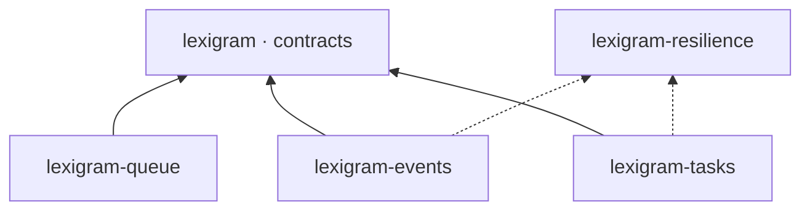
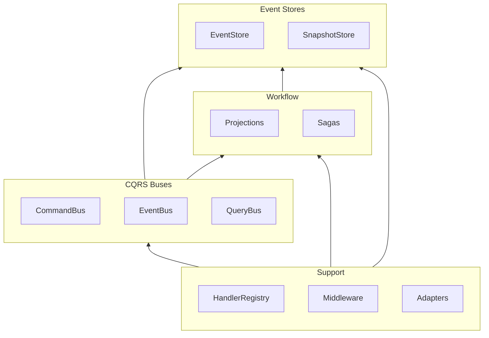
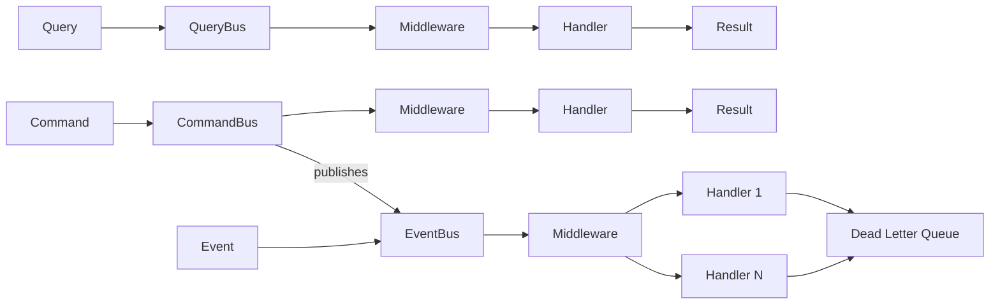
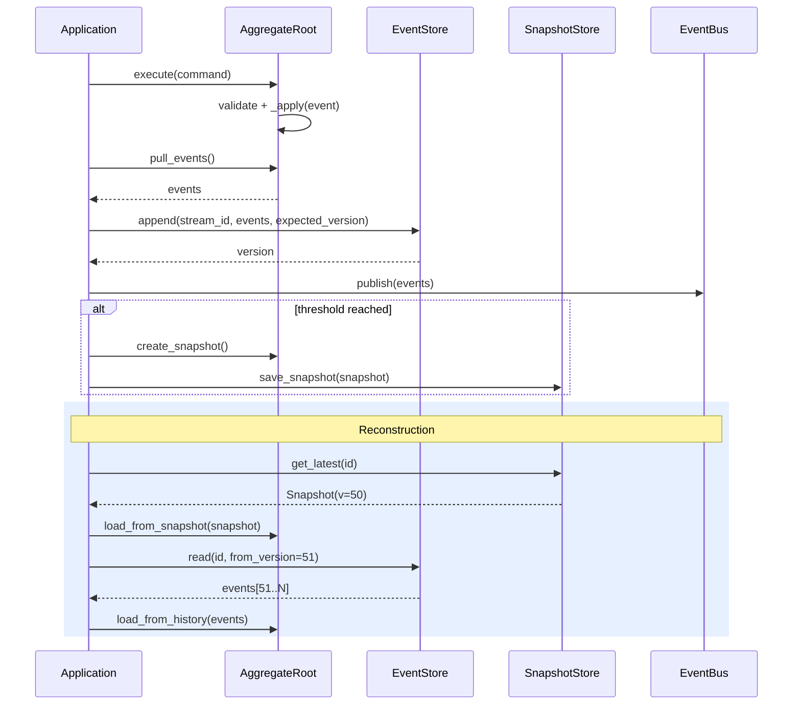
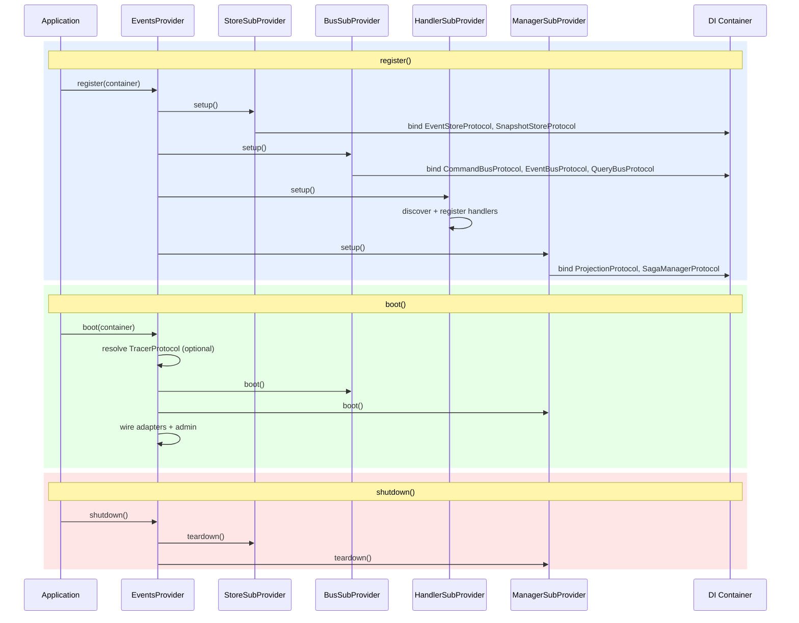

# Architecture

Internal design of the `lexigram-events` package — CQRS, event sourcing, projections, and saga orchestration for Lexigram applications.

---

## Role in the System

`lexigram-events` provides the CQRS and event sourcing layer. It occupies the **messaging and workflow** tier alongside `lexigram-queue` and `lexigram-tasks`.



**Depends on:** `lexigram`, `lexigram-contracts` | **May import:** `lexigram-resilience`

---

## Architecture Overview

The package is organized around four core subsystems: **buses** (command/event/query dispatch), **stores** (event/snapshot persistence), **projections** (read model management), and **sagas** (distributed transaction orchestration).



```
packages/lexigram-events/src/lexigram/events/
├── config.py             # EventsConfig + sub-configs
├── module.py             # EventsModule (IoC entry point)
├── constants.py          # Enums, env-var prefixes
├── exceptions.py         # EventError hierarchy
├── types.py              # DTOs (EventEnvelope, Snapshot, Checkpoint, etc.)
├── protocols.py          # Internal protocols (serializer, filter)
├── aggregates/           # AggregateRoot, Entity, ValueObject
├── buses/                # CommandBus, EventBus, QueryBus
├── messages/             # Message base classes (Message, Command, Event, Query)
├── handlers/             # Handler registry and discovery
├── stores/               # Event store backends (memory, postgres, mongodb, sqlite, redis)
├── repository/           # EventSourcingRepository
├── di/                   # EventsProvider + sub-providers
├── projections/          # Projection engine
├── sagas/                # Saga orchestration
├── middleware/           # Middleware pipeline
├── streaming/            # WebSocket event streaming
├── adapters/             # Message broker adapters (RabbitMQ, Kafka, Azure)
├── schema/               # Schema registry and evolution
├── encryption/           # Event encryption
├── webhooks/             # Outbound webhook dispatcher
├── decorators/           # @command_handler, @event_handler, @query_handler
├── admin/                # Admin dashboard widgets
└── cli/                  # CLI commands
```

---

## CQRS Bus System

Three buses implement the CQRS pattern with individual handler registries and middleware pipelines:



| Bus | Pattern | Handlers | Returns |
|-----|---------|----------|---------|
| `CommandBusImpl` | Command dispatch | 1 | `CommandResult` |
| `EventBusImpl` | Pub/sub per event type | N (parallel) | `DispatchResult` |
| `QueryBusImpl` | Query dispatch | 1 | Query result |

### EventBus Details

- Per-event-type `BoundedChannel` for backpressure
- Background drain tasks for concurrent dispatch
- Dead letter queue for failed events after retries
- Configurable: `max_concurrent_handlers`, `handler_timeout`, `parallel_dispatch`, `continue_on_error`

### Middleware Order

```
ValidationMiddleware → TransactionMiddleware → LoggingMiddleware →
RetryMiddleware → MetricsMiddleware → CircuitBreakerMiddleware
```

```python
class AuditMiddleware(EventMiddlewareProtocol):
    async def __call__(self, event, next_handler):
        await audit_log(event)
        return await next_handler(event)
```

---

## Event Sourcing

Aggregates are reconstructed by replaying events from their stream. State changes are persisted as an immutable log.



### AggregateRoot

`AggregateRoot` extends `DomainModel` with event buffering, snapshot support, and naming-convention-based event handlers:

```python
class Order(AggregateRoot):
    status: str = "draft"

    def add_item(self, product_id, quantity, price):
        self._apply(ItemAddedEvent(order_id=self.id, product_id=product_id,
                                   quantity=quantity, price=price))

    def _handle_item_added(self, event: ItemAddedEvent):
        self.items.append(OrderItem(event.product_id, event.quantity, event.price))
```

Handlers follow `_handle_{snake_case}` convention. Causation/correlation IDs propagate via `_set_context()` (MF-05).

### Snapshots

| Strategy | Trigger |
|----------|---------|
| `EVENT_COUNT` | After N events (default: 100) |
| `TIME_BASED` | After T seconds |
| `ON_DEMAND` | By caller |

---

## Provider Lifecycle

`EventsProvider` orchestrates four sub-providers for modular lifecycle management.



**Provider attrs:** `config_key = "events"`, `priority = ProviderPriority.INFRASTRUCTURE` (boots after database/cache).

### EventsModule

```python
EventsModule.configure()                                            # in-memory defaults
EventsModule.configure(EventsConfig(event_store_backend=BACKEND))   # production
EventsModule.scope(CreateOrderHandler, GetOrderHandler)             # feature-scoped handlers
EventsModule.stub()                                                 # unit test stub
```

---

## Projections

Projections build read models from event streams. The `ProjectionManager` tracks progress via `Checkpoint` objects and supports full rebuilds with configurable batch sizes.

```python
class OrderSummaryProjection(ProjectionProtocol):
    async def handle_event(self, event: DomainEvent) -> None:
        if isinstance(event, OrderCreated):
            await self.db.execute(
                "INSERT INTO order_summary (id, customer, total) VALUES ($1, $2, $3)",
                event.order_id, event.customer_id, 0)
```

States: `STOPPED` → `RUNNING` → `CATCHING_UP` → `LIVE` | `FAULTED` (error) | `REBUILDING` (full replay).

Config: `checkpoint_interval`, `batch_size`, `rebuild_batch_size`, `enable_parallel_projections`.

---

## Sagas

Sagas coordinate multi-step distributed transactions with compensation on failure. The `SagaManager` persists saga state and drives step execution.

```python
class OrderFulfillmentSaga(SagaBase):
    @saga_step(compensation=compensate_reserve_inventory)
    async def reserve_inventory(self, ctx: SagaContext) -> SagaStepResult:
        result = await ctx.services.inventory.reserve(ctx.data["order_id"])
        return SagaStepResult.success(data={"reservation_id": result.id})
```

States: `NOT_STARTED → STARTED → RUNNING → COMPLETED`, with compensation flow on `FAILED`/`TIMED_OUT`.

| Store | Class |
|-------|-------|
| In-Memory | `InMemorySagaStore` |
| SQL | `SqlSagaStore` |

---

## Backend Support

| Backend | Extras | Store | Snapshot |
|---------|--------|-------|----------|
| In-Memory | built-in | `InMemoryEventStore` | `InMemorySnapshotStore` |
| PostgreSQL | `postgres` | `PostgresEventStore` | `PostgresSnapshotStore` |
| SQLite | `sqlite` | `SqliteEventStore` | `SqliteSnapshotStore` |
| MongoDB | `mongodb` | `MongoDBEventStore` | `MongoDBSnapshotStore` |
| Redis | `redis` | `RedisEventStore` | — |

All stores implement `EventStoreProtocol` with: `append()` (optimistic concurrency), `read()` (version range), `stream_all()` (global ordering), `compact()`.

### Message Broker Adapters

RabbitMQ (`rabbitmq`), Kafka (`kafka`), Azure Service Bus (`azure`). All implement `PubSubProtocol`.

---

## Contracts Used

All major protocols are defined in `lexigram-contracts`:

- **`lexigram.contracts.events`:** `EventBusProtocol`, `CommandBusProtocol`, `QueryBusProtocol`, `EventStoreProtocol`, `SnapshotStoreProtocol`, `EventHandlerProtocol`, `CommandHandlerProtocol`, `QueryHandlerProtocol`, `ProjectionProtocol`, `AggregateFactoryProtocol`, `MultiEventHandlerProtocol`
- **`lexigram.contracts.domain`:** `DomainEvent`
- **`lexigram.contracts.workflow`:** `SagaProtocol`, `SagaManagerProtocol`

Package-internal protocols (`EventSerializerProtocol`, `EventFilterProtocol`) live in `protocols.py`.

---

## Exception Convention

Exceptions extend `EventError`, `DomainError`, or `InfrastructureError` from contracts:

`ConcurrencyError` (`004`), `CommandExecutionError` (`005`), `QueryExecutionError` (`006`), `EventHandlerError` (`008`), `StreamNotFoundError` (`007`), `ProjectionBuildError` (`015`), `WebhookDeliveryError` (`018`). All extend `EventError`, `DomainError`, or `InfrastructureError` from contracts.

---

## Extension Points

| Point | Mechanism |
|-------|-----------|
| Custom event store | Implement `EventStoreProtocol` |
| Custom snapshot store | Implement `SnapshotStoreProtocol` |
| Custom bus | Implement `CommandBusProtocol` / `EventBusProtocol` / `QueryBusProtocol` |
| Custom projection | Implement `ProjectionProtocol` |
| Custom saga manager | Implement `SagaManagerProtocol` |
| Custom middleware | Implement `EventMiddlewareProtocol` |
| Message broker adapter | Implement `PubSubProtocol`, register in `AdapterRegistry` |
| Custom handler | Subclass `CommandHandlerProtocol` / `EventHandlerProtocol` / `QueryHandlerProtocol` |
| Event serializer | Implement `EventSerializerProtocol` |
| Event filter | Implement `EventFilterProtocol` |
| Schema evolution | Configure `SchemaEvolution` on event store |
| Encryption | Configure encryption serializer |
| Webhook dispatcher | Configure `WebhookDispatcher` |
