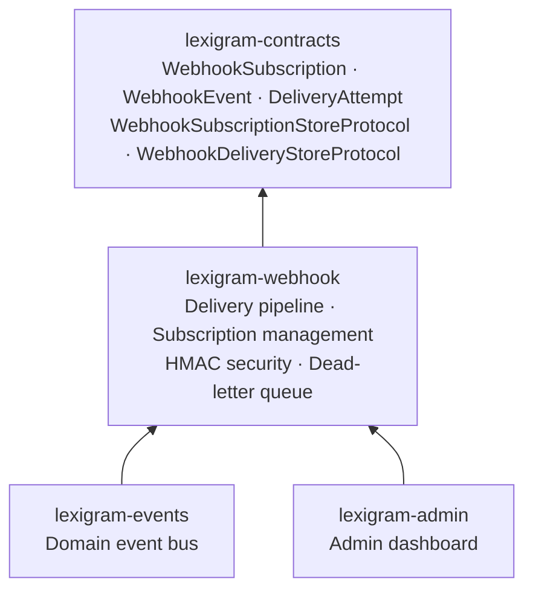
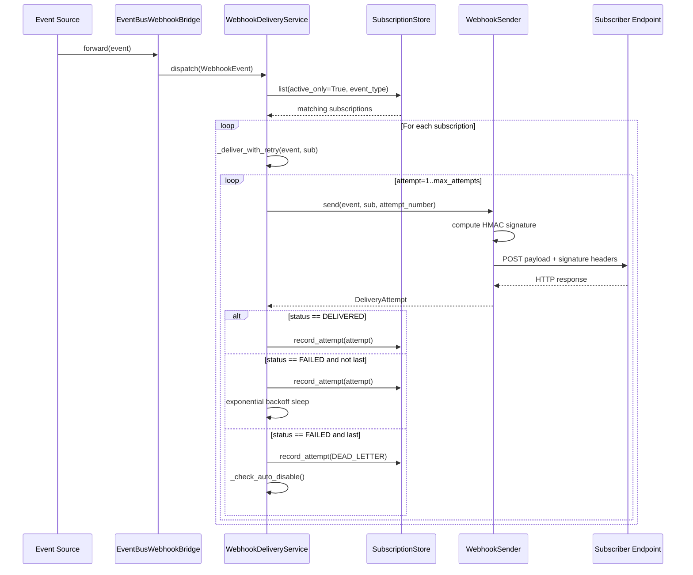
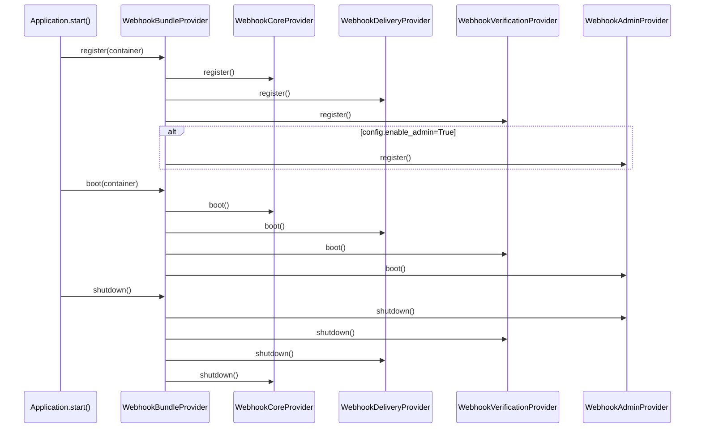
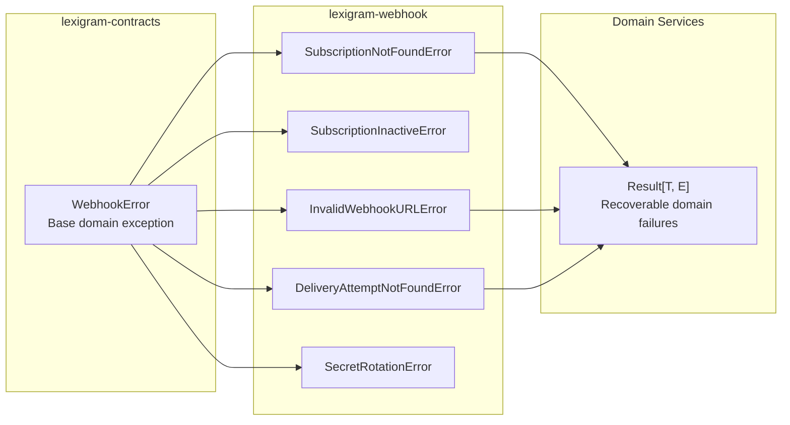

# Architecture

Internal design of the `lexigram-webhook` package.

---

## Role in the System



`lexigram-webhook` is the outbound webhook delivery layer. It provides subscription CRUD, event fan-out with exponential-backoff retry, HMAC signature signing and verification, storage backends (in-memory, SQL), and dead-letter queue management.

---

## Package Layout

```
packages/lexigram-webhook/src/lexigram/webhook/
├── __init__.py              # Public surface — re-exports + WebhookModule, WebhookConfig
├── config.py                # WebhookConfig — 18 fields with env overrides
├── constants.py             # Default values + StrEnums (StoreBackend, DeliveryStatus)
├── decorators.py            # @webhook_event decorator for event emission
├── events.py                # Domain events (WebhookDeliveredEvent, WebhookDeliveryFailedEvent)
├── exceptions.py            # Leaf exceptions (SubscriptionNotFoundError, etc.)
├── hooks.py                 # Lifecycle hook payloads (before/after delivery, subscription change)
├── module.py                # WebhookModule — DynamicModule factory
├── protocols.py             # Re-exports from lexigram.contracts.webhook
├── types.py                 # Internal types (DeliveryBatch, RetrySchedule)
├── bridge/
│   └── event_bus.py         # EventBusWebhookBridge — domain event to WebhookEvent bridge
├── delivery/
│   ├── dead_letter.py       # DeadLetterManager — DLQ listing + counting
│   ├── sender.py            # WebhookSender — HTTP POST with HMAC signing
│   └── service.py           # WebhookDeliveryService — fan-out + retry orchestration
├── di/
│   ├── bundle_provider.py   # WebhookBundleProvider — composite entry point
│   └── sub_providers/
│       ├── admin_provider.py        # WebhookAdminProvider — admin contributor
│       ├── core_provider.py         # WebhookCoreProvider — config + stores + subscription
│       ├── delivery_provider.py     # WebhookDeliveryProvider — sender + delivery + DLQ
│       └── verification_provider.py # WebhookVerificationProvider — HMAC verifier
├── store/
│   ├── memory.py            # InMemoryWebhookStore — both subscription + delivery (default)
│   └── sql.py               # SqlWebhookSubscriptionStore + SqlWebhookDeliveryStore
├── subscription/
│   ├── secret.py            # generate_webhook_secret — cryptographically secure hex
│   └── service.py           # WebhookSubscriptionService — CRUD + secret rotation
└── verification/
    ├── helpers.py           # WebhookHeaders, extract_webhook_headers, verify_webhook_payload
    └── hmac.py              # HMACSignatureVerifier — compute + constant-time verify
```

---

## Webhook Delivery Pipeline



The pipeline fans out a single `WebhookEvent` to all matching active subscriptions concurrently. Each delivery runs independently with exponential-backoff retry. Exhausted retries escalate to **dead-letter** status and may trigger **auto-disable** of the subscription if the failure threshold is exceeded.

### Delivery Model

`DeliveryAttempt` is a frozen dataclass in `lexigram.contracts.webhook.types`:

```python
@dataclass(frozen=True)
class DeliveryAttempt:
    attempt_id: str
    subscription_id: str
    event_id: str
    event_type: str
    status: DeliveryStatus        # pending | delivered | failed | dead_letter
    status_code: int | None       # HTTP status (None if connection failed)
    attempt_number: int
    attempted_at: datetime
    next_retry_at: datetime | None
    error_message: str | None
    duration_ms: float | None
```

### Retry Policy

The retry policy is fully configurable via `WebhookConfig`:

| Parameter | Default | Description |
|-----------|---------|-------------|
| `retry_max_attempts` | 5 | Maximum delivery attempts before dead-letter |
| `retry_base_delay` | 1.0s | Initial retry delay |
| `retry_max_delay` | 60.0s | Ceiling on exponential backoff |
| `retry_backoff_factor` | 2.0 | Multiplier applied each retry |
| `disable_after_consecutive_failures` | 50 | Auto-disable threshold within window |
| `failure_window_hours` | 24 | Sliding window for failure counting |

Backoff formula: `delay = min(base * factor^(attempt-1), max_delay)`

When a subscription accumulates `disable_after_consecutive_failures` failures (FAILED + DEAD_LETTER) within `failure_window_hours`, the delivery service automatically deactivates it.

---

## Subscription Management

`WebhookSubscriptionService` provides CRUD operations via `Result[T, E]`:

```python
service = WebhookSubscriptionService(store, config)

result = await service.create(
    url="https://example.com/hooks",
    event_types=frozenset({"order.created", "order.updated"}),
)
if result.is_ok():
    sub = result.unwrap()  # WebhookSubscription with auto-generated secret

await service.rotate_secret(sub.subscription_id)  # Grace period honored
await service.deactivate(sub.subscription_id)      # Stop deliveries
await service.activate(sub.subscription_id)        # Resume
```

### Secret Rotation

`rotate_secret()` stores the previous secret in `metadata["previous_secret"]` with an expiry timestamp (`metadata["previous_secret_expires"]`). Both old and new secrets are accepted during the grace period (`secret_rotation_grace_hours`, default 24h). This allows consumers to transition without downtime.

```python
# Subscription after rotation:
#   secret = "new_hex_secret"
#   metadata["previous_secret"] = "old_hex_secret"
#   metadata["previous_secret_expires"] = "2026-06-02T12:00:00+00:00"
```

---

## Security

### HMAC Signing

`WebhookSender` computes an HMAC-SHA256 signature for every outgoing payload:

```python
# X-Webhook-Signature: sha256=<hex_digest>
signature = HMACSignatureVerifier().compute_signature(payload_bytes, secret)
```

Every HTTP delivery includes four standard headers:

| Header | Config Field | Purpose |
|--------|-------------|---------|
| `X-Webhook-Signature` | `signature_header` | HMAC-SHA256 of payload body |
| `X-Webhook-Event-Type` | `event_type_header` | Event type for routing |
| `X-Webhook-Event-ID` | `event_id_header` | Unique event ID for deduplication |
| `X-Webhook-Timestamp` | `timestamp_header` | ISO-8601 timestamp of delivery |

### Inbound Verification

The `HMACSignatureVerifier` supports both prefixed (`sha256=abc123`) and bare (`abc123`) signature formats using constant-time comparison to prevent timing side-channel attacks.

```python
# Verify inbound webhook
from lexigram.webhook.verification.helpers import verify_webhook_payload

is_valid = await verify_webhook_payload(
    payload=await request.body(),
    signature_header=request.headers.get("X-Webhook-Signature", ""),
    secret=subscription.secret,
)
```

---

## Adapter System

### Store Backends

Two store backends implement `WebhookSubscriptionStoreProtocol` and `WebhookDeliveryStoreProtocol`:

| Backend | Value | Persistence | When to Use |
|---------|-------|-----------|-------------|
| In-memory | `"memory"` (default) | None | Dev, tests, single-process |
| SQL | `"sql"` | SQL database | Production (requires `lexigram-webhook[sql]`) |

```python
# Select backend via config
WebhookConfig(store_backend="sql")
```

The `WebhookCoreProvider` selects the backend based on `config.store_backend`. The SQL backend uses `DatabaseProviderProtocol` from `lexigram-contracts` and creates two tables (`webhook_subscriptions`, `webhook_delivery_attempts`) with appropriate indexes.

### Event Bridge

`EventBusWebhookBridge` connects the domain event bus to the webhook delivery pipeline. It receives `WebhookEvent` instances and forwards them to `WebhookDeliveryService.dispatch()`:

```python
bridge = EventBusWebhookBridge(delivery_service)
await bridge.forward(WebhookEvent(
    event_id=str(uuid4()),
    event_type="order.created",
    payload={"order_id": "123"},
))
```

---

## Contracts Used

The package implements protocols from `lexigram.contracts.webhook`:

| Protocol | Implemented By | Purpose |
|----------|---------------|---------|
| `WebhookSubscriptionStoreProtocol` | `InMemoryWebhookStore`, `SqlWebhookSubscriptionStore` | Subscription CRUD |
| `WebhookDeliveryStoreProtocol` | `InMemoryWebhookStore`, `SqlWebhookDeliveryStore` | Delivery attempt logging + DLQ |
| `WebhookDeliveryServiceProtocol` | `WebhookDeliveryService` | Event fan-out + retry orchestration |

Types (`WebhookSubscription`, `WebhookEvent`, `DeliveryAttempt`, `DeliveryStatus`) are defined in `lexigram.contracts.webhook.types`. The base exception `WebhookError` lives in `lexigram.contracts.webhook.exceptions`.

---

## Provider Lifecycle

`WebhookBundleProvider` (priority `ProviderPriority.COMMS`) composes four sub-providers:



### What Each Sub-Provider Registers

**WebhookCoreProvider:**
- `WebhookConfig` (singleton)
- `WebhookSubscriptionStoreProtocol` (singleton — `InMemoryWebhookStore`)
- `WebhookDeliveryStoreProtocol` (singleton — same instance)
- `WebhookSubscriptionService`

**WebhookDeliveryProvider:**
- `WebhookSender`
- `WebhookDeliveryServiceProtocol` → `WebhookDeliveryService`
- `DeadLetterManager`

**WebhookVerificationProvider:**
- `HMACSignatureVerifier`

**WebhookAdminProvider** (only if `config.enable_admin=True`):
- `WebhookAdminContributor`

All sub-providers share priority `COMMS` so they boot after infrastructure and security providers. The admin provider uses priority `LOW` to resolve after the DI container is fully populated.

### DI Registration

```python
# WebhookModule wires everything:
app.use(WebhookModule.configure(WebhookConfig(store_backend="sql")))
```

The `WebhookModule.configure()` returns a `DynamicModule` exporting `WebhookSubscriptionStoreProtocol`, `WebhookDeliveryServiceProtocol`, and `WebhookSubscriptionService`.

---

## Constants

`constants.py` defines:

| Symbol | Description |
|--------|-------------|
| `StoreBackend` | Enum: `MEMORY`, `SQL` |
| `DeliveryStatus` | Enum: `PENDING`, `DELIVERED`, `FAILED`, `DEAD_LETTER`, `CANCELLED` |
| `SignatureAlgorithm` | Enum: `SHA256`, `SHA512` |
| `ENV_PREFIX` | `LEX_WEBHOOK__` |
| `DEFAULT_RETRY_MAX_ATTEMPTS` | 5 |
| `DEFAULT_RETRY_BASE_DELAY` | 1.0 |
| `DEFAULT_RETRY_MAX_DELAY` | 60.0 |
| `DEFAULT_RETRY_BACKOFF_FACTOR` | 2.0 |
| `DEFAULT_SECRET_LENGTH` | 32 bytes |
| `DEFAULT_SIGNATURE_HEADER` | `X-Webhook-Signature` |
| `__version__` | Package version |

---

## Domain Events

The delivery pipeline emits three domain events:

| Event | When | Payload |
|-------|------|---------|
| `WebhookDeliveredEvent` | Successful delivery | `attempt_id`, `subscription_id`, `event_type` |
| `WebhookDeliveryFailedEvent` | Failed attempt | `attempt_id`, `subscription_id`, `event_type`, `error`, `attempt_number` |
| `WebhookSubscriptionCreatedEvent` | New subscription | `subscription_id`, `url` |

Consumers subscribe via `EventBusProtocol` for metrics, logging, and alerts:

```python
event_bus.subscribe(WebhookDeliveryFailedEvent, handle_delivery_failure)
```

---

## Lifecycle Hooks

Three hook payloads allow custom behavior at key points in the delivery lifecycle:

| Hook | When | Fuel For |
|------|------|----------|
| `WebhookBeforeDeliveryHook` | Before each attempt | Request enrichment, audit |
| `WebhookDeliveryCompletedHook` | After each attempt | Metrics, logging |
| `WebhookSubscriptionChangedHook` | Subscription CRUD | Cache invalidation |

Register handlers via the framework's `HookRegistryProtocol`:

```python
hook_registry.register_handler("webhook.before_delivery", my_enricher)
```

---

## Exception Convention



`WebhookError` lives in `lexigram.contracts.webhook.exceptions` as the base. Leaf exceptions in `lexigram.webhook.exceptions` extend it. Domain operations return `Result[T, WebhookError]` — callers handle at the service boundary.

---

## Extension Points

| Point | Mechanism | Example |
|-------|-----------|---------|
| Custom store backend | Implement `WebhookSubscriptionStoreProtocol` + `WebhookDeliveryStoreProtocol` | Redis-backed store |
| Custom HTTP sender | Replace `WebhookSender` in container | Mock sender for testing |
| Delivery hooks | Register `WebhookBeforeDeliveryHook` / `WebhookDeliveryCompletedHook` via `HookRegistryProtocol` | Request enrichment, audit logging |
| Domain events | Subscribe to `WebhookDeliveredEvent` / `WebhookDeliveryFailedEvent` via `EventBusProtocol` | Metrics, alerts |
| Admin dashboard | `config.enable_admin=True` registers `WebhookAdminContributor` | Pre-built, wire via entry points |
| Secret rotation callback | Override `WebhookSubscriptionService.rotate_secret()` | External secret store |
| Custom security scheme | Replace `HMACSignatureVerifier` in container | Custom signing algorithm |
