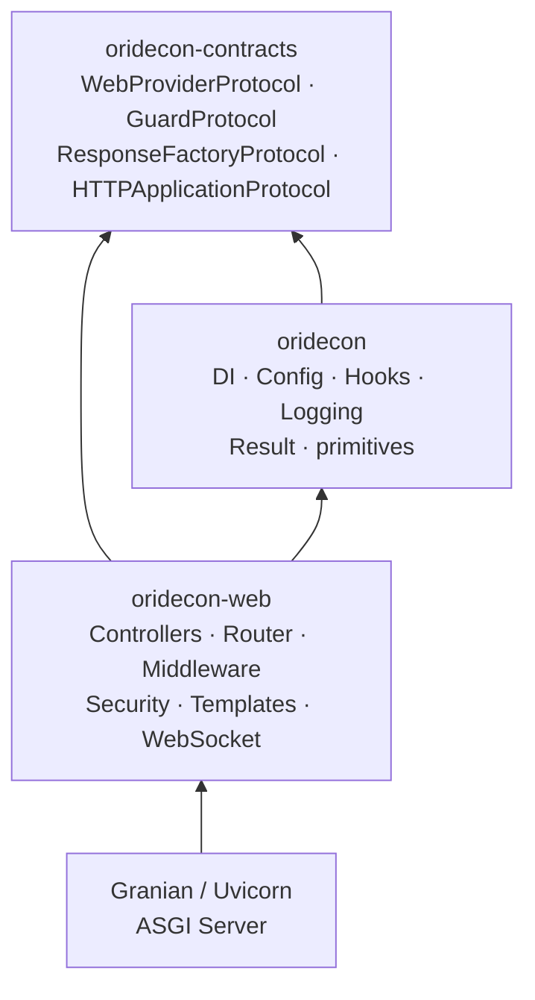
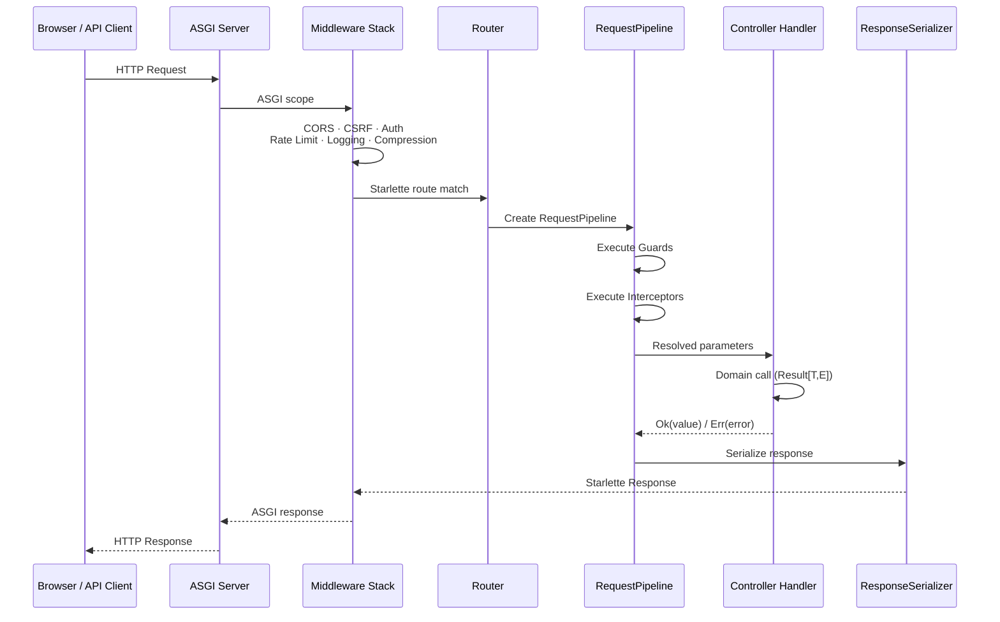
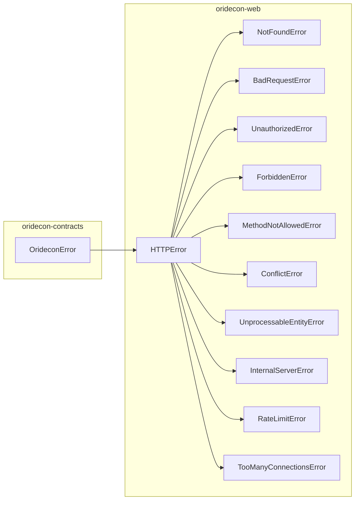
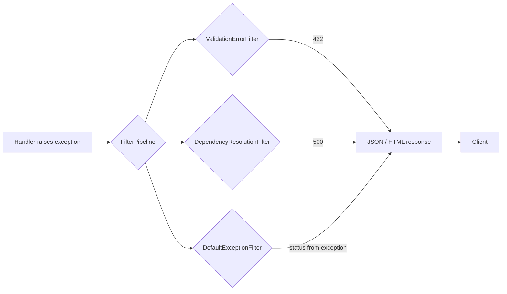

# Architecture

Internal design of the `oridecon-web` package.

---

## Role in the System

`oridecon-web` is a **presentation-layer** extension. It translates HTTP requests into domain operations via DI-resolved controllers and domain results back into HTTP responses. It depends only on `oridecon` (core) and `oridecon-contracts` (protocols) — never on other extensions directly.



**Import direction:** Arrows point toward the dependency. `oridecon-web` imports from `oridecon` and `oridecon-contracts`. The ASGI server sits below, invoking the Starlette application built during `WebProvider.boot()`.

---

## Request Lifecycle

Every HTTP request passes through a five-phase pipeline before reaching the handler, and the result flows back through serialization:



**Middleware order** (outermost → innermost):
1. `DIScopeMiddleware` — injects scoped container per request
2. `RequestIDMiddleware` — assigns unique request ID
3. `CorsMiddleware` — CORS headers
4. `CSRFMiddleware` — CSRF token validation
5. `AuthMiddleware` — authentication (when enabled)
6. `RateLimitMiddleware` — rate limiting
7. `AccessLogMiddleware` — structured request logging
8. `CompressionMiddleware` — response compression
9. `TimingMiddleware` — request duration tracking

---

## Routing System

Routes are declared via decorators on `Controller` subclasses, collected by `RouteRegistry`, and mounted on Starlette during `WebProvider.boot()`.

### Route decorators

```python
from oridecon.web import Controller, get, post, put, delete

class UserController(Controller):
    prefix = "/users"

    @get("/")
    async def list(self, limit: int = 20) -> list[User]: ...

    @post("/")
    async def create(self, body: CreateUserRequest) -> User: ...

    @get("/{user_id}")
    async def get(self, user_id: str) -> User: ...
```

### Route Resolution Flow

```mermaid
flowchart LR
    A["@get(&#39;/users&#39;)<br/>sets func._route_config"] --> B[Controller subclass]
    B --> C[ControllerRegistry<br/>stores class]
    C --> D[RouteRegistry.register_controller<br/>reads collect_routes()]
    D --> E[WebRouterManager.register_routes<br/>mounts on Starlette]
    E --> F[Router._create_endpoint<br/>wraps handler with pipeline]
    F --> G[Starlette routes<br/>added via add_route]
```

### Controller Discovery

Controllers are discovered through three mechanisms:

| Mechanism | When |
|-----------|------|
| Explicit list | `WebProvider(controllers=[...])` |
| Package scan | `WebProvider.auto_discover("myapp.api")` |
| Entry points | `oridecon.web.contributors` — extensions like `oridecon-auth` register automatically |

### API Versioning

The `@api_version` decorator supports four strategies:

| Strategy | Mechanism | Detected By |
|----------|-----------|-------------|
| URI | `/v1/users` | Path prefix extraction |
| Header | `X-API-Version: 1` | Header name configurable via `VersioningConfig.header_name` |
| Media type | `Accept: application/vnd.api.v1+json` | Accept header parsing |
| Query | `?api_version=1` | Query parameter name configurable via `VersioningConfig.query_param` |

```python
@api_version(1, deprecated=False)
class UserControllerV1(Controller):
    prefix = "/users"   # mounted at /v1/users

@api_version(2, deprecated=True, sunset="2025-12-31")
class UserControllerV2(Controller):
    prefix = "/users"   # mounted at /v2/users + Deprecation header
```

---

## DI Integration

`WebModule.configure()` creates a `DynamicModule` with `WebProvider` and exports the provider plus `WebRateLimiterProtocol`.

### WebProvider Lifecycle

| Phase | What Happens |
|-------|-------------|
| `__init__` | Accepts controllers, middleware, config. Builds `WebMiddlewareManager` and `WebRouterManager`. |
| `register()` | Registers 20+ singletons in the container: security configs, route/controller registries, filter/interceptor pipelines, Router, ResponseSerializer, BackgroundTaskRunner. Auto-discovers contributors from entry points. |
| `boot()` | Five-phase init: OpenAPI generator → Starlette app → middleware pipeline → integrations (auth, rate limit, GraphQL, SQL, cache) → route registration. |
| `shutdown()` | Clears references. ASGI server lifecycle cleanup is handled by the lifespan context manager. |

### Provider Priority

`WebProvider` runs at `ProviderPriority.PRESENTATION` (80) — after infrastructure, security, and domain providers. This guarantees database, cache, and auth are ready before routes mount.

### DI Registration

```python
# oridecon/web/di/provider.py (WebProvider.register)
container.singleton(WebProvider, self)
container.singleton(WebProviderProtocol, self)
container.singleton(RouteRegistry, route_registry)         # global singleton
container.singleton(ControllerRegistry, controller_registry) # global singleton
container.singleton(Router, Router())
container.singleton(ResponseSerializer, ResponseSerializer())
container.singleton(InterceptorPipeline, InterceptorPipeline())
container.singleton(FilterPipeline, filter_pipeline)
container.singleton(SecurityConfig, self.web_config.security)
container.singleton(CORSConfig, self.web_config.cors)
container.singleton(CSRFConfig, self.web_config.security.csrf)
container.singleton(ResponseFactoryProtocol, StarletteResponseAdapter)
container.transient(BackgroundTaskRunnerProtocol, StarletteBackgroundTaskRunner)
```

Controllers registered as singletons are pre-resolved and cached by the `Router` at startup for per-request injection.

---

## Template Rendering

`oridecon-web` provides a Jinja2-based template engine via `Jinja2Templates`:

```python
from oridecon.web.templates import Jinja2Templates

templates = Jinja2Templates(
    directory="templates",
    context_processors=[add_request_context],
)

# Controller usage
class MyController(Controller):
    def __init__(self, templates: Jinja2Templates) -> None:
        self._templates = templates

    @get("/")
    async def index(self) -> HTMLResponse:
        return self._templates.render_response(
            "index.html", {"title": "Home"}
        )
```

**Template Loading:** Uses `jinja2.FileSystemLoader` with autoescape for HTML/XML. Templates are resolved relative to the configured `directory` (defaults to `"templates"`).

**Default filters/globals installed on every environment:**

| Name | Type | Purpose |
|------|------|---------|
| `tojson` | Filter | Safe JSON serialization returning `Markup` |
| `format_datetime` | Filter | Datetime formatting with fallback |
| `now` | Global | Current UTC datetime |
| `static_url` | Global | Build `/static/...` URLs |

**Context Processors:** Optional callables that receive and can mutate the template context before rendering. Registered at `Jinja2Templates` construction time.

---

## Security

### Guards (Pre-Request Authorization)

Guards implement `GuardProtocol` from `oridecon-contracts` and execute before the handler:

```python
from oridecon.web.security.guards import AuthGuard, RoleGuard, PermissionGuard
from oridecon.web.security import use_guards

@use_guards(AuthGuard)
async def authenticated_only(self): ...

@use_guards(AuthGuard, RoleGuard("admin", authorizer=authorizer))
async def admin_only(self): ...

@use_guards(PermissionGuard("users:write", authorizer=authorizer))
async def create_user(self): ...
```

| Guard | Purpose |
|-------|---------|
| `AuthGuard` | Checks `request.state.user` is set (authenticated) |
| `RoleGuard` | Checks user has required role(s) via `AuthorizerProtocol` |
| `PermissionGuard` | Checks user has required permission(s) via `AuthorizerProtocol` |

### CSRF Protection

CSRF middleware validates a token on all state-modifying methods (POST, PUT, PATCH, DELETE) for non-API paths. HTMX requests (`hx-request` header present) bypass CSRF validation (same-origin by default).

Configurable via `WebConfig.security.csrf`:

```python
CSRFConfig(
    enabled=True,
    excluded_paths=["/api/", "/health", "/metrics"],
    cookie_name="csrf_token",
    header_name="X-CSRF-Token",
)
```

### CORS

Configured via `WebConfig.cors`:

```python
CORSConfig(
    allowed_origins=["https://app.example.com"],
    allow_methods=["GET", "POST", "PUT", "DELETE", "PATCH", "OPTIONS"],
    allow_headers=["*"],
    allow_credentials=True,
)
```

Production validation blocks wildcard `*` origins in production environments.

### Security Headers

The security module applies HSTS, CSP, and security headers via dedicated middleware. The `CSPConfig` supports per-route CSP directives, and the `APIDocsConfig` automatically injects CSP rules for Swagger UI and ReDoc endpoints.

---

## HTMX / WebSocket Support

### HTMX

`oridecon-web` provides an `HTMXResponse` convenience class for HTMX endpoints:

```python
from oridecon.web import HTMXResponse

class MyController(Controller):
    @post("/save")
    async def save(self, data: dict) -> HTMXResponse:
        # Return HTML fragment with HX-Trigger header
        return HTMXResponse(
            "<div>Saved</div>",
            hx_trigger={"showToast": "Saved successfully"},
        )
```

HTMX requests (`HX-Request` header) are detected by the CSRF middleware and bypassed (same-origin). The response serializer treats bare strings as HTML when the request appears to be an HTMX swap.

### WebSocket

WebSocket support is built on `AbstractWebSocketHandler`:

```python
from oridecon.web.websocket import AbstractWebSocketHandler

class ChatHandler(AbstractWebSocketHandler):
    rooms: dict[str, set[WebSocket]] = {}

    async def on_connect(self, websocket):
        await websocket.accept()
        room_id = websocket.path_params["room_id"]
        self.rooms.setdefault(room_id, set()).add(websocket)

    async def on_message(self, websocket, message):
        room_id = websocket.path_params["room_id"]
        for ws in self.rooms.get(room_id, set()):
            await ws.send_json(message)

    async def on_disconnect(self, websocket):
        room_id = websocket.path_params["room_id"]
        self.rooms.get(room_id, set()).discard(websocket)
```

**Handler lifecycle:** `on_connect` → `on_message` loop → `on_disconnect`. Built-in support for:

| Feature | Config |
|---------|--------|
| Connection caps | `max_connections`, `max_connections_per_user` |
| Rate limiting | `max_messages_per_second` (token bucket) |
| Broadcast | `broadcast()`, `broadcast_text()` to all connections |
| Ping/keepalive | `ping_interval`, `ping_timeout` class attributes |

### SSE (Server-Sent Events)

The `oridecon.web.sse` package provides SSE handler support with backpressure management and heartbeat keepalive. Decorated via `@sse_event`:

```python
from oridecon.web.sse import AbstractSSEHandler

class NotificationSSE(AbstractSSEHandler):
    async def event_generator(self, request):
        while True:
            yield {"event": "notification", "data": "..."}
            await asyncio.sleep(1)
```

---

## Error Handling

### Exception Hierarchy



### Error Response Flow



**Error response format (JSON):** Uses RFC 7807 Problem Details (`ProblemDetail` dataclass):

```json
{
  "type": "urn:oridecon:not-found",
  "title": "Not Found",
  "status": 404,
  "detail": "User 'abc' not found"
}
```

**Debug mode:** When `debug=True` and the client prefers HTML, `DebugHtmlErrorRenderer` produces an interactive error page with traceback, source context, and redacted request details.

**HTTP Error classes** all carry:
- `status_code` — HTTP status
- `detail` — human-readable message
- `headers` — response headers (e.g. `Retry-After` for rate limits)
- `code` — error code string (`"NOT_FOUND"`, `"RATE_LIMIT_EXCEEDED"`, etc.)
- `__cause__` — optional chained exception

---

## Contract Boundary

Protocols that `oridecon-web` implements/consumes from `oridecon-contracts`:

| Protocol | Import | Role |
|----------|--------|------|
| `WebProviderProtocol` | `oridecon.contracts.web` | Provider contract — implements full web lifecycle |
| `HTTPApplicationProtocol` | `oridecon.contracts.web` | ASGI app contract — allows mounting sub-apps |
| `GuardProtocol` | `oridecon.contracts.web.guard` | Pre-handler authorization check |
| `ResponseFactoryProtocol` | `oridecon.contracts.web` | Response creation abstraction |
| `BackgroundTaskRunnerProtocol` | `oridecon.contracts.web` | Post-response background tasks |
| `WebRateLimiterProtocol` | `oridecon.contracts.web` | Rate limiting interface |
| `WebMiddlewareProtocol` | `oridecon.contracts.web` | ASGI middleware contract |
| `ExceptionFilterProtocol` | `oridecon.contracts.web` | Exception → response conversion |
| `WebContributorProtocol` | `oridecon.contracts.web` | Entry-point based contribution |
| `ConnectionManagerProtocol` | `oridecon.contracts.web` | WebSocket/SSE connection tracking |
| `CRUDServiceProtocol` | `oridecon.contracts.web` | Generic CRUD service interface |
| `HookRegistryProtocol` | `oridecon.contracts.core` | Lifecycle hook registration |
| `HealthCheckResult` | `oridecon.contracts.core` | Health check types |

---

## Extension Points

| Point | Mechanism | Example |
|-------|-----------|---------|
| Custom controller | Subclass `Controller`, use `@get`/`@post` decorators | `class MyController(Controller):` |
| Custom middleware | Implement ASGI middleware class | `class TimingMiddleware:` |
| Custom guard | Implement `GuardProtocol` | `class CustomGuard:` |
| Custom interceptor | Implement `WebInterceptorProtocol` | `class LoggingInterceptor:` |
| Custom exception filter | Implement `ExceptionFilterProtocol` | `class MyFilter:` |
| Custom template engine | Subclass/inject `Jinja2Templates` | `Jinja2Templates(directory=...)` |
| Custom response type | Subclass Starlette response | `class CSVResponse(Response):` |
| Web contributor | Implement `WebContributorProtocol`, register entry point | `oridecon.web.contributors` |
| Custom rate limiter | Implement `WebRateLimiterProtocol` | `class RedisRateLimiter:` |
| Custom auth provider | Implement authenticator, register in container | `container.singleton(AuthHandler, ...)` |
| Custom pipe | Implement `PipeProtocol` | `class ParseIntPipe:` |

---

## Source Map

| Module | Purpose |
|--------|---------|
| `oridecon.web.di.provider` | `WebProvider` — registers all web services in the container |
| `oridecon.web.module` | `WebModule` — `configure()` / `stub()` module wrapper |
| `oridecon.web.config` | `WebConfig`, `ServerConfig`, `RateLimitConfig` — configuration models |
| `oridecon.web.routing.router` | `Router` — controller DI strategy, route registration, endpoint creation |
| `oridecon.web.routing.registry` | `RouteRegistry` — stores route metadata |
| `oridecon.web.routing.decorators` | `@get`, `@post`, `@put`, `@delete`, `@patch`, `@websocket` |
| `oridecon.web.routing.controller` | `Controller` base, `GenericController[T]` with CRUD patterns |
| `oridecon.web.routing.manager` | `WebRouterManager` — mounts routes on Starlette |
| `oridecon.web.routing.discovery` | `discover_controllers()` — finds `Controller` subclasses in packages |
| `oridecon.web.routing.pipeline` | `RequestPipeline` — orchestrates guards, interceptors, handler, serialization |
| `oridecon.web.routing.versioning` | `@api_version`, `VersioningMiddleware`, `VersionExtractor` |
| `oridecon.web.routing.parameter_binder` | `ParameterBinder` — resolves handler parameters from request |
| `oridecon.web.middleware.stack` | `DefaultMiddlewareStack` — ordered middleware pipeline |
| `oridecon.web.security.guards` | `AuthGuard`, `RoleGuard`, `PermissionGuard`, `@use_guards` |
| `oridecon.web.security.csrf` | CSRF token generation and validation middleware |
| `oridecon.web.security.cors` | CORS middleware and configuration |
| `oridecon.web.transport.responses` | `JSONResponse`, `HTMLResponse`, `HTMXResponse`, `StreamingResponse` |
| `oridecon.web.templates.core` | `Jinja2Templates`, `TemplateResponse`, `render_template` |
| `oridecon.web.websocket.handler` | `AbstractWebSocketHandler` — WebSocket lifecycle base class |
| `oridecon.web.sse` | `AbstractSSEHandler` — Server-Sent Events base class; `EventSourceResponse`, `ServerSentEvent` |
| `oridecon.web.errors.html_error_renderer` | `DebugHtmlErrorRenderer` — debug HTML error pages |
| `oridecon.web.errors.problem_detail` | `ProblemDetail` — RFC 7807 error format |
| `oridecon.web.exceptions` | `HTTPError`, `NotFoundError`, `BadRequestError`, etc. |
| `oridecon.web.hooks` | `WebRequestReceivedHook`, `WebResponsePreparedHook` |
| `oridecon.web.protocols` | `PipeProtocol`, `WebInterceptorProtocol`, `WebProviderProtocol` helpers |
| `oridecon.web.integrations` | Auth, rate limit, GraphQL, SQL, cache integration setup |
| `oridecon.web.docs.generator` | `OpenAPIGenerator` — auto-generates OpenAPI spec |
| `oridecon.web.contributors` | `WebContributorRegistry` — entry-point-based extension |
| `oridecon.web.filters.pipeline` | `FilterPipeline` — exception filter chain |
| `oridecon.web.interceptors.pipeline` | `InterceptorPipeline` — request/response interceptor chain |
| `oridecon.web.server.runner` | `run_server()` — Granian-based ASGI server launcher |

---

## Constants

| Symbol | Value | Description |
|--------|-------|-------------|
| `ENV_PREFIX` | `ORI_WEB__` | Environment variable prefix for config |
| `DEFAULT_HOST` | `0.0.0.0` | Default bind host |
| `DEFAULT_PORT` | `8000` | Default bind port |
| `DEFAULT_HEALTH_PATH` | `/health` | Health check endpoint |
| `DEFAULT_DOCS_PATH` | `/docs` | Swagger UI endpoint |
| `DEFAULT_OPENAPI_PATH` | `/openapi.json` | OpenAPI schema endpoint |
| `DEFAULT_PAGE_SIZE` | `20` | Default pagination page size |
| `DEFAULT_MAX_PAGE_SIZE` | `100` | Maximum pagination page size |
| `DEFAULT_RATE_LIMIT_REQUESTS` | `100` | Default rate limit per window |
| `DEFAULT_RATE_LIMIT_WINDOW` | `60` | Default rate limit window (seconds) |

---

## Performance

- **`Router._signature_cache`** — LRU cache of handler parameter signatures computed once at registration time
- **`_cached_get_type_hints`** — `@lru_cache` wrapper around `typing.get_type_hints()` to avoid repeated forward-ref resolution
- **`ResponseSerializer`** — configurable serialization with Pydantic model-dump-json fast path
- **`WebProvider.boot()`** — pre-resolves singleton controllers and caches them in a `WeakValueDictionary`
- **Controller discovery** — happens once at boot, never at request time
